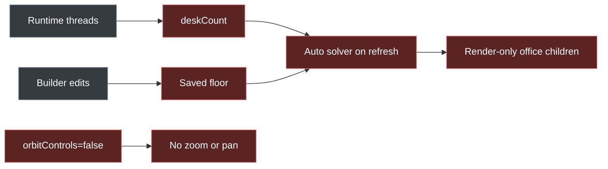
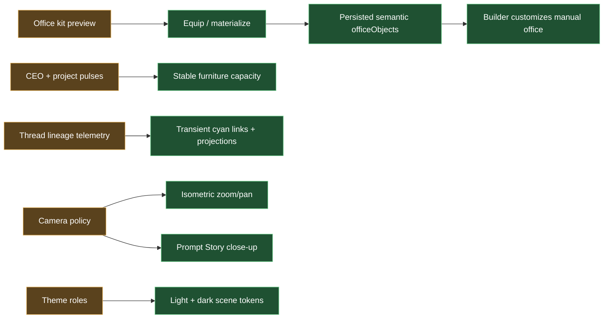

# Durable office kits, stable presence, and camera recovery

## Purpose

Make a generated Office3D composition a durable, editable office rather than a
render-only arrangement that is recomputed from volatile runtime workers.
Restore camera interaction and story framing, preserve Builder authority, and
show thread creation/forking as transient organizational activity without
turning every child thread into permanent furniture.

## Product decisions

### Office kits are selectable and equipped

- A generated office is a previewable `OfficeKit`, not the live office yet.
- Builder owns the kit UX under **Layout -> Office Kits**: selectable kit cards,
  a non-persistent scene preview, `Equip`, and `Reset to equipped kit` actions.
- Equipping over a customized office shows a conflict summary naming which
  kit-owned objects will be replaced and confirming that user-owned objects
  remain. Cancel is non-mutating.
- `Equip` materializes the kit's floor and semantic prefab instances into the
  canonical office settings and `officeObjects` sidecar.
- Equipping another kit replaces only objects owned by the previously equipped
  kit. User-created objects are preserved unless the operator explicitly
  chooses a destructive replacement.
- The first Builder mutation changes the equipped office to a customized/manual
  state while retaining source-kit identity for reset or comparison.
- `Reset to kit` and `Regenerate preview` are explicit actions; refresh is never
  an implicit regeneration event.

### Persist semantic prefab instances, not raw mesh parts

Persist every generated unit a user could reasonably select, move, configure,
hide, or replace:

- command commons
- team neighborhood
- activity alcove
- storage run
- practical-light fixture/group
- planter/decor group
- circulation or floor-zone owner when it carries editable semantics

A persisted prefab may still render internal boards, legs, trim, bulbs, screen
tiles, and other non-editable mesh children. Those parts are implementation
detail, not individual inventory objects.

Hard invariant: anything independently selectable, movable, configurable,
hideable, or replaceable in Builder has its own `officeObject`. Only
non-interactive implementation meshes may remain render-time children.

```ts
type OfficeKitInstance = {
  kitId: string;
  kitVersion: number;
  seed: string;
  source: "generated" | "catalog";
};

type OfficeKitOwnedMetadata = {
  kitId: string;
  kitVersion: number;
  prefabId: string;
  generatedObjectKey: string;
};

materializeOfficeKit(kit, rosterSnapshot)
  -> officeLayout + officeObjects[] + ownershipReceipt
```

### Durable roles own furniture; ephemeral work owns effects

- The company has one persistent CEO.
- Each project has one persistent `project_pulse` employee. Pulses within the
  equipped kit's capacity own one stable station.
- Kits declare persistent-project capacity. Preview/equip fits the current
  project roster once; a later project claims a reserved free slot. When
  capacity is exhausted, the office remains unchanged and Builder offers a
  larger-kit/regenerate preview instead of silently reflowing the live office.
  Overflow pulses stay visible as unseated in the roster and may appear at the
  command commons, but create no furniture until a larger kit is equipped.
- Runtime subagents, forked threads, eval workers, and short-lived delegated
  work do not create desks or change the office footprint.
- Codex roster presence is derived from merged local/Convex hook telemetry and
  expires five minutes after the latest observation. App-server connectivity
  may enable control actions but is not a rendering dependency.
- Root conversation labels come from sanitized hook metadata with deterministic
  precedence: native Codex name, ticket display binding, hook title, agent name,
  then generic fallback. Newer generic rows may update state but cannot erase a
  stronger title; native renames become visible on the next lifecycle hook.
- An active ephemeral worker may appear as a temporary projection near its
  parent, command commons, or active landmark, then disappear when its presence
  expires.
- A thread `created`, `forked`, or native `spawned` edge triggers a thin
  light-blue head-to-head lineage link. Edge kind remains visible in the
  inspector graph rather than relying on scene color alone. Resolve the parent
  endpoint to its employee, then owning
  `project_pulse`, then CEO. Resolve the child to its employee or spawn a
  non-colliding transient projection 1.25 world units from the resolved parent,
  biased toward the command commons. Link and projection live for 2.2 seconds
  and fade over the final 0.5 seconds. The effect is presentation-only,
  deduped by event identity, and never persisted as an office object.
- Existing thread-lineage telemetry is the source; Office3D must not create a
  second lineage store.
- Only root, non-eval, non-ephemeral hook conversations enter the employee
  roster. A spawned subagent may receive the transient projection above while
  active, but never a durable employee, desk, or presence extension after its
  lifecycle event expires.

### Camera behavior is explicit

- Fixed isometric means rotation is locked; it does not mean controls are off.
- Wheel/pinch zoom remains enabled from 0.65x to 2.5x the fitted isometric
  framing. Secondary-drag, middle-drag, Space+primary-drag, and two-finger drag
  pan; primary drag remains available to selection and Builder interactions.
- Builder enters its editing camera and persists an authoritative manual layout
  on Apply.
- Story mode resolves the employee target before presentation, switches to a
  close perspective camera promptly, and reports target-resolution versus
  animation latency separately.
- Leaving Story or Builder returns to the prior isometric framing and zoom.

### Themes resolve semantic roles

Kits persist semantic material roles or token identifiers, not resolved hex
colors. Light and dark mode resolve a complete scene palette: background,
floor, walls, furniture, screens, practical lights, employee contrast, lineage
effects, and selection states. A theme change must not rewrite kit geometry or
office-object transforms.

### Automatic hosted rooms use a department archipelago

`team_neighborhoods` is an automatic presentation, not a second durable office
schema. It maps the fixed hosted-room catalog into four light, raised islands:
Intelligence (Research, Skills, Self-Improvement), Operations (Harness,
Organization, Finance), Production (Production, Comms), and Assurance (QA,
Telemetry, Thread Data). Four ordinary walkable bridges join those islands to a
central Project Council around the Company World nexus. Each Office-visible
project receives one equal Council sector and contributes its existing
project-scoped CEO, or its existing Project Pulse as the fallback Council
Lead. The company CEO is never a project seat.

The archipelago is derived from one shared pure geometry owner and renders over
the existing tile-backed floor/click/navigation layout. It never persists
islands, changes room/host/panel identity, creates agents from transient skill
events, or changes a project’s company-model state. Specialist stations are
fixed service fixtures mapped from the registry to their existing rooms; only
an active ticket with a registered `specialist` projects an ephemeral,
project-derived worker and a Council-to-station dispatch line. Permanent room billboards,
the rectangular shell, and the dark Command Commons cage are absent from this
automatic presentation; room identity remains available through interaction and
active work. The Company World landmark is a table-free, multi-path particle
hive-mind swarm, not a static ring cue. Manual/Builder and equipped office-kit layouts retain their
authored floor, wall, and object transforms unchanged.

## Diagram summary

### Before



### After



Legend: red = current problem, amber = changed owner or policy, green = new
durable behavior, gray = retained input.

## Behavior contract

1. Previewing a kit causes no sidecar mutation.
2. Equipping produces stable IDs/keys and one persistence transaction or a
   recoverable staged transaction.
3. Reload renders persisted kit objects without running generation again.
4. Builder Apply establishes manual ownership; automatic layout cannot overwrite
   it until an explicit reset/equip action.
5. One-agent projects do not render three permanent desks.
6. Ephemeral workers never affect `deskCount`, collision footprints, or shell
   dimensions.
7. Isometric zoom/pan work while rotation remains locked.
8. Story camera reaches a speaking shot promptly and does not remount the WebGL
   scene to change projection.
9. Thread-lineage effects are visible only for fresh deduped events and clean up
   deterministically.
10. Light and dark themes preserve readable contrast and the selected kit's
    identity.
11. At the default camera, employee world height is 1.8-2.4 times desk-worktop
    height and the invisible employee hit capsule is at least 0.45 world units
    wide.
12. Automatic `team_neighborhoods` renders exactly four department islands, one
    central Project Council around the Company World nexus, four bridges, and
    the eleven fixed rooms without an enclosing shell; manual/Builder layouts
    never enter that reflow path.
13. Council sectors are deterministic and equal for the visible project IDs.
    A ticket clone appears only for an active ticket with a known specialist;
    skill helpers and generic telemetry do not create a clone.

## Non-goals

- Persisting every table leg, shelf board, bulb, or screen tile independently.
- Giving every Codex thread a permanent desk.
- Replacing thread-lineage telemetry with an Office3D-specific event store.
- Procedurally regenerating the equipped office on every refresh.
- Supporting arbitrary user-authored prefab definitions in the first slice.

## Proof

- Equip, reload, customize, reload, reset-to-kit browser flow.
- Sidecar snapshots before preview, after equip, and after Builder Apply.
- Isometric wheel/pinch zoom and pan while rotation stays locked.
- Story target-ready and camera-settled latency measurements.
- Seeded created/forked event showing and cleaning up one lineage effect.
- Stable office footprint while 0, 1, and many ephemeral workers appear.
- Light/dark screenshots from the same persisted kit.
