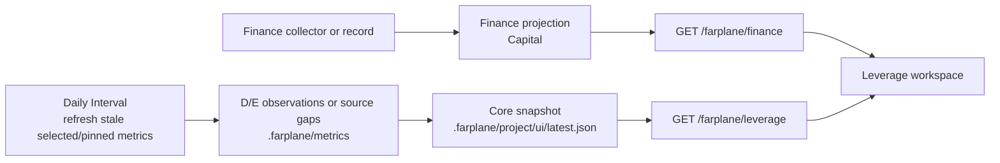

# Leverage Resource Workspace

Leverage is the one visible workspace for company Capital, owned-account
Distribution, and project Edge. It composes read models; it creates no resource
store, collector, or second finance ledger.

## Daily Rollup



Capital is a company-level finance projection. Distribution and Edge are
project observations that Core compiles into snapshots; the panel joins those
two read models rather than rolling three raw stores into one database.

## Product Decisions

- **Capital is company-level.** Finance owns dated cash, flow, close, and
  source-gap evidence; it is never allocated or duplicated per project.
- **Distribution is account-level.** Numeric `leverage: distribution` metrics
  group by observed `(platform, account_id)`, never project, metric name, or
  display label. One account card lists every project that uses it.
- **Edge is qualitative.** Each project has one `leverage: edge` Markdown
  metric; its latest valid paragraph is one project row, never a strength score.
- **One visible entrypoint.** Office menu and command-palette actions, the cash
  HUD, and the Finance Office room all open Leverage. Finance has no separate
  visible launcher or panel.

## Evidence And Storage Contract

`farplane/metrics.yaml` defines project metrics and refreshers; dated
observations under `.farplane/metrics/` hold their evidence. The compiled
`.farplane/project/ui/latest.json` snapshot is a read model. Core owns window,
aggregation, and malformed-refresh semantics.

Edge is `pinned: true` but unselected: Daily refreshes it without making it a
planning objective. Its refresher updates the paragraph only from verified
evidence or emits a source gap.

```yaml
metrics:
  edge:
    label: Edge
    description: Current evidence-backed advantage.
    type: markdown
    pinned: true
    leverage: edge
    refresh: >-
      Summarize verified evidence that materially strengthens this project's
      advantage; replace the current paragraph only when the evidence changed.

  instagram_followers:
    label: Instagram followers
    type: stock
    unit: followers
    direction: maximize
    leverage: distribution
    refresh_ref: instagram_account_metrics
```

A distribution collector attaches account identity to its dated observation,
not the tracked metric definition:

```json
{
  "metric_id": "instagram_followers",
  "date": "2026-08-12",
  "value": 921,
  "status": "available",
  "payload": {
    "distribution_account": {
      "platform": "instagram",
      "account_id": "provider-owned-id",
      "label": "@operator"
    }
  }
}
```

Core retains the last valid Edge paragraph when a refresh is invalid and emits a
source gap. Missing account identity is also a gap; Leverage never guesses it
from a metric name or project.

## Projection And Privacy Contract

The Leverage panel reads `GET /farplane/finance` for Finance-owned Capital
detail and `GET /farplane/leverage` for the registered, deduplicated
`company.projects[].trackingContext` projection. The latter extracts only the
explicit Distribution and Edge cards from each project snapshot. Missing
tracking context, unreadable snapshots, stale readings, unavailable values, and
absent account identity stay visible as evidence gaps rather than zeroes.

The browser receives no provider account ID, raw observations, project strategy,
or private finance evidence. The account card uses an opaque derived ID and
shows a human account label plus `Used by` projects. The Capital detail uses the
existing browser-safe Finance projection; neither endpoint writes source state.

## Surfaces

| Surface | Owner | Role |
| --- | --- | --- |
| `~/.farplane/finance` | Finance CLI and collectors | Canonical company cash, flow, close, and receipt evidence. |
| `farplane/metrics.yaml` + `.farplane/metrics/` | Project refreshers and Core | Metric definition plus dated project evidence. |
| `.farplane/project/ui/latest.json` | Core snapshot compiler | Read-only project card projection. |
| `GET /farplane/finance` | Finance projection | Browser-safe Capital detail. |
| `GET /farplane/leverage` | `ui/server/leverage-projection.ts` | Browser-safe Distribution, Edge, and evidence-gap projection. |
| `LeveragePanel` | `ui/src/modules/leverage/` | The single full-workspace resource UI. |

## Limits

- The panel never collects, refreshes, or writes source state.
- It accepts no manual account ID and exposes no provider account ID.

## Proof

- `ui/server/leverage-projection.test.ts` proves account grouping, source-gap
  behavior, project-path deduplication, deterministic conflict handling, and
  Edge rows.
- Module hook tests prove both browser-safe projection routes.
- Office registry, shell, store, room-catalog, and render-policy tests prove
  every capital entrypoint opens the single Leverage state.
- Browser QA verifies a full-size Leverage workspace, one grouped account card,
  Capital detail, Edge rows, and visible evidence gaps.
