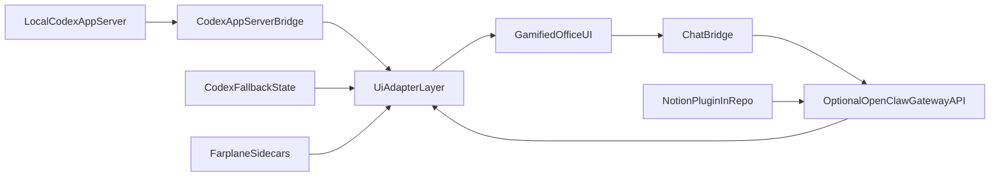
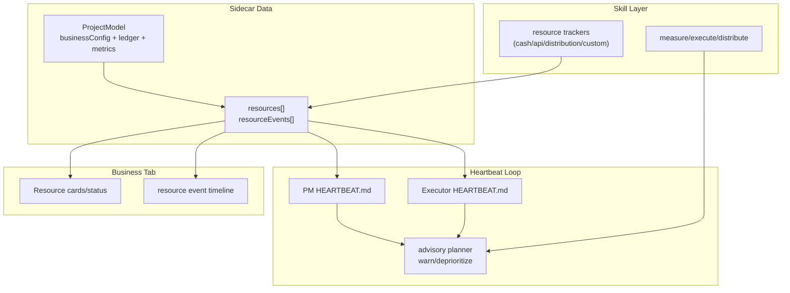

# Farplane AI Architecture

## Canonical Indexes

- OpenClaw Multi-Agent Routing: https://docs.openclaw.ai/concepts/multi-agent#multi-agent-routing
- OpenClaw Plugins: https://docs.openclaw.ai/tools/plugin#plugins

## Direction

Farplane AI is a UI-first control center over OpenClaw.

- OpenClaw owns runtime, bindings, sessions, and plugin lifecycle.
- Farplane AI owns gamified visualization, operator workflows, and state mapping UX.
- Notion integration is delivered as an OpenClaw plugin inside this repository.

## System Overview

## Business Resource Advisory Flow

## Data Sources

- local Codex app-server via the Vite `/codex/app-server/rpc` bridge
- `~/.farplane/company.json`
- `~/.farplane/office.json`
- `~/.farplane/office-objects.json`
- optional `~/.openclaw/openclaw.json`
- optional `~/.openclaw/agents/<agentId>/sessions/sessions.json`
- optional `~/.openclaw/agents/<agentId>/sessions/*.jsonl`
- optional OpenClaw gateway APIs for session operations and message send/steer flows

## State Ownership

Farplane intentionally uses a hybrid state model.

- Convex is canonical for realtime operational state:
  - agent live status
  - agent activity/event timelines
  - team board tasks
  - team board events
- Local Farplane sidecars under `~/.farplane` are canonical for UI-owned structural state:
  - `company.json` for company/project metadata and sidecar-owned policies
  - `office.json` for room layout, decor, and camera/view settings
  - `office-objects.json` for persisted office object placement and team-cluster anchors
- Codex is the default runtime adapter for v0. With `CODEX_APP_SERVER_URL`
  configured on the local UI server, the Vite state bridge proxies app-server
  JSON-RPC and the Codex adapter maps threads into temporary workers, sessions,
  and chat timelines.
- Without app-server, Codex mode supplies a `codex-main` placeholder so the
  office shell still opens.
- OpenClaw runtime config, when used, remains adapter-owned under `~/.openclaw/openclaw.json`.

This split is deliberate for the current single-VPS/local-instance architecture:

- realtime value exists mainly for status and task workflows, which Convex already handles well
- office layout and object placement are warm local config, not high-frequency collaborative data
- OpenClaw itself expects file-backed runtime/config ownership, so moving `openclaw.json` into Convex would fight the runtime boundary instead of simplifying it
- office layout and object persistence carry local invariants around tile-backed room shape, cluster-anchor placement, and archive cleanup that are already encoded in sidecar-backed flows

## Why We Are Not Migrating Sidecars To Convex

We evaluated moving the broader office/config sidecars into Convex and decided not to do a full migration right now.

Reasons:

- The main realtime requirement was agent status, and that path is already in Convex.
- A full migration would create a large blast radius across onboarding, CLI sidecar store, Vite bridge endpoints, office builder persistence, team lifecycle flows, and local fallback behavior.
- `office.json` and `office-objects.json` are tightly coupled to builder invariants and local placement rules; keeping them as local Farplane sidecars avoids a hosted dual-write path while the product is single-operator/local-first.
- `openclaw.json` is OpenClaw-owned runtime configuration, not just app data. Replacing that file boundary with Convex would add complexity without improving operator workflows.
- The current optional-Convex setup lets the office still boot from local state even when Convex is unavailable.

If future requirements change, the first candidate for hosted/shared storage is selected `company.json` metadata. The least suitable hosted candidate is `openclaw.json`, because that remains adapter-owned runtime configuration.

## UI Adapter Contracts

- Agent roster model (`AgentCardModel`)
- Session list model (`SessionRowModel`)
- Timeline model (`SessionTimelineModel`)
- Memory and skills models for multi-agent operational visibility

## Product Boundaries

### OpenClaw responsibilities

- Multi-agent routing and bindings
- Session persistence
- Tool and sandbox policy enforcement
- Plugin discovery/loading

### Farplane AI responsibilities

- Agent/session visualization and gamified office interactions
- Operator memory and skills dashboards
- Chat bridge UI to selected OpenClaw sessions
- Notion plugin development and packaging in-repo
