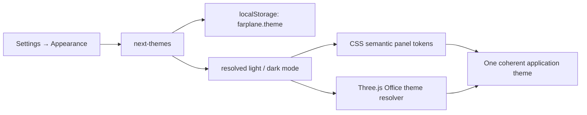

# Configuration System

Farplane has one operator-facing Settings experience, but it intentionally has
more than one persistence surface. A setting, a secret, and mutable product
state have different lifecycle and safety requirements.

```text
Settings UI
  ├─ Configurations → ~/.farplane/config.toml      non-secret, local operator defaults
  ├─ Office          → ~/.farplane/office*.json     mutable office state
  ├─ Company/finance  → ~/.farplane/*.json           mutable business state
  ├─ Project policy   → <project>/farplane/*         versioned, shared project policy
  └─ Connections      → Doppler process environment  credentials only
```

## Contract

The Configs tab is a catalog, not a generic editor. Every row states its
scope, storage location, owner, and available action. The same UI may list a
contract that is read-only, file-only, or owned by an external runtime; that is
intentional discovery, not permission to edit arbitrary files.

```text
configuration_contract(scope, location, owner)
  -> one safe editor or a truthful read-only / file-only destination
```

| Category | Meaning | Safe UI behavior |
| --- | --- | --- |
| Operator configuration | Non-secret behavior that varies by operator machine | Typed editor in **Settings → Configs** or a feature-owned panel |
| Browser preference | Non-secret per-browser UI behavior | Existing Settings controls |
| Project configuration | Versioned policy under the selected project | Catalog and existing project/feature owners; no raw blanket editor |
| Credential | Secret material injected into the process | Readiness and value-free Doppler instructions only |
| Runtime-owned configuration | Codex or OpenClaw client state | Read-only routing to the owning runtime |
| Product/execution record | Office objects, company data, jobs, caches, events, and reports | Excluded from the configuration catalog |

The configuration function is deliberately narrow:

```text
resolve(feature, operator_config, project_policy, runtime_catalog)
  -> effective_nonsecret_settings + validation_evidence
```

Runtime catalog capabilities override a human-entered value only to reject an
unsupported choice; they never silently change the configured setting.

## Current inventory

### Operator configuration — `~/.farplane/config.toml`

| Contract | Owner | UI action | Notes |
| --- | --- | --- | --- |
| `[features.video_intelligence.analysis]` | Feature defaults | Expand **Video analysis** | Default model and reasoning effort for new Video Intelligence analysis. |
| `[runtime]`, `[convex]` endpoint URLs | Runtime & automation | Expand **Runtime & automation** | Non-secret runtime connection values. |
| `[env]` non-secret values | Runtime & automation | Expand **Runtime & automation** | 15 typed values for hooks, Vite-safe URLs, review behavior, and automation. |
| `[telegram]`, `[telegram.streaming]` | Communications | Expand **Telegram gateway** | Routing, allowlist, and bridge values; bot token is readiness-only. |
| `[hooks.file_change]` | Hook Telemetry | Feature-owned editor | Machine-local despite the historical project-local label. |
| `[integrations.slash]` | Finance CLI | File or CLI only | Non-secret Slash base URL and legal-entity identifier; API key is injected. |

The runtime bridge declares 28 environment-backed controls. Fifteen non-secret
values can be changed in **Runtime & automation**:

```text
CONVEX_SITE_URL                     FARPLANE_CONVEX_SITE_URL
FARPLANE_FILE_CHANGE_PATTERNS       FARPLANE_FILE_CHANGE_SUMMARY_MODEL
FARPLANE_FILE_CHANGE_HOOK_DEBUG     FARPLANE_SKILL_HOOK_DEBUG
VITE_CONVEX_URL                     VITE_FARPLANE_RUNTIME_ADAPTER
VITE_CODEX_APP_SERVER_URL           VITE_GATEWAY_URL
FARPLANE_STATE_BASE                 CODEX_REVIEW_MODEL
CODEX_REVIEW_TIMEOUT_MS             STRICT_AGENT_REVIEW
FARPLANE_SKIP_AGENT_REVIEW
```

Thirteen credential-readiness rows are listed without their values and stay in
Doppler: `FARPLANE_TELEMETRY_TOKEN`, `FARPLANE_STATE_BRIDGE_TOKEN`,
`VITE_GATEWAY_TOKEN`, `VITE_MAPBOX_ACCESS_TOKEN` / `MAPBOX_ACCESS_TOKEN`,
`FARPLANE_MESHY_API_KEY` / `MESHY_API_KEY`, `NOTION_API_KEY`,
`TELEGRAM_BOT_TOKEN`, `SLASH_API_KEY`, `LIVEKIT_URL`, `LIVEKIT_API_KEY`,
`LIVEKIT_API_SECRET`, `OPENAI_API_KEY` / `CODEX_API_KEY`, and
`ELEVENLABS_API_KEY`.

### Local and browser configuration

| Contract | Location | Owner | UI action |
| --- | --- | --- | --- |
| Office view and layout kit | `~/.farplane/office.json` | Office View | Expand **Office & appearance**; full decor and builder controls remain feature-owned. |
| Codex office visibility | `~/.farplane/office.json.codex`; legacy `~/.farplane/codex-office.json` | Codex runtime | Expand **Runtime & automation**. |
| Runtime adapter | `localStorage: farplane.runtime-adapter.v1` | Runtime | Expand **Runtime & automation**. |
| OpenClaw gateway UI | `localStorage: farplane.gateway-config.v1` | OpenClaw runtime | Expand **Runtime & automation**; token remains environment-only. |
| General settings | `localStorage: farplane.theme` plus app session state | General settings | Expand **Office & appearance** for theme, debug, builder mode, and onboarding. |
| Office character graphics | `localStorage: farplane.office.characterSprite*` | Office View | Expand **Office & appearance**. |
| Video Intelligence operator profile | `~/.farplane/USER.md` | Local video agent | File or CLI only. |
| Team resources | `~/.farplane/projects/<projectId>/RESOURCES.md` | Team CLI | File or CLI only. |
| Legacy shell config | `~/.farplane/farplane.json` | Onboarding compatibility | Read-only; no new settings belong here. |
| Developer bootstrap | `.env.local` and `ui/.env.local` | Onboarding CLI | File or CLI only; checkout-local, not canonical operator configuration. |
| Office onboarding completion | `localStorage: farplane.office-onboarding.completed` | General settings | Replayed from **Office & appearance**. |
| Chat presentation preferences | `localStorage: farplane-chat-store` | Chat | Feature-owned editor. |
| Developer diagnostic overrides | `localStorage: farplane.debug.pathfinding`, `farplane.debug.gateway`, `farplane.debug.officeRefresh` | Developer diagnostics | Browser-console / developer only. |

### Appearance resolution

The browser stores one appearance preference: `dark`, `light`, or `system`.
`next-themes` owns persistence, system-preference observation, cross-tab sync,
and the root `light` / `dark` class. That resolved mode fans out to the two
rendering contracts instead of creating a second Office setting:



`ui/src/config/theme-system.ts` owns the visible preset names, storage key, and
Company Nexus primitives. `ui/src/styles.css` maps those primitives to panel
roles; `ui/src/config/office-theme.ts` maps them to scene roles. Project,
department, warning, and destructive colors remain semantic data signals and
do not become general interface chrome.

### Versioned project configuration

The Project Config workspace currently reads these ten files from the selected
project. `brand.yaml` is edited through Resource Bank → Brand Kits; the others
are cataloged read-only until a feature-owned editor exists.

| Contract | Location |
| --- | --- |
| Manifest | `farplane/manifest.json` |
| Config Index | `farplane/README.md` (documentation index, not executable config) |
| Harness | `farplane/harness.yaml` |
| Metrics | `farplane/metrics.yaml` |
| Brand | `farplane/brand.yaml` |
| Agent profiles | `farplane/agents.yaml` |
| Automations | `farplane/automations.toml` |
| Bindings | `farplane/bindings.yaml` |
| Hooks policy | `farplane/hooks.json` (distinct from the operator hook listener) |
| Project PM | `farplane/pm.json` (bridge-backed, no mounted editor) |

Additional supported project contracts are
`farplane/dashboard-runtime-sources.json`, `skills/**/skill.config.yaml`, and
tracked configuration templates under `templates/**`. Templates are source
material, not live configuration until they are materialized.

`farplane/README.md` is deliberately shown in the source catalog as the project
configuration index, but it is documentation rather than executable policy.

### Credentials and external runtimes

| Contract | Location | UI action |
| --- | --- | --- |
| Doppler credentials | Doppler-injected process environment | Readiness only. The UI may show value-free `doppler secrets set NAME` guidance, never a secret field. |
| OpenClaw runtime config | `~/.openclaw/openclaw.json` | Runtime-owned; use vetted OpenClaw controls. |
| OpenClaw device identity and authorization | `localStorage: openclaw-device-identity-v1`, `openclaw.device.auth.v1` | Runtime-owned authentication material; never expose or edit in Farplane. |
| Codex global state | `~/.codex/.codex-global-state.json` | Runtime-owned and read-only in Farplane. |

### Bootstrap and process-routing inputs

`FARPLANE_STATE_DIR`, `FARPLANE_HOME`, `OPENCLAW_STATE_DIR`,
`OPENCLAW_CONFIG_PATH`, `FARPLANE_VITE_CACHE_DIR`,
`FARPLANE_FRAMEWORK_ROOT`, `FARPLANE_MINE_ROOT`, and `FARPLANE_EVALS_ROOT`
choose local storage roots or development runtime paths. They are process launch
inputs—not user settings—and therefore stay out of the UI catalog. Repository
tooling manifests such as `package.json`, `tsconfig.json`, `biome.json`, plugin
manifests, and sidecar templates are also intentionally outside this product
configuration contract.

### Explicit exclusions

`company.json`, finance stores, approvals, `office-objects.json`, Telegram
gateway `state.json`, Convex jobs, `.farplane/state`, events, evals, reports,
browser caches, recovery transactions, activity-seen timestamps, and Codex/
OpenClaw job state are operational records. They must not become a generic
Configs surface. OpenClaw device identity and authorization are listed only as
runtime-owned credentials, never as editable data.

## Feature registry

Feature defaults are declared in `cli/operator-settings.ts`. The initial
registry entry is `video_intelligence.analysis`, persisted as:

```toml
[features.video_intelligence.analysis]
model = "gpt-5.6-terra"
reasoning_effort = "xhigh"
```

The YouTube bridge resolves this profile once per new job, saves the exact
snapshot to the Content job and analysis revision, asks the live Codex
app-server for `model/list`, and refuses to start if the requested
model/effort pair is not advertised. Existing jobs retain their original
snapshot; changing a default only affects future analysis.

## UI shape

```text
┌ Settings ──────────────────────────────────────────────────┐
│ General   Office   [ Configs ]   Comms                       │
├─────────────────────────────────────────────────────────────┤
│ Configs                                      36 named sources │
│ Open a feature to change it.                                  │
│                                                               │
│ ▾ Video analysis       gpt-5.6-terra · Extra high            │
│   model + reasoning effort + Save                             │
│ › Telegram gateway     Bot token stays in Doppler             │
│ › Runtime & automation This Mac and browser                   │
│ › Office & appearance  This Mac and browser                   │
│ › Project policy       13 project sources                     │
│ › Connections & credentials Doppler and runtime-owned         │
│ › Complete source inventory                                   │
└─────────────────────────────────────────────────────────────┘
```

The technical inventory is one expansion below the feature sections. It serves
an operator who knows a file, owner, or compatibility setting without pushing
everyday configuration through a second settings screen.

Connections are not a secret editor. A missing credential shows its status and
the exact `doppler secrets set NAME` command, then asks the operator to restart
the affected process. This keeps secret material out of browser memory, local
configuration files, and source control.

## Design decisions

Do not merge all configuration into one JSON or TOML. The single discovery
surface is **Settings → Configs**; the persistence surfaces remain separated by
lifecycle and security boundary. `office.json`, company/finance records,
approvals, and generated runtime state are not settings. New cross-feature
non-secret operator values enter the typed registry; new shared policy enters
the appropriate versioned `farplane/` file. Secrets stay in Doppler and the UI
never writes a secret to TOML, browser storage, or a sidecar. Duplicate legacy
readers can be retired only through an explicit data-preserving migration.
