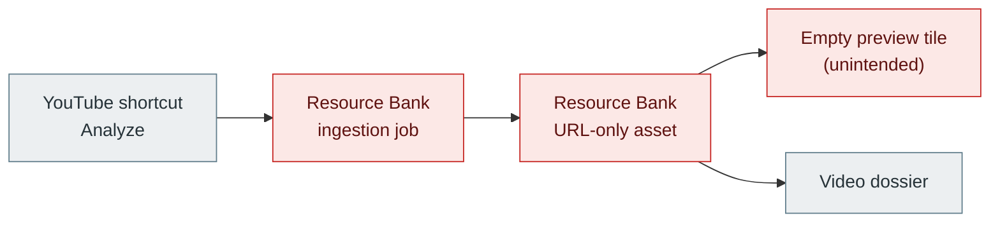
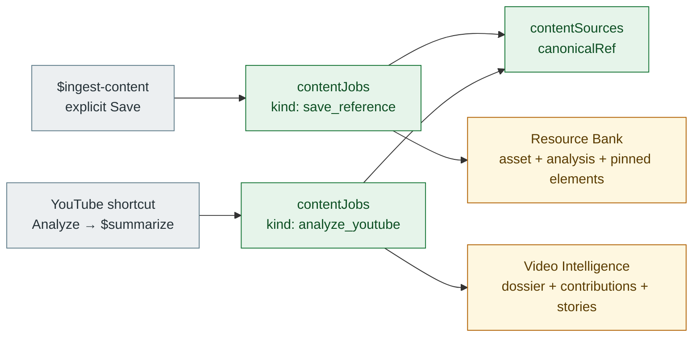

# Content Capture And Analysis

This system separates two intentional outcomes for one canonical source:

```ts
saveReference(source, note?, context?) -> contentJob(save_reference) + ResourceBankAsset
analyzeYouTube(video, projectId?) -> contentJob(analyze_youtube) + VideoDossier
```

`contentSources` owns canonical identity. `contentJobs` owns an attempted
operation and lifecycle. Resource Bank and Video Intelligence own only the
product records specific to their respective outcomes.

## Boundary

- **Save** is an explicit operator decision. `$ingest-content` writes a
  `save_reference` job, a reusable Resource Bank asset, optional analysis, and
  note-grounded pinned elements.
- **Analyze** is Vidgard's YouTube analysis decision. The shortcut invokes the
  installed `$summarize` skill, then writes an `analyze_youtube` job, dossier,
  story contributions, and tags. It never creates a Resource Bank asset.
- A shared URL can have both job kinds, but Analyze never implies Save. A future
  Save action may reuse its `contentSource` and create a separate save job.

## Before



## After



Legend: green = new shared ownership; amber = retained product owner with a
new boundary; gray = existing caller.

## Convex Map

| Owner | Tables | Write entrypoint | Read boundary |
| --- | --- | --- | --- |
| Shared content | `contentSources`, `contentJobs` | `modules/content/saves:saveReference`; `modules/videoIntelligence/videos:queueVideo` | source/job identity and lifecycle |
| Resource Bank | `resourceBankAssets`, `resourceBankAnalyses`, `resourceBankCreativeElements`, findings, Brand Kits | `saveReference`, `addPinnedElement` | only `save_reference` assets are curated/retrievable |
| Video Intelligence | dossiers, contributions, stories, tags | `queueVideo`, `attachThread`, `completeVideo`, `failVideo` | `getVideoIntelligenceProjection` starts from analyze jobs/sources |

`queueVideo` reuses an active `sourceId + analyze_youtube` job. A terminal
analysis may be explicitly rerun as a new job; the projection presents the
latest state per source while a dossier retains its repeat count.

## Operational Flow

1. A caller normalizes a canonical source reference and reuses or creates a
   `contentSource`.
2. The caller writes exactly one typed `contentJob` for Save or Analyze.
3. Save creates the Resource Bank product records. Analyze creates or updates
   the Video Intelligence dossier and reporting graph.
4. Resource Bank readers accept only `save_reference`; Video Intelligence
   readers start with `analyze_youtube`.

## Legacy Migration

The old `resourceBankIngestionJobs` table is compatibility data only. The
confirmation-gated migration first creates generic source/job links, then
relinks every dependent asset, analysis, element, finding, Brand Kit snapshot,
and dossier. It deletes a Vidgard legacy tree only when its generic dossier
links are present, Brand Kit references are durable, and bounded reads show no
overflow. The 2026-08-08 live migration moved 66 legacy jobs and removed the 58
bridge-provenance analysis trees from Resource Bank; eight saved references
remain as migration-compatibility records.

## Skill And Caller Map

| Caller | Owns | Must not do |
| --- | --- | --- |
| `$ingest-content` | explicit reusable Save; note-bound pinned elements | turn passive analysis into a saved asset |
| YouTube shortcut / Vidgard | analyze YouTube; invoke `$summarize`; persist evidence-backed dossier state | invoke `$ingest-content` or write Resource Bank assets |
| `$summarize` | source reading and structured analysis evidence | decide that a source belongs in Resource Bank |

The source material passed into `$summarize` is untrusted. Its output is
validated by the bridge before `completeVideo` persists a dossier.

## Proof And Maintenance

- Verify the Resource Bank dashboard contains only saved references and shows a
  useful empty state when none exist.
- Verify Vidgard retains queued, failed, and completed jobs/dossiers after a
  bridge restart.
- Use `previewLegacyResourceBankMigration` before any future migration batch;
  use the confirmation-gated migration/deletion mutations only in bounded
  batches.
- Treat an empty preview on an explicit Save as missing preview evidence, not as
  a reason to move the item into Video Intelligence.
