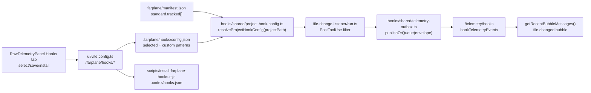

# TASK-0002: Project Hook Config, Installer, And File-Change Telemetry

## Summary
Farplane already has unified hook telemetry and a file-change listener, but the standard installer only installs skill invocation telemetry and the UI only previews watched patterns. Make hooks first-class per project: read `farplane/manifest.json`, let the operator select which Farplane files emit file-change events, install both hooks from the UI/CLI, and make hook publishing durable through a local retry outbox.

## Scope
- In:
  - Project-local hook config stored under `.farplane/hooks/config.json`.
  - Manifest-aware watched file defaults from `farplane/manifest.json`.
  - CLI installer that writes both skill invocation and file-change `PostToolUse` hooks.
  - Vite bridge endpoints for hook config read/save/install.
  - Raw Telemetry Hooks tab UI for selecting tracked files/patterns and installing hooks.
  - Durable hook outbox for failed `/telemetry/hooks` publishes, flushed opportunistically on later hook runs.
  - Focused tests for config resolution, installer output, file-change parsing, and outbox retry.
- Out:
  - Codex-generated diff summarization inside the hook path.
  - Browser auto-trusting Codex hooks; `/hooks` trust remains explicit.
  - Convex schema changes beyond existing `hookTelemetryEvents`.
  - Tracking all repo writes by default.

## Delta
- Before:
  - `npm run hooks:install` installs only `skill-invocation-listener`.
  - `file-change-listener` exists but is not installed by the canonical helper.
  - Raw Telemetry shows a read-only watched-pattern preview.
  - Failed hook publishes are dropped after logging.
- After:
  - `npm run hooks:install` installs both skill invocation and file-change hooks.
  - Raw Telemetry Hooks tab reads the active project manifest/config, lets the operator toggle manifest files plus custom patterns, saves config locally, and runs a project install action.
  - `file-change-listener` resolves patterns from env, `.farplane/hooks/config.json`, `farplane/manifest.json`, then defaults.
  - Hook publishes use a local `.farplane/hooks/outbox.jsonl` retry queue so temporary Convex/network failures can replay.

## Program
```text
vars:
  manifest = farplane/manifest.json
  config = .farplane/hooks/config.json
  outbox = .farplane/hooks/outbox.jsonl
  install_script = scripts/install-farplane-hooks.mjs

program:
  ground(current hooks, Vite bridge, RawTelemetryPanel, manifest) -> gaps
  add_hook_runtime_lib(gaps) -> config + manifest pattern resolver + outbox publisher
  replace_installer(gaps) -> install both hook commands idempotently
  wire_file_change_hook(resolver) -> filtered file.changed events
  add_bridge_endpoints(config, installer) -> GET/POST/install project hook config
  add_ui(bridge) -> selector + custom patterns + install button
  verify(done_when, proof) -> focused vitest + installer dry run + UI build/type evidence
```

## Map


## Done / Proof
```text
done_when:
  - operator can open Raw Telemetry -> Hooks and see manifest-backed tracked file choices
  - operator can save watched file config and install hooks from the UI
  - npm run hooks:install installs skill invocation and file-change listeners idempotently
  - file-change hook filters by saved project config/manifest and sends file.changed telemetry
  - failed hook publishes queue locally and retry on later hook runs

proof:
  checks:
    - npm run test:once -- hooks/file-change-listener hooks/shared
    - node scripts/install-farplane-hooks.mjs --json
    - npm run ui:typecheck or narrow touched-file type evidence
  manual:
    - Raw Telemetry Hooks tab shows manifest files, saved patterns, and install result
  review:
    - rubric: minimal module boundaries, no raw transcript leakage, no browser home-dir scraping, no hook-path LLM blocking
      required_tas: advisory
  evidence:
    - command outputs in progress.md
```

## State
- `next_action:` implement runtime libs, installer, bridge endpoints, UI, tests
- `blocked:` false
- `latest_verification:` not run
- `result:` pending

## Links
- `program:` tickets/TASK-0002/program.md
- `progress:` tickets/TASK-0002/progress.md
- `manifest:` farplane/manifest.json
- `module:` ui/src/modules/hook-telemetry/
