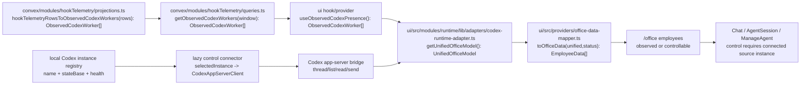

# TASK-0003: Telemetry-First Codex Office Presence And Lazy Multi-Instance Control

## Summary
Farplane should not require a live Codex app-server connection just to show that
employee agents are working. The office should render observed Codex workers,
projects, activity, and recency from pure telemetry projections first, then
connect to a specific Codex app-server only when the operator wants direct
control such as sending a message, opening a live session, or changing a
thread's office role.

This ticket creates the first end-to-end slice of a multi-Codex office: multiple
Codex instances can publish telemetry into the same Farplane office, the UI can
render them as separate observed workers or teams, and each observed instance
can advertise a lazy connection target for message/control actions.

The key behavior change is that ephemeral worker presence should be derived
from telemetry, not from last chat activity. Chat/thread activity can enrich or
override a matching connected worker, but it should not be required to decide
whether an ephemeral worker exists in the office.

## Scope
- In:
  - Define a normalized telemetry-derived office presence model for Codex
    workers, sessions, projects, and source instances.
  - Include a stable machine or runtime-instance identity in observed presence
    so one project can safely have different Codex instances owning different
    threads on different machines.
  - Replace last-chat-activity ephemeral worker discovery with telemetry-derived
    discovery, while preserving chat activity only as connected-session detail.
  - Derive office employees and status/activity from Convex telemetry and hook
    projections when Codex app-server is disconnected or unavailable.
  - Preserve the existing Codex app-server path for live thread listing,
    timeline reads, prompt sending, and office-role writes.
  - Add a local multi-instance connection registry shape for Codex control
    endpoints, with per-instance connection state and "connect to control"
    affordances.
  - Make direct message/send controls lazy: disabled or connect-prompted until
    the selected Codex instance has an active app-server bridge.
  - Keep telemetry-only rendering read-only and clearly distinguish observed
    presence from controllable sessions.
  - Add deterministic tests for telemetry-to-office presence derivation,
    app-server-disconnected fallback, and multi-instance identity separation.
  - Capture browser evidence that `/office` renders telemetry-observed Codex
    workers without `CODEX_APP_SERVER_URL`, then enables control affordances
    after a configured instance is connected.
- Out:
  - Starting or managing multiple Codex app-server processes from Farplane.
  - Remote authentication, secret storage, or public multi-user access.
  - Replacing Codex app-server control APIs for live prompt sending.
  - Moving durable project memory or sidecar state into Convex.
  - Full compute backend selection or `runTicket(ticketId)` execution.
  - OpenClaw runtime behavior beyond preserving adapter boundaries.

## Delta
- Before:
  - Codex office presence primarily depends on the Codex app-server adapter for
    project/thread mapping.
  - Ephemeral worker visibility is tied too closely to last chat/thread
    activity, so workers can disappear when the control bridge is disconnected
    even if telemetry proves they are active.
  - Telemetry dashboards show activity, but office employee rendering still
    waits on runtime adapter data for meaningful Codex worker presence.
  - `CODEX_APP_SERVER_URL` is treated as the main Codex bridge for both
    visibility and control.
  - One local Codex app-server endpoint is assumed by the UI control path.
- After:
  - `/office` can render observed Codex workers from telemetry alone.
  - Ephemeral worker discovery uses telemetry recency and source identity first;
    chat/thread recency becomes extra session detail for connected instances.
  - A disconnected or missing app-server does not erase recent worker presence;
    it only disables direct message/control actions.
  - Multiple Codex instances can contribute telemetry rows into one office
    view, separated by stable machine/source/runtime-instance identity rather
    than by project path alone.
  - The operator connects a specific Codex instance only when they want to send
    a message, inspect a live thread, or mutate Codex office role settings.

### First-Principles Basis
- `objective:` Make the office truthfully show active ephemeral Codex workers
  even when no app-server control bridge is connected.
- `need:` Operator trust depends on seeing real work in progress; requiring a
  chat/control bridge for visibility hides useful telemetry and collapses
  multi-instance operation back into one local endpoint.
- `root_cause:` The current Codex path derives worker existence from
  app-server thread/project read models, while Convex/hook telemetry is only
  overlaid onto known agent ids.
- `assumption:` Recent hook telemetry contains enough source, project, session,
  turn, and timing data to create observed read-only workers. If the current
  payload is missing a stable source instance id, the first build step should
  derive a conservative fallback from `source`, `machineId` or `machineName`,
  `projectId`, and `sessionId`, then record the follow-up need for richer hook
  metadata.
- `first_viable_slice:` Render telemetry-observed Codex workers from recent
  hook/runtime rows with read-only controls, then let matching app-server
  thread status override only the same source/session.
- `proof:` Seed or mock two source instances and prove `/office` renders both
  without `CODEX_APP_SERVER_URL`; connect one instance and prove only its
  workers become controllable.
- `tradeoff:` This introduces a small observed-presence model before the full
  compute backend abstraction. That is acceptable because it directly removes
  the visibility/control coupling without taking on process management.
- `non_goals:` no background app-server launching, credentials, remote auth,
  multi-user sharing, OpenClaw behavior changes, or `runTicket(ticketId)`.

## Program
```text
vars:
  observed_presence = telemetry/hook/agent-status derived Codex workers
  control_registry = local Farplane Codex instance connection targets
  control_bridge = existing Codex app-server RPC bridge
  source_window = recent telemetry window for observed ephemeral workers

program:
  1. ground(current telemetry projections, office data provider, Codex adapter) -> exact source fields
     - inspect hook payloads used by hookTelemetryRowsToActivityPingRows()
     - inspect CodexRuntimeAdapter.getUnifiedOfficeModel(), getAgentsLiveStatus(), listSessions(), sendMessage()
     - inspect useAgentLiveStatuses() because it already overlays hook bubbles for known codex-thread ids
  2. define_presence_contract(observed_presence) -> telemetry-derived employee/session model
     - add a pure projection from recent telemetry rows to ObservedCodexWorker[]
     - use stable ids: codex-observed:<machineOrInstanceId>:<projectId>:<sessionOrThreadKey>
     - mark workers as observed/read-only and preserve machine/source instance id on metadata
  3. query_presence(source_window) -> Convex query + UI hook
     - add a hookTelemetry/runtimeTelemetry query that returns compact observed worker rows
     - do not return raw prompts/transcripts; only status labels, timing, source, project/session ids, and counts
  4. merge_office_sources(observed_presence, app_server_model) -> UnifiedOfficeModel
     - insert observed agents before toOfficeData() so teams/desks/employees derive normally
     - dedupe by source instance + session/thread when a connected app-server returns a matching codex-thread
     - let connected thread status override matching observed status, never unrelated observed workers
  5. add_instance_registry(control_registry) -> local settings + health state
     - extend Codex runtime settings with a local list of named control endpoints
     - keep existing stateBase as the default instance for backward compatibility
     - store no credentials in this ticket
  6. lazy_control(control_bridge) -> connect/send/read only for selected instance
     - disable send/timeline/role writes for observed-only workers
     - route enabled control through the selected instance endpoint
     - show a compact connect affordance instead of trying to auto-start processes
  7. add_ui_states(merge) -> observed badges, connect affordance, disabled send copy
     - make observed vs controllable inspectable through QA bridge or deterministic DOM labels
     - keep office visual treatment compact and theme-token based
  8. verify(ticket) -> focused tests + browser proof without and with app-server control
```

## Map


Typed flow:
1. `HookTelemetryRow { hookName, hookType, projectId?, sessionId?, payload, eventAt }`
   becomes `ActivityPingRow` and `ObservedCodexWorker`.
2. `ObservedCodexWorker { workerId, sourceInstanceId, machineId?, machineName?,
   sessionKey, threadId?, projectId, projectPath?, displayName, state,
   statusText, lastSeenAt, controllable:false }` becomes a synthetic
   `CompanyModel.agents[]` row plus `AgentCardModel`.
3. `UnifiedOfficeModel` carries observed rows into `toOfficeData()`.
4. `EmployeeData` exposes observed/read-only metadata for labels, disabled
   controls, and QA inspection.

Identity rule:
- `projectId` or `projectPath` groups workers into the same project/team.
- `machineId` or stable runtime instance id separates ownership inside that
  project.
- `sessionId`/`threadId` identifies the worker lane owned by that instance.
- Dedupe and control matching must use `machineOrInstanceId + projectId +
  sessionOrThreadKey`, never project alone.

Touch:
- `convex/modules/hookTelemetry/projections.ts`: add observed Codex worker
  projection beside existing runtime/bubble projections.
- `convex/modules/hookTelemetry/queries.ts` and `validators.ts`: add bounded
  query args and compact return rows.
- `ui/src/hooks/` or `ui/src/modules/runtime/lib/...`: add a React hook/client
  wrapper for observed presence.
- `ui/src/modules/runtime/lib/adapters/codex-runtime-adapter.ts`: merge
  observed workers with app-server read model and expose controllability
  metadata.
- `ui/src/providers/office-data-provider.tsx`: feed observed presence into the
  Codex adapter/provider path without destabilizing live-status refresh.
- `ui/src/providers/office-data-mapper.ts`: preserve observed/read-only flags on
  `EmployeeData` and keep presence expiry telemetry-based.
- `ui/src/modules/office/components/agent-session-panel.tsx`,
  `ui/src/modules/chat/hooks/*`, and
  `ui/src/modules/office/components/manage-agent-modal/index.tsx`: gate send,
  timeline, and role writes behind connected/control-capable source.
- `ui/src/modules/settings/*` and `ui/src/modules/runtime/lib/gateway/config.ts`:
  add a backward-compatible local Codex instance registry around `stateBase`.
- Tests: extend `convex/modules/hookTelemetry/hookTelemetry.test.ts`,
  `ui/src/providers/office-data-provider.test.ts`, and runtime adapter tests.

## Agent Contract
- `Open`: `npm run ui`, then `/office`.
- `Test hook`: focused Vitest coverage for telemetry presence derivation and
  office-data-provider fallback; browser QA through `qa/cookbook/office.md`.
- `Stabilize`: seed telemetry fixture rows or mock Convex query data so QA can
  render observed workers without a live app-server; use existing sidecar
  templates for local office structure.
- `Inspect`: expose deterministic DOM labels or QA bridge state for observed
  versus controllable Codex workers; keep canvas-only employee rendering backed
  by inspectable state.
- `Key screens/states`:
  - `/office` with no `CODEX_APP_SERVER_URL` and recent telemetry rows.
  - `/office` with two observed Codex source instances.
  - employee/session control affordance while disconnected.
  - selected instance connected and send/live-session affordance enabled.
  - Settings or runtime panel showing per-instance connection status.
- `QA cookbook`: `qa/cookbook/office.md`.
- `Taste refs`: `docs/TASTE.md`; keep operational status compact, badge-like,
  and readable inside office panels without large explanatory cards.
- `Expected artifacts`: screenshots for telemetry-only office, multi-instance
  observed office, and connected control state; QA report with console/errors.
- `Delegate with`: `tickets/TASK-0003/ticket.md`, especially `Scope`,
  `Program`, `Agent Contract`, and `Done / Proof`.

## Done / Proof

```text
done_when:
  - /office renders recent Codex worker presence from telemetry with no live app-server configured
  - ephemeral worker discovery no longer depends on last chat/thread activity
  - telemetry-derived workers are visually and programmatically marked as observed/read-only
  - direct message, live thread read, and office-role writes remain unavailable until a selected Codex instance is connected
  - at least two Codex telemetry source instances can appear in the same office without identity collisions
  - connecting one Codex instance enables control only for that instance, not every observed worker
  - app-server-backed live status can override stale telemetry for the matching source/thread without deleting unrelated observed workers

proof:
  metrics:
    - none mechanical beyond deterministic checks and QA evidence
  checks:
    - focused Vitest tests for telemetry presence projection and source identity separation
    - focused office data/provider tests for app-server-disconnected fallback and connected override behavior
    - focused control gating tests for send/timeline/role actions on observed-only workers
    - npm run --workspace @farplane/ui build -- or narrower equivalent agreed in plan
  manual:
    - browser QA proves /office renders telemetry-observed workers without CODEX_APP_SERVER_URL
    - browser QA proves a connected instance enables send/live-session controls for only that instance
  review:
    - rubric: runtime adapter boundaries, telemetry privacy, UI testability, office UX clarity
      required_tas: TAS-A
    - hard gates: no transcript/prompt leakage in observed presence rows; no app-server process launching; no credentials or secrets stored in browser-visible config
  evidence:
    - screenshots: telemetry-only office, multi-instance observed office, connected instance controls
    - QA report under docs/research/qa-testing/TASK-0003/<timestamp>/
    - command outputs recorded in ticket progress or closeout notes
```

## Run Hints
- `likely_size:` medium-large UI/runtime integration.
- `goal_recommendation:` use a Goal or ticket-scoped progress log if the build
  spans multiple turns.
- `compute_hint:` local Codex is sufficient; do not require OpenClaw unless a
  plan explicitly tests adapter preservation.
- `proof_weight:` browser evidence matters more than repeated full builds.
- `batchability:` not batchable with unrelated UI work because this changes
  runtime identity and office rendering semantics.
- `human_gates:` ask before adding credentials, remote endpoints, background
  process management, or changing hook/app-server trust behavior.

## State
- `next_action:` review mechanical proof and capture optional browser QA with
  seeded/live Convex telemetry if visual evidence is required before archive.
- `blocked:` false
- `latest_verification:` focused tests passed; root and Convex typechecks
  passed; UI production build passed; pre-push exited 0 with full UI typecheck
  warning on existing unrelated debt.
- `result:` review-ready implementation proof

## Links
- `program:` none yet
- `progress:` none yet
- `artifacts:` docs/research/qa-testing/TASK-0003/
- `review:` none yet
- `refs:` `ARCHITECTURE.md`, `PROJECT_RULES.md`,
  `docs/bootstrap-brief.md`, `docs/MEMORY.md`, `qa/cookbook/office.md`,
  `ui/src/modules/runtime/README.md`,
  `ui/src/modules/runtime/lib/adapters/codex-runtime-adapter.ts`,
  `ui/src/providers/office-data-provider.tsx`,
  `ui/src/providers/office-data-mapper.ts`,
  `convex/modules/hookTelemetry/`, `convex/modules/runtimeTelemetry/`,
  `convex/modules/agentActivity/`

## Notes
- `Split check:` keep this as one ticket. Convex projection, runtime merge,
  UI control gating, and browser proof all serve one operator-visible behavior:
  telemetry-first ephemeral worker presence with lazy control.
- `Main risk:` source-instance identity may be under-specified in current hook
  payloads. Start with a deterministic fallback key, but do not pretend it is a
  durable multi-machine identity if payload evidence is weak.
- `Rollback:` keep app-server-derived Codex workers as the override path. If
  telemetry projection is wrong, disabling the observed-presence query should
  return the office to the current app-server-only behavior.
- `Convex caveat:` `convex/_generated/ai/guidelines.md` was not present during
  planning; implementation must still follow `convex/AGENTS.md`, validators,
  module-local query organization, and `npx tsc -p convex/tsconfig.json --noEmit`
  if Convex code changes.
- `Proof note:` mechanical and manual hook proof is complete. Browser proof was
  not captured in this pass because no seeded/live Convex telemetry browser
  fixture was started; use `qa/cookbook/office.md` for the remaining visual QA
  pass if review requires screenshots before archive.
