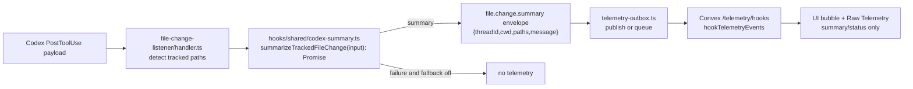

# TASK-0004: Local Codex Summaries For Tracked File-Change Status

## Summary
The file-change hook should not send noisy raw `file.changed` telemetry when the UI only needs a useful employee status bubble. Convert tracked file changes into a concise local Codex-generated summary first, then publish only the summary/status event through the existing hook telemetry outbox.

This ticket keeps summarization project-local through the installed Codex CLI instead of adding AI SDK/API configuration to the app.

## Scope
- In:
  - Add a hook-runtime local Codex summarizer helper with model command discovery, timeout handling, bounded prompt/input, and deterministic test seams.
  - Update `file-change-listener` so tracked file edits publish `file.change.summary` only after local summarization succeeds.
  - Keep publish durability through `hooks/shared/telemetry-outbox.ts`.
  - Add one optional model override while keeping the installed hook defaults usable without manual env setup.
  - Update Raw Telemetry filters/copy for `file.change.summary`.
  - Prove the local Codex CLI command works on this machine.
  - Install/use the hook, edit a tracked file, and verify a summary event/status update is emitted.
  - Run precommit/pre-push-style checks and commit the modular change.
- Out:
  - AI SDK/OpenAI API integration inside the UI or Convex app.
  - Sending raw file-change telemetry before the summary exists.
  - Summarizing arbitrary untracked files.
  - Long-running hidden daemons or background autonomy.

## Delta
- Before:
  - The file-change listener detects tracked writes and publishes raw `file.changed` telemetry with path metadata plus a basic message.
  - UI filters include `file.changed`.
  - The app would need a later summarization layer to turn raw events into useful bubbles.
- After:
  - The file-change listener detects tracked writes, summarizes them locally with Codex, then publishes `file.change.summary`.
  - The summary event payload is minimal: `eventName`, `threadId`, `cwd`, `paths`, and `message`.
  - If summarization fails or times out, the hook does not publish raw file-change telemetry.

## Program
```text
vars:
  ticket = tickets/TASK-0004/ticket.md
  program = tickets/TASK-0004/program.md
  progress = tickets/TASK-0004/progress.md
  summarizer = hooks/shared/codex-summary.ts
  listener = hooks/file-change-listener/
  ui = ui/src/modules/hook-telemetry/raw-telemetry-panel.tsx

program:
  ground(current hook parser, outbox, install script, UI filters) -> exact seams
  probe_codex_cli(default executable + optional model flag) -> supported command contract
  add_summarizer(helper) -> bounded local codex exec wrapper + tests
  update_listener(helper) -> summary-only file.change.summary publish
  update_ui(event contract) -> filters/copy match summary-only behavior
  install_and_probe_hook(config) -> edit tracked file -> emitted summary event
  verify(ticket) -> focused tests + lint/type evidence + precommit/prepush checks
  commit_when_clean(modular change)
```

## Map


## Done / Proof
```text
done_when:
  - local Codex CLI summarizer command is probed and works with a small prompt
  - tracked file-change hook publishes file.change.summary, not raw file.changed, by default
  - summarizer input is bounded and avoids dumping whole files or tool transcripts
  - summarizer timeout/failure does not delay indefinitely or publish noisy raw telemetry
  - hook install path still installs skill invocation and file-change listeners
  - editing a tracked Farplane file produces a summary telemetry/status update
  - code is checked, reviewed for smell, committed, and branch remains on main

proof:
  checks:
    - focused Vitest coverage for codex summary helper and file-change listener behavior
    - npx biome lint on touched source/test files
    - relevant typecheck scan for touched UI/hook files
    - bash scripts/pre_push_check.sh or documented narrower fallback if existing debt blocks
  manual:
    - codex CLI probe output proves the default executable and selected model invocation work
    - npm run hooks:install installs the generated hook config
    - a controlled edit to a tracked file emits file.change.summary telemetry/status
  review:
    - rubric: minimal module boundaries, bounded local AI input, durable outbox semantics, no raw noise, no new app AI secrets
      required_tas: advisory local review
  evidence:
    - command outputs and hook probe result appended to tickets/TASK-0004/progress.md
    - commit hash after successful commit
```

## State
- `next_action:` create Goal, implement summary helper and listener contract, then run proof.
- `blocked:` false
- `latest_verification:` not run
- `result:` pending

## Links
- `program:` tickets/TASK-0004/program.md
- `progress:` tickets/TASK-0004/progress.md
- `parent:` tickets/TASK-0002/ticket.md
- `refs:` hooks/file-change-listener/, hooks/shared/, scripts/install-farplane-hooks.mjs, ui/src/modules/hook-telemetry/
