# TASK-0008: Codex Thread Lineage Hook Telemetry And UI Graph

## Summary
Extend the Farplane hook telemetry system so native Codex thread creation and
forking become first-class lineage events, then render those parent-child edges
as an operator graph in the UI. The recommended first slice is feasible through
a dedicated `PostToolUse` listener that watches successful `create_thread` and
`fork_thread` tool calls, publishes compact sanitized `thread.created` and
`thread.forked` envelopes into the existing `hookTelemetryEvents` log, and adds
a Raw Telemetry `Threads` tab backed by a Convex projection.

## Scope
- In:
  - Add a repo-local `hooks/thread-lineage-listener/` package for Codex
    `PostToolUse` payloads.
  - Extend `scripts/install-farplane-hooks.mjs` so `npm run hooks:install`
    idempotently installs the thread lineage listener beside the existing skill
    invocation and file-change hooks.
  - Publish only compact metadata: event name, source tool, parent thread id or
    session id, child thread id, pending worktree id when present, title when
    present, cwd/project path, turn id, and event key.
  - Reuse `hooks/shared/telemetry-outbox.ts` for durable publish retry.
  - Add Convex projection/query helpers that reduce raw hook rows into
    `ThreadLineageGraph { nodes, edges, stats }`.
  - Add Raw Telemetry `Threads` tab with a compact graph, edge table, filters,
    empty/loading/error states, and project/session range controls.
  - Add focused tests for parser variants, installer idempotency, Convex graph
    projection, and UI model formatting.
  - Capture browser evidence of the graph surface with seeded or live thread
    lineage data.
- Out:
  - Scraping private `~/.codex` thread storage as the primary source of truth.
  - Storing raw tool output, prompts, transcripts, or full thread bodies.
  - Managing or creating threads from the graph UI.
  - Replacing Codex app-server thread listing or office worker mapping.
  - Convex schema changes unless projection performance proves the raw table is
    insufficient.
  - A full persistent thread handoff ledger; this ticket only makes lineage
    observable through hook telemetry.

## Delta
- Before:
  - Farplane can install hook telemetry for skill reads and tracked file-change
    summaries.
  - `hookTelemetryEvents` is the unified raw log, and existing projections know
    the names `thread.created` and `thread.forked`, but no installed listener
    emits those events.
  - Raw Telemetry can inspect rows and distributions but cannot explain how
    Codex conversations branch from each other.
- After:
  - `npm run hooks:install` installs a third managed `PostToolUse` hook that
    detects successful `create_thread` and `fork_thread` calls.
  - Thread lifecycle events land in `hookTelemetryEvents` with sanitized,
    deduplicated, outbox-backed envelopes.
  - Raw Telemetry includes a `Threads` graph tab where operators can see parent
    sessions, created/forked children, pending worktree placeholders, event
    timing, and orphan or unknown-parent edges.
  - Office bubbles can continue to use existing thread-created/forked message
    projection without a separate storage path.
- Why now:
  - Thread branching is becoming part of Farplane's operator workflow; without
    lineage visibility, context splits are hard to audit and reconcile.
- First-principles basis:
  - `objective:` make conversation context branching visible where the operator
    already inspects Codex activity.
  - `need:` operators need to know which thread spawned which follow-up and
    whether that child is a fork or a fresh created thread.
  - `root_cause:` native thread tool calls are visible at hook time, but
    Farplane currently discards that relationship.
  - `assumption:` Codex `PostToolUse` payloads include enough tool name/input
    and sanitized result metadata to extract child identifiers. If a variant
    only exposes `pendingWorktreeId`, the graph should create a pending node
    and update later only when a future event names the real thread id.
  - `first_viable_slice:` capture lineage from the hook payload and graph it in
    Raw Telemetry; do not add mutation/control workflows.
  - `tradeoff:` storing lineage as projection over raw hook telemetry avoids a
    new durable table now, at the cost of bounded-window graph queries.
  - `non_goals:` thread management, private file scraping, raw transcript
    storage, and cross-product graph automation.

## Map

```mermaid
flowchart LR
  C["Codex PostToolUse payload\ncreate_thread | fork_thread"] --> P["hooks/thread-lineage-listener/handler.ts\nparseThreadLineageEvents(stdin): ThreadLineageCandidate[]"]
  P --> E["thread.created/thread.forked envelope\n{parentThreadId, childThreadId?, pendingWorktreeId?, title, cwd}"]
  E --> O["hooks/shared/telemetry-outbox.ts\npublishHookTelemetryWithOutbox()"]
  O --> H["Convex /telemetry/hooks\nhookTelemetryEvents raw log"]
  H --> Q["convex/modules/hookTelemetry/projections.ts\nhookTelemetryRowsToThreadLineageGraph(rows)"]
  Q --> R["queries.getThreadLineageGraph(args)\nThreadLineageGraph"]
  R --> U["ui/src/modules/hook-telemetry\nRawTelemetryPanel Threads tab"]
  U --> G["graph-workbench/SVG or React Flow renderer\nnodes + fork/create edges"]
```


- `Touch:`
  - `hooks/thread-lineage-listener/HOOK.md`
  - `hooks/thread-lineage-listener/handler.ts`
  - `hooks/thread-lineage-listener/run.ts`
  - `hooks/thread-lineage-listener/handler.test.ts`
  - `scripts/install-farplane-hooks.mjs`
  - `scripts/install-farplane-hooks.test.ts`
  - `convex/modules/hookTelemetry/projections.ts`
  - `convex/modules/hookTelemetry/queries.ts`
  - `convex/modules/hookTelemetry/validators.ts`
  - `convex/modules/hookTelemetry/hookTelemetry.test.ts`
  - `ui/src/modules/hook-telemetry/raw-telemetry-panel.tsx`
  - optional module-local helper under `ui/src/modules/hook-telemetry/`
- `Inspect:`
  - `hooks/skill-invocation-listener/handler.ts`
  - `hooks/file-change-listener/handler.ts`
  - `hooks/shared/telemetry-outbox.ts`
  - `ui/src/modules/graph-workbench/`
  - `ui/src/components/ai-elements/canvas.tsx`
  - `ui/src/modules/hook-telemetry/docs/qa-runbook.md`
- `Signature delta:`
  - `parseThreadLineageEventsFromPayload(payload, now?) -> ThreadLineageCandidate[]`
  - `buildThreadLineageTelemetryEnvelope(candidate) -> HookTelemetryEnvelope`
  - `hookTelemetryRowsToThreadLineageGraph(rows) -> ThreadLineageGraph`
  - `getThreadLineageGraph({ rangeDays?, projectId?, sessionId?, limit? }) -> ThreadLineageGraph`
- `Type sketch:`
```text
ThreadLineageCandidate {
  eventName: "thread.created" | "thread.forked"
  sourceTool: "create_thread" | "fork_thread"
  parentThreadId?: string
  parentSessionId?: string
  childThreadId?: string
  pendingWorktreeId?: string
  title?: string
  projectPath?: string
  turnId?: string
  occurredAt: number
  eventKey: string
}

ThreadLineageGraph {
  nodes: Array<{ id, kind: "thread" | "pending" | "unknown-parent", label, projectPath?, lastSeenAt }>
  edges: Array<{ id, source, target, kind: "created" | "forked", eventAt, sourceTool }>
  stats: { nodeCount, edgeCount, forkCount, createCount, orphanCount }
}
```

## Program
```text
signature:
  thread_lineage_hooks(request, hook_state, ui_state) -> ticket_plan + graph_surface + evidence

vars:
  ticket = tickets/TASK-0008/ticket.md
  program = tickets/TASK-0008/program.md
  progress = tickets/TASK-0008/progress.md
  listener = hooks/thread-lineage-listener/
  installer = scripts/install-farplane-hooks.mjs
  raw_log = hookTelemetryEvents
  ui = ui/src/modules/hook-telemetry/raw-telemetry-panel.tsx

program:
  1. ground(current hook payload assumptions) -> parser fixtures
     - capture or construct representative `create_thread` and `fork_thread`
       PostToolUse payloads including success, pending worktree, missing child,
       and unrelated tool variants.
  2. add_listener(fixtures) -> deterministic parser + run entrypoint
     - scan untrusted payloads shallowly and ignore transcript/tool output text
       except bounded identifier/result fields.
     - derive parent from current `sessionId` first, then explicit thread
       fields, and label unknown parents visibly.
  3. publish_lineage(candidates) -> outbox-backed hook telemetry
     - set `hookName=thread-lineage-listener`, `hookType=PostToolUse`,
       `payload.eventName=thread.created|thread.forked`, stable `eventKey`.
  4. install_hook(listener) -> managed config
     - add one managed `PostToolUse` entry with matcher for thread tools when
       possible, or a broad safe matcher if Codex matcher names are unavailable.
  5. project_graph(raw_log) -> ThreadLineageGraph
     - reduce bounded raw rows into nodes/edges and expose stats.
     - include pending nodes when only `pendingWorktreeId` exists.
  6. add_ui_graph(projection) -> Raw Telemetry Threads tab
     - reuse existing graph rendering patterns/dependencies.
     - show graph, edge list, counts, filters, empty states, and event payload
       drilldown links without raw transcript content.
  7. verify(ticket) -> focused tests + installer dry run + browser proof
```

## Goal Packet Preview
```text
goal_packet:
  ticket: tickets/TASK-0008/ticket.md
  program: tickets/TASK-0008/program.md
  progress: tickets/TASK-0008/progress.md
  files:
    - tickets/TASK-0008/ticket.md
    - tickets/TASK-0008/program.md
    - tickets/TASK-0008/progress.md
    - hooks/skill-invocation-listener/handler.ts
    - hooks/file-change-listener/handler.ts
    - hooks/shared/telemetry-outbox.ts
    - scripts/install-farplane-hooks.mjs
    - convex/modules/hookTelemetry/projections.ts
    - convex/modules/hookTelemetry/queries.ts
    - convex/modules/hookTelemetry/validators.ts
    - ui/src/modules/hook-telemetry/raw-telemetry-panel.tsx
    - ui/src/modules/graph-workbench/
  budget:
    time: one focused implementation pass
    compute: local tests, typecheck/build, browser QA; no deploy or spend
    subagents: optional QA/review lane after implementation
  metric: hybrid mechanical + browser proof + reviewer sufficiency
  proof_route:
    - focused Vitest for hook parser, installer, Convex projection, UI helper
    - installer JSON dry run
    - browser QA screenshot of Raw Telemetry Threads graph
    - reviewer lane for security/privacy and module-boundary sufficiency
  drift_policy:
    - stay within hook telemetry raw-log projection
    - block before adding a Convex table, private `~/.codex` scraping, or thread-control mutations
  final_evidence:
    - command summaries in progress.md
    - screenshot/image evidence in final report:
      
  native_goal_prompt: |
    /goal Run the following files as one Goal Packet.
    Files:
    - tickets/TASK-0008/ticket.md
    - tickets/TASK-0008/program.md
    - tickets/TASK-0008/progress.md
    - hooks/skill-invocation-listener/handler.ts
    - hooks/file-change-listener/handler.ts
    - hooks/shared/telemetry-outbox.ts
    - scripts/install-farplane-hooks.mjs
    - convex/modules/hookTelemetry/projections.ts
    - convex/modules/hookTelemetry/queries.ts
    - convex/modules/hookTelemetry/validators.ts
    - ui/src/modules/hook-telemetry/raw-telemetry-panel.tsx
    - ui/src/modules/graph-workbench/

    Task: Complete TASK-0008 exactly as defined by the listed ticket and
    program. Add thread lineage hook telemetry for Codex create/fork tool calls
    and a Raw Telemetry graph surface without raw transcript storage, private
    Codex file scraping, or thread-control mutations.

    Logging: Before ending each turn, append a compact structured entry to
    tickets/TASK-0008/progress.md with changed files, parser assumptions,
    verification commands, browser evidence path, review/QA status, and
    blockers.

    Metric: Satisfy the Done / Proof in ticket.md and program.md. Mechanical
    tests, installer dry run, browser screenshot evidence, and reviewer
    sufficiency are all required; tests alone are not enough for the UI graph.

    After each turn: Compare progress against ticket.md and program.md. Continue
    if the next step is in scope and within budget. Block before adding new
    durable storage, scraping `~/.codex` as source of truth, storing raw
    transcript/tool output, or mutating thread state from the graph. Stop
    complete only after final evidence can include
    , or block/revise with the exact
    missing screenshot proof.

    Approval: This prompt may be run only after the human approves the current
    Goal Packet. If the ticket plan changes, regenerate the packet before
    execution.
  approval:
    status: pending
    rule: approve ticket plan and Goal Packet together before implementation
```

## Done / Proof
```text
done_when:
  - `npm run hooks:install` installs skill invocation, file-change, and thread
    lineage listeners idempotently.
  - `thread-lineage-listener` emits compact `thread.created` and
    `thread.forked` hook telemetry for successful `create_thread` and
    `fork_thread` calls.
  - parser ignores unrelated tools, failed/ambiguous payloads without child or
    pending identifiers, and raw transcript/tool output fields.
  - failed publishes queue through `.farplane/hooks/outbox.jsonl` and replay on
    later hook runs.
  - Convex projection returns a deterministic thread lineage graph from raw
    hook rows.
  - Raw Telemetry exposes a `Threads` tab with graph, edge list, stats, filters,
    empty/loading/error states, and no horizontal overflow.
  - final report includes browser screenshot/image evidence of the graph.

proof:
  checks:
    - npm run test:once -- hooks/thread-lineage-listener hooks/shared scripts/install-farplane-hooks.test.ts convex/modules/hookTelemetry
    - node scripts/install-farplane-hooks.mjs --json
    - npm run ui:build or documented narrower fallback if unrelated debt blocks
  manual:
    - use seeded Convex hook rows or a controlled live hook event to show at
      least one created edge and one forked edge in Raw Telemetry -> Threads
    - capture desktop screenshot and console/page error state
    - verify `/hooks` trust copy remains explicit after install
  review:
    - rubric: no raw prompt/transcript/tool output persistence, minimal module
      boundaries, deterministic graph projection, no private Codex store
      scraping, no UI thread-control mutation
      required_tas: advisory reviewer after implementation
  evidence:
    - tickets/TASK-0008/progress.md command summaries
    - browser screenshot path embedded in final report
    - reviewer note or explicit self-review blocker if reviewer lane unavailable
```

## Documentation / Closeout
```text
docs_closeout:
  close_ticket: required
  documentation_skill: not_required
  docs_changed:
    - ui/src/modules/hook-telemetry/README.md if the new Threads tab needs durable operator notes
    - hooks/thread-lineage-listener/HOOK.md
  documentation_reason: routine module/hook docs only; no substantive docs skill required unless scope expands
  final_writeback:
    - update ticket state, latest verification, and evidence links
    - append progress.md proof summary
    - record follow-up if native Codex payloads do not expose stable child ids
```

## State
- `next_action:` human reviews feasibility, scope, and Goal Packet preview.
- `blocked:` false
- `latest_verification:` planning context inspected; no tests run because this is a plan-only pass.
- `plan_qa:`
  - `minimal_required_version:` pass
  - `reuse_before_new_surface:` pass
  - `least_parameters:` pass
  - `new_files_functions_justified:` pass
  - `goal_packet_preview:` pass
  - `clarifying_questions:` pass
  - `proof_route_explicit:` pass
  - `documentation_closeout_route:` pass
  - `highest_risk:` native Codex hook payload shape may not expose child thread id consistently.
  - `fix_or_deferral:` parser should support pending-worktree nodes and block before private file scraping or schema expansion.

## Links
- `program:` tickets/TASK-0008/program.md
- `progress:` tickets/TASK-0008/progress.md
- `parent:` tickets/TASK-0002/ticket.md
- `refs:`
  - `hooks/skill-invocation-listener/handler.ts`
  - `hooks/file-change-listener/handler.ts`
  - `hooks/shared/telemetry-outbox.ts`
  - `scripts/install-farplane-hooks.mjs`
  - `convex/modules/hookTelemetry/projections.ts`
  - `ui/src/modules/hook-telemetry/raw-telemetry-panel.tsx`
  - `ui/src/modules/graph-workbench/`

## Notes
- `Feasibility:` high for capturing lineage at hook time and visualizing it as a bounded telemetry graph. Medium risk on exact child-id extraction because the native Codex hook payload shape must be verified against real `create_thread` and `fork_thread` events.
- `Recommended path:` use a new dedicated listener rather than overloading the file-change or skill listeners. That keeps privacy and parser tests simpler.
- `Fallback:` if `PostToolUse` lacks child thread ids, emit a pending child node keyed by `pendingWorktreeId` or a stable event key, then add a follow-up for reconciliation from a trusted app-server API instead of scraping `~/.codex`.
- `Rollback:` remove the managed installer entry and ignore `thread-lineage-listener` rows; existing skill/file telemetry remains unchanged.
