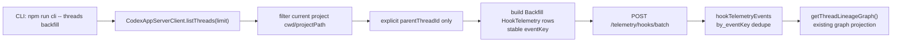

# TASK-0010: Minimal Thread Lineage Backfill CLI

## Summary
Add the smallest useful backfill command for manually forked Codex threads. The
command should scan current-project Codex thread metadata, emit one sanitized
lineage row for every thread with an explicit `parentThreadId`, and publish
those rows into the existing `hookTelemetryEvents` ingest path so the current
Raw Telemetry `Threads` graph can render hook-captured and backfilled edges
together.

## Scope
- `In:`
  - Add a `threads backfill` Farplane UI CLI command.
  - List recent Codex app-server threads through the existing
    `CodexAppServerClient`.
  - Filter to the current project path by default, with a minimal
    `--project-path <path>` override and `--limit <n>`.
  - Emit only explicit lineage where `thread.parentThreadId` is present.
  - Publish rows to `/telemetry/hooks/batch` with
    `hookName=thread-lineage-backfill`, `hookType=Backfill`, and payload
    `eventName=thread.forked`.
  - Use a stable dedupe key:
    `thread-lineage:v1:{projectId}:{parentThreadId}:{childThreadId}:forked`.
  - Support `--dry-run` and `--json`.
  - Add focused CLI unit tests and projection/dedupe coverage.
- `Out:`
  - No automation catalogue.
  - No title/preview inference.
  - No transcript/session-file scraping.
  - No new Convex table.
  - No new UI route or graph rewrite.
  - No attempt to distinguish `created` vs `forked` for backfilled metadata;
    explicit `parentThreadId` is treated as `forked` until Codex exposes a
    stronger creation-kind field.

## Delta
- `Before:`
  - `TASK-0008` captures live `create_thread` and `fork_thread` tool calls when
    hooks are trusted.
  - Manual forks or forks made before hook installation can be missing from the
    graph.
  - The graph already reads lineage rows from `hookTelemetryEvents`.
- `After:`
  - `npm run cli -- threads backfill` reconciles explicit parent-child metadata
    from current-project Codex threads into the same raw hook telemetry stream.
  - Hook and backfill rows dedupe by stable lineage `eventKey`.
  - The existing Threads graph shows the edge without caring whether it came
    from live hook capture or later backfill.
- `Why now:`
  - Manual thread forking is part of the operator workflow; a live-only hook
    cannot recover missed history.
- `First-principles basis:`
  - `objective:` recover missing thread lineage without broadening the graph
    model.
  - `need:` manually forked project contexts should be visible even if hooks
    were not trusted or installed at the time.
  - `root_cause:` live hooks observe tool calls, but backfill needs a project
    metadata reconciliation pass.
  - `constraint:` keep privacy and scope tight; no prompt, transcript, or
    heuristic inference.
  - `first viable slice:` explicit `parentThreadId` only.
  - `tradeoff:` some real lineage remains unknown, but the command is safe,
    deterministic, and dedupes cleanly with hook events.
  - `non-goals:` automation run graph, inferred lineage, persistent control
    mutations, and schema migration.

## Map


- `Touch:`
  - `cli/thread-commands.ts`
  - `cli/thread-commands.test.ts`
  - `cli/farplane-cli.ts`
  - `convex/modules/hookTelemetry/hookTelemetry.test.ts`
  - `tickets/TASK-0010/{ticket.md,program.md,progress.md}`
- `Inspect:`
  - `cli/AGENTS.md`
  - `cli/cli-utils.ts`
  - `ui/src/modules/runtime/lib/codex-app-server/client.ts`
  - `ui/src/modules/runtime/lib/codex-app-server/types.ts`
  - `convex/modules/hookTelemetry/events.ts`
  - `convex/modules/hookTelemetry/projections.ts`
  - `hooks/thread-lineage-listener/handler.ts`
- `Signature delta:`
  - `registerThreadCommands(program: Command): void`
  - `buildThreadLineageBackfillEvents(threads, options) -> HookTelemetryEnvelope[]`
  - `runThreadLineageBackfill(options) -> { scanned, emitted, duplicateSafeKeys }`
- `Typed flow:`
```text
CodexThread {
  id: string
  parentThreadId?: string | null
  cwd?: string
  name?: string | null
  preview?: string
  updatedAt?: number
}
  -> HookTelemetryEnvelope {
       hookName: "thread-lineage-backfill"
       hookType: "Backfill"
       projectId
       sessionId: parentThreadId
       eventAt: updatedAt || Date.now()
       eventKey: "thread-lineage:v1:{projectId}:{parent}:{child}:forked"
       payload: {
         eventName: "thread.forked"
         sourceTool: "backfill"
         parentThreadId
         childThreadId: id
         title
         cwd
       }
     }
```

## Program
```text
signature:
  minimal_thread_lineage_backfill(project_state, codex_threads) -> telemetry_rows + evidence

vars:
  ticket = tickets/TASK-0010/ticket.md
  program = tickets/TASK-0010/program.md
  progress = tickets/TASK-0010/progress.md
  cli = cli/thread-commands.ts
  graph = convex/modules/hookTelemetry/projections.ts

program:
  1. add_thread_command_shell() -> registered `threads backfill`
     - reuse commander and CLI output patterns
     - keep JSON output stable for tests
  2. build_backfill_rows() -> deterministic envelopes
     - include only threads with explicit `parentThreadId`
     - derive project id from project path using the existing codex slug rule
     - generate stable event keys that match the logical parent-child-kind edge
  3. publish_or_dry_run() -> HTTP batch ingest or preview
     - use `FARPLANE_CONVEX_SITE_URL || CONVEX_SITE_URL`
     - use optional `FARPLANE_TELEMETRY_TOKEN`
     - dry-run prints rows without network
  4. verify_dedupe() -> tests
     - CLI unit tests for filter, event shape, dry-run, missing URL, and JSON
     - projection test proving `thread-lineage-backfill` rows render in graph
     - ingest event-key behavior already covered by module tests; add a focused
       regression only if needed while implementing
  5. run_evidence() -> command proof
     - run targeted tests
     - run `npm run cli -- threads backfill --dry-run --json`
     - run typecheck/root build gate if touched imports require it
```

## Goal Packet Preview
```text
goal_packet:
  ticket: tickets/TASK-0010/ticket.md
  program: tickets/TASK-0010/program.md
  progress: tickets/TASK-0010/progress.md
  files:
    - tickets/TASK-0010/ticket.md
    - tickets/TASK-0010/program.md
    - tickets/TASK-0010/progress.md
    - cli/AGENTS.md
    - cli/farplane-cli.ts
    - cli/cli-utils.ts
    - ui/src/modules/runtime/lib/codex-app-server/client.ts
    - ui/src/modules/runtime/lib/codex-app-server/types.ts
    - convex/modules/hookTelemetry/events.ts
    - convex/modules/hookTelemetry/projections.ts
    - hooks/thread-lineage-listener/handler.ts
  budget:
    time: one focused implementation pass
    compute: local CLI tests, focused telemetry tests, typecheck
    spend: none
    deploy: none
    destructive_actions: none
  metric: mechanical checks plus CLI dry-run proof
  proof_route:
    - focused Vitest for CLI backfill and lineage projection
    - `npm run cli -- threads backfill --dry-run --json`
    - `npm run typecheck:root -- --pretty false`
  drift_policy:
    - stop before adding automation catalogue, transcript scraping, title
      inference, a new Convex table, or UI graph redesign
  final_evidence:
    - final response summarizes command outputs and changed files
    - no screenshot required because this slice adds a CLI data backfill path,
      not a new user-visible UI state
  native_goal_prompt: |
    /goal Run the following files as one Goal Packet.
    Files:
    - tickets/TASK-0010/ticket.md
    - tickets/TASK-0010/program.md
    - tickets/TASK-0010/progress.md
    - cli/AGENTS.md
    - cli/farplane-cli.ts
    - cli/cli-utils.ts
    - ui/src/modules/runtime/lib/codex-app-server/client.ts
    - ui/src/modules/runtime/lib/codex-app-server/types.ts
    - convex/modules/hookTelemetry/events.ts
    - convex/modules/hookTelemetry/projections.ts
    - hooks/thread-lineage-listener/handler.ts

    Task: Complete TASK-0010 exactly as defined by the listed ticket and
    program. Implement the minimal project-scoped `threads backfill` CLI path
    for explicit `parentThreadId` lineage only. Preserve the ticket's out-of-
    scope boundaries: no automation catalogue, no transcript scraping, no title
    inference, no new Convex table, and no UI graph redesign.

    Logging: Before ending each turn, append a compact structured entry to
    tickets/TASK-0010/progress.md with changes, checks, blockers, and next
    action.

    Metric: Satisfy the Done / Proof in tickets/TASK-0010/ticket.md and the
    mechanical proof route in tickets/TASK-0010/program.md.

    After each turn: Compare progress against the listed files, continue within
    the current implementation window if useful, otherwise mark complete only
    when the CLI command, tests, typecheck, and progress writeback are done.

    Approval: The operator explicitly requested this Goal-backed implementation
    after the plan; do not broaden scope without returning to planning.
  approval:
    status: approved
    rule: user requested Goal-backed end-to-end run on 2026-06-24
```

## Done / Proof
```text
done_when:
  - `npm run cli -- threads backfill --dry-run --json` exists and prints
    deterministic project-scoped candidate rows without network side effects.
  - backfill emits rows only for threads with explicit `parentThreadId`.
  - backfill event keys dedupe against repeated runs and equivalent hook rows
    by logical `{projectId,parentThreadId,childThreadId,kind}`.
  - existing `getThreadLineageGraph` renders backfill rows as forked edges.
  - progress and ticket state are updated with evidence.

proof:
  checks:
    - npm run test:once -- cli/thread-commands.test.ts convex/modules/hookTelemetry/hookTelemetry.test.ts
    - npm run cli -- threads backfill --dry-run --json
    - npm run typecheck:root -- --pretty false
  manual:
    - inspect dry-run JSON for `hookName=thread-lineage-backfill`,
      `hookType=Backfill`, `eventName=thread.forked`, and stable event keys
  review:
    - rubric: minimality, no transcript scraping, no new table, no UI redesign,
      stable dedupe key
      required_tas: self-review sufficient for CLI-only mechanical slice
  evidence:
    - tickets/TASK-0010/progress.md
```

## Documentation / Closeout
```text
docs_closeout:
  close_ticket: required
  documentation_skill: not_required
  docs_changed:
    - tickets/TASK-0010/ticket.md
    - tickets/TASK-0010/program.md
    - tickets/TASK-0010/progress.md
  documentation_reason: none; command behavior is covered by ticket and CLI help
  final_writeback:
    - update ticket/progress evidence
    - summarize command output and checks in final response
```

## State
- `next_action:` review diff and decide whether project Threads tab should consume this graph next.
- `blocked:` false
- `latest_verification:` focused Vitest, root typecheck, and real CLI dry-run passed on 2026-06-24.
- `plan_qa:`
  - `minimal_required_version:` pass
  - `reuse_before_new_surface:` pass
  - `least_parameters:` pass
  - `new_files_functions_justified:` pass
  - `goal_packet_preview:` pass
  - `clarifying_questions:` pass; no blocking ambiguity
  - `proof_route_explicit:` pass
  - `documentation_closeout_route:` pass
  - `highest_risk:` Codex app-server may not expose `parentThreadId` for all
    manual forks.
  - `fix_or_deferral:` keep explicit-only; do not infer lineage from titles.

## Links
- `program:` tickets/TASK-0010/program.md
- `progress:` tickets/TASK-0010/progress.md
- `artifacts:` none yet
- `review:` inline plan QA above
- `refs:` TASK-0008, hook telemetry module, Codex app-server client/types, CLI AGENTS

## Notes
- `Blast radius:` CLI command plus existing hook telemetry projection tests.
- `Risks / rollback:` remove `threads` CLI registration and new command file;
  no schema changes.
- `Follow-ups:` project-scoped Threads tab can consume the same graph later.
