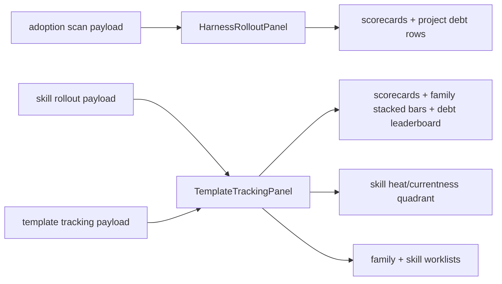

# TASK-0012: Build Rollout Adoption Dashboard Charts

## Summary
Rollout and Template Tracking should read as migration dashboards, not catalog
inventories. Operators need to see which projects, template families, and
skills are on the latest version, where version debt is concentrated, and which
hot skills deserve immediate maintenance.

## Scope
- In:
  - Add high-level adoption scorecards to Rollout and Template Tracking.
  - Add stacked version/status distribution bars for template families.
  - Add a rollout debt leaderboard sorted by stale/missing consumers.
  - Add a skill heat/currentness quadrant using existing skill rollout data.
  - Preserve row-by-row worklists for exact remediation targets.
  - Treat ticket templates as active/new-ticket compliance rather than archived
    historical debt when that data is distinguishable.
- Out:
  - New backend scan commands or schema changes.
  - Historical trend storage.
  - Writing template upgrades from the UI.
  - Full visual redesign of the Harness Map, Skill OS, or Eval OS.

## Delta
- `Before:` Template Tracking is family/catalog-first and shows counts such as
  tracked, unversioned, gaps, and consumers without making latest-version
  adoption the main story. Rollout is mainly a project table.
- `After:` The top of the surfaces answers "how close are we to latest?" with
  scorecards and charts, then the bottom rows answer "what do I fix next?"
- `Why now:` The operator clarified that rollout is fundamentally about moving
  projects, skills, and template families to latest versions, while archived
  historical tickets should not create false debt.
- `First-principles basis:` Objective is migration clarity. The system already
  has read-only adoption, skill rollout, template rollout, and heat-adjacent
  payloads; the missing layer is display priority, not more data modeling.
  First viable slice uses existing payloads only. Proof is type/build plus a
  browser-visible dashboard state. Non-goal is automated remediation.

## Map



- `Touch:`
  - `ui/src/modules/harness-os/harness-rollout-panel.tsx`
  - `ui/src/modules/harness-os/template-tracking-panel.tsx`
  - `ui/src/modules/harness-os/harness-os-types.ts` if existing optional
    fields need safer typing.
- `Inspect:`
  - `ui/src/components/ui/chart.tsx`
  - `ui/src/modules/telemetry/components/telemetry-dashboard-recharts.tsx`
  - `ui/src/modules/harness-os/use-harness-os-data.ts`
- `Legend:` adoption payloads stay read-only; chart transforms are local UI
  projections; row tables remain the remediation surface.

## Program

```text
signature:
  rollout_dashboard(existing_payloads) -> charts + rows + verification

vars:
  target = rollout/template dashboard v1
  owner = ui/src/modules/harness-os

program:
  ground(payloads, current_panels) -> chart_transform_plan
  change(chart_transform_plan) -> dashboard_components
  verify(done_when, proof) -> type/build/browser evidence
```

## Goal Packet Preview

```text
goal_packet:
  ticket: tickets/TASK-0012/ticket.md
  program: tickets/TASK-0012/program.md
  progress: tickets/TASK-0012/progress.md
  files:
    - tickets/TASK-0012/ticket.md
    - tickets/TASK-0012/program.md
    - tickets/TASK-0012/progress.md
    - ui/src/modules/harness-os/harness-rollout-panel.tsx
    - ui/src/modules/harness-os/template-tracking-panel.tsx
    - ui/src/modules/harness-os/harness-os-types.ts
  budget:
    time: current implementation turn
    spend: none
  metric:
    mechanical checks plus browser-visible UI evidence
  proof_route:
    self implementation checks, browser screenshot if local app can run
  drift_policy:
    compare against this ticket before final response
  final_evidence:
    include checks run and best available UI evidence or blocker
  native_goal_prompt: |
    /goal Run the listed files as one Goal Packet. Complete the dashboard
    charts and worklists described in TASK-0012, update progress.md before
    finishing, verify with type/build and browser evidence when possible, and
    preserve unrelated dirty worktree changes.
  approval:
    status: approved
    rule: user explicitly asked to create the ticket and implement with a Goal
```

## Done / Proof

```text
done_when:
  - Rollout shows project latest/spec adoption scorecards and project debt rows.
  - Template Tracking shows latest adoption scorecards, family distribution
    bars, rollout debt leaderboard, and row worklists.
  - Skill rollout data is used to show hot/current/stale skill maintenance
    priority.
  - Archived/historical ticket template debt is not implied as rollout debt.

proof:
  checks:
    - npm run typecheck:root or narrower TypeScript check if root debt blocks
    - npm run ui:build when practical
    - git diff --check
  manual:
    - inspect `/template-rollout` or equivalent panel in browser if app starts
  review:
    - rubric: UI usefulness and evidence sufficiency
      required_tas: local pass
  evidence:
    - progress.md updated with implementation and verification
    - screenshot path when browser proof succeeds
```

## Documentation / Closeout

```text
docs_closeout:
  close_ticket: required
  documentation_skill: not_required
  docs_changed:
    - tickets/TASK-0012/*
  documentation_reason: ticket writeback only
  final_writeback:
    - ticket status and latest verification
    - progress entries
    - checks and browser evidence
```

## State
- `next_action:` user review of shipped dashboard shape
- `blocked:` false
- `latest_verification:` root typecheck, UI build, targeted Harness lint,
  whitespace check, route smoke checks, and Playwright screenshot proof passed.
- `result:` done

## Links
- `program:` tickets/TASK-0012/program.md
- `progress:` tickets/TASK-0012/progress.md
- `artifacts:` tickets/TASK-0012/artifacts/
- `review:` local pass
- `refs:`
  - docs/specs/FP02-harness-product-model.md
  - ui/src/modules/harness-os/README.md
  - /Users/kenjipcx/Zanarkand Technologies/projects/Farplane/docs/farplane-framework/harness-maintenance.md

## Notes
- `Blast radius:` Harness OS rollout/template panels only.
- `Risks / rollback:` If chart transforms misread optional payload fields,
  fallback rows and empty states must still render.
- `Follow-ups:` Historical adoption trend lines need scan snapshots and are out
  of this ticket.
- `Evidence:`
  - `tickets/TASK-0012/artifacts/template-rollout-dashboard.png`
  - `tickets/TASK-0012/artifacts/rollout-dashboard.png`
