# TASK-0013: Build Deterministic Office Layout Solver

## Summary
Office auto-fit should behave like a small game-layout solver: reserve walkable
paths, place required teams, pack optional objects into legal leftover space,
then prune empty edge tiles without breaking navigation. The current code has
most of these pieces, but they are split across the mapper and area helpers, so
area-first strategies such as `team_neighborhoods` can bypass the final compact
and walkability optimization pass.

## Scope
- In:
  - Add a deterministic solver surface for automatic office layout generation.
  - Treat reserved walk paths as first-class walkable occupancy: objects cannot
    claim path cells, agents can traverse them.
  - Wire the solver first to `team_neighborhoods`; keep `manual` untouched.
  - Preserve existing team area debug overlays and the no-generated-wall
    direction.
  - Reuse existing occupancy, placement reservation, quality scoring, area
    layout, and edge-pruning code where possible.
  - Add focused unit tests for path reservation, object packing, edge pruning,
    and area-first solver wiring.
- Out:
  - Generated wall/divider features.
  - Full physics, realtime navigation, or employee locomotion rewrites.
  - Persisting solver debug data into sidecars.
  - New user-facing layout strategy settings beyond existing strategies.
  - Replacing manual builder placement.

## State
- Implemented and verified on 2026-06-25.
- Browser proof captured at
  `tickets/TASK-0013/artifacts/screens/team-neighborhoods-office-final-proof.png`
  after temporarily switching the local sidecar to `team_neighborhoods`; the
  sidecar was restored to its prior `activity_treemap` strategy afterward.
- `office-layout-solver.ts` is intentionally kept as one owner file for this
  first solver pass even though it is over 500 raw lines. Split plan: after the
  next strategy reuse or follow-up review, extract route reservation,
  optional-object packing, and edge-pruning helpers into module-local files
  under `ui/src/modules/office/lib/` without changing the public
  `solveOfficeAutoLayout` contract.

## Delta
- `Before:` `office-data-mapper.ts` owns a long mixed pipeline. Classic auto-fit
  gets connectivity candidates and pruning, while area-first strategies derive
  a planning rectangle and can skip the compact final solver pass.
- `After:` automatic layout runs through one staged solver contract:
  semantic areas -> required team anchors -> reserved walk graph -> furniture
  placement -> edge pruning -> quality report. `team_neighborhoods` uses that
  solver before returning scene data.
- `Why now:` The office looks visually uneven when team areas are clear but the
  actual floor shape, pathing, and furniture packing are not solved together.
  The operator wants the path drawn first so it blocks furniture placement,
  which is exactly a reserved-walkable-cell solver model.
- `First-principles basis:` The objective is a compact, readable founder-control
  office. Required teams and access lanes are hard constraints; optional
  furniture and empty-tile reduction are soft optimization. The first viable
  slice should improve `team_neighborhoods` only, because that is the current
  default and the strategy with the most visible area-first mismatch. The main
  tradeoff is accepting a deterministic heuristic solver rather than a global
  optimizer, so layouts stay debuggable and fast.

## Map

```mermaid
flowchart LR
  strategy["layout strategy + company graph"] --> areas["office-area-layout\nareas + preferred anchors"]
  areas --> required["required objects\nteam clusters + locked furniture"]
  required --> paths["reserved walk graph\nMST + loops + routed corridors"]
  paths --> pack["placement-engine\npack optional furniture outside paths"]
  pack --> prune["edge prune\npreserve POI connectivity + reserved paths"]
  prune --> quality["office-layout-quality\nscore + debug report"]
  quality --> mapper["office-data-mapper\ntoOfficeData output"]
```



- `Touch:`
  - `ui/src/modules/office/lib/office-layout-solver.ts`
  - `ui/src/modules/office/lib/office-layout-solver.test.ts`
  - `ui/src/providers/office-data-mapper.ts`
  - `ui/src/providers/office-data-provider.test.ts`
  - `ui/src/modules/office/lib/office-area-layout.test.ts` if existing area
    expectations need solver-aware updates
- `Inspect:`
  - `ui/src/modules/office/lib/office-area-layout.ts`
  - `ui/src/modules/office/lib/office-layout-quality.ts`
  - `ui/src/modules/office/systems/occupancy-system.ts`
  - `ui/src/modules/office/systems/placement-engine.ts`
  - `ui/src/modules/settings/settings-dialog-panels.tsx`
- `Legend:` keep existing area strategies and UI settings; add one solver owner;
  move/compose mapper-private helpers only when that reduces duplication.

## Program

```text
signature:
  solveOfficeAutoLayout(input) -> office_layout_solution

types:
  OfficeLayoutSolverInput:
    strategy
    sourceLayout
    company
    planningTeams
    lockedObjects
    optionalObjects
    workload?
    activity?

  OfficeLayoutSolution:
    officeLayout
    officeAreas
    teamAnchorsByTeamId
    placedObjects
    reservedWalkTiles
    quality
    debug

hard_constraints:
  - manual layout never enters the solver
  - all required team clusters stay inside the final officeLayout
  - locked objects keep their persisted positions
  - reservedWalkTiles cannot be occupied by optional furniture
  - all important POIs remain reachable after pruning
  - min lane size and min room/table padding are enforced for generated layout

soft_score:
  - reward more optional objects placed legally
  - reward lower empty edge area
  - reward shorter average important path length
  - penalize dead ends and choke points
  - reward parent/child project proximity from area ordering

program:
  1. Extract solver-local primitives from mapper where reuse is justified:
     connectivity graph, corridor reservation, object packing, prune guard.
  2. Build the `team_neighborhoods` solver path:
     area layout -> required team anchors -> reserved corridors -> furniture
     placement -> pruned final layout -> quality report.
  3. Keep `legacy`, `activity_treemap`, and `command_districts` behavior stable
     unless tests show the new solver can safely share one helper.
  4. Update `toOfficeData` to call the solver for `team_neighborhoods` and
     remove the bypass where area-first layouts skip final compacting.
  5. Add tests proving required POIs remain connected, path cells block
     furniture placement, empty edges shrink, and manual mode preserves exact
     object/layout coordinates.
```

## Goal Packet

```text
goal_packet:
  ticket: tickets/TASK-0013/ticket.md
  program: tickets/TASK-0013/program.md
  progress: tickets/TASK-0013/progress.md
  generated_goal_prompt: tickets/TASK-0013/generated-goal-prompt.md
  files:
    - tickets/TASK-0013/ticket.md
    - tickets/TASK-0013/program.md
    - tickets/TASK-0013/progress.md
    - tickets/TASK-0013/generated-goal-prompt.md
    - ui/src/modules/office/lib/office-layout-solver.ts
    - ui/src/modules/office/lib/office-layout-solver.test.ts
    - ui/src/providers/office-data-mapper.ts
    - ui/src/providers/office-data-provider.test.ts
  trigger: active_goal
  budget:
    time: current implementation window
    token_model_compute: not specified
    subagents: none required unless QA/review needs isolation
    spend: none
  metric:
    hybrid: focused mechanical tests, typecheck, and browser-visible UI evidence
  drift_policy:
    compare every turn against this ticket, program.md, and progress.md
  proof_route:
    implementation checks plus browser screenshot when local UI launches cleanly
  final_evidence:
    final response includes checks and 
    when screenshot proof succeeds; otherwise include blocker reason
  approval:
    status: approved
    rule: operator explicitly asked Goal Advisor to run the ticket end to end
```

## Agent Contract

```text
Open:
  npm run ui, then /office with Settings -> Office layout strategy set to
  Team Neighborhoods

Test hook:
  focused Vitest tests for office-layout-solver plus office-data-provider mapper
  tests using artificial large-team fixtures

Stabilize:
  use deterministic fixture company models; do not depend on live runtime polling

Inspect:
  team area debug overlay, office stats HUD, rendered team tables, optional
  furniture count, and no generated walls

Key screens/states:
  - default Team Neighborhoods office
  - large team / many employees fixture
  - manual layout strategy preserving builder coordinates

QA cookbook:
  qa/README.md first; no dedicated cookbook yet

Taste refs:
  docs/TASTE.md, especially compact operational density and avoiding decorative
  whitespace

Expected artifacts:
  focused test output and one browser screenshot of the final office if local UI
  proof succeeds

Delegate with:
  tickets/TASK-0013/ticket.md
```

## Done / Proof

```text
done_when:
  - `team_neighborhoods` uses the new deterministic solver path.
  - Solver output reserves walkable path tiles before optional furniture packing.
  - Optional furniture cannot occupy reserved walk path cells.
  - Edge-tile pruning reduces empty area without disconnecting important POIs.
  - Manual layout still returns persisted layout and object coordinates exactly.
  - Generated wall/divider behavior remains absent from auto layout.

proof:
  checks:
    - npx vitest run ui/src/modules/office/lib/office-layout-solver.test.ts ui/src/providers/office-data-provider.test.ts ui/src/modules/office/lib/office-area-layout.test.ts
    - npm run typecheck:root
    - git diff --check
  manual:
    - launch `npm run ui` and inspect `/office` in Team Neighborhoods mode
    - confirm a large-team fixture has readable tables, connected lanes, no wall spam, and less dead empty edge space
  review:
    - rubric: layout correctness, solver ownership, and proof sufficiency
      required_tas: local pass
  evidence:
    - ticket progress entry with changed files and checks
    - screenshot path for the best office proof, or blocker reason if browser proof cannot run
```

## Documentation / Closeout

```text
docs_closeout:
  close_ticket: required
  documentation_skill: not_required
  docs_changed:
    - tickets/TASK-0013/*
  documentation_reason: ticket writeback only unless solver behavior becomes a reusable spec
  final_writeback:
    - ticket status, verification results, and screenshot/proof paths
    - any follow-up ticket for graph/org-layout solver expansion
```

## Plan QA

```text
plan_qa:
  minimal_required_version: pass
  reuse_before_new_surface: pass
  least_parameters: pass
  new_files_functions_justified: pass
  goal_packet_preview: pass
  clarifying_questions: pass
  proof_route_explicit: pass
  documentation_closeout_route: pass
  highest_risk: extracting mapper helpers could accidentally change non-target strategies
  fix_or_deferral: wire the new solver only to `team_neighborhoods` first and keep legacy/treemap/command behavior under existing tests
```

## State
- `next_action:` implement the solver and verify
- `blocked:` false
- `latest_verification:` not run
- `result:` pending

## Links
- `program:` tickets/TASK-0013/program.md
- `progress:` tickets/TASK-0013/progress.md
- `generated_goal_prompt:` tickets/TASK-0013/generated-goal-prompt.md
- `artifacts:` tickets/TASK-0013/artifacts/
- `review:`
- `refs:`
  - ui/src/modules/office/AGENTS.md
  - ui/src/modules/office/README.md
  - ui/src/modules/office/lib/office-area-layout.ts
  - ui/src/modules/office/lib/office-layout-quality.ts
  - ui/src/modules/office/systems/occupancy-system.ts
  - ui/src/modules/office/systems/placement-engine.ts
  - ui/src/providers/office-data-mapper.ts
  - docs/TASTE.md

## Notes
- `Blast radius:` Office auto-layout generation and mapper tests. Manual layout
  and builder placement must stay stable.
- `Risks / rollback:` If solver extraction grows too large, keep the new file as
  a thin orchestrator and leave helper implementations in the mapper for this
  ticket. Rollback is reverting the `team_neighborhoods` call site to the
  current area-first path.
- `Follow-ups:` Add graph/org-chart strategy only after this solver has a stable
  path reservation and quality report contract.
