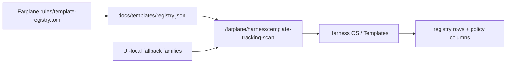

# TASK-0015: Back Template Tracking With The Farplane Template Registry

## Summary
Template Tracking should be a registry-backed maintenance surface, not a
second hardcoded UI inventory. Farplane already owns a high-impact template
registry in `rules/template-registry.toml` and generated
`docs/templates/registry.jsonl`; Farplane-UI should prefer that registry,
decorate it with maintainability policy, and only use the UI-local family list
as a fallback when the registry is unavailable.

## Scope
- In:
  - Read Farplane `docs/templates/registry.jsonl` from the framework root.
  - Convert registry rows into Template Tracking families.
  - Add maintainability policy fields for owner-local templates:
    `installTarget`, `historyPolicy`, `consumerScope`, and `registryPath`.
  - Keep templates physically owner-local; do not relocate source templates in
    this ticket.
  - Show registry/policy fields in Template Tracking rows so the operator can
    distinguish install-global, skill-package, project-scaffold, and source-only
    templates.
  - Preserve the existing UI-local scan as an honest fallback.
  - Document the Harness OS contract in the module README.
- Out:
  - Moving Farplane template files between directories.
  - Adding writer controls for template upgrades.
  - Mining git history or storing old template versions.
  - Replacing Skill OS skill-template rollout details.

## Delta
- `Before:` Template Tracking has a UI-local `TEMPLATE_TRACKING_FAMILIES` list
  that can drift from the Farplane framework registry and includes scanner-gap
  placeholders as if they were first-class tracked templates.
- `After:` Template Tracking prefers Farplane's generated template registry as
  the source of truth, then adds UI policy labels that explain where templates
  live, how they are installed, and what history policy applies.
- `Example:` `global-agents-template` reads from the registry path
  `templates/global/AGENTS.md`, shows `codex-global` as install target, and
  remains source-owned by the Farplane framework rather than being copied into a
  new UI-specific template folder.

## Map



- `Touch:`
  - `ui/vite.config.ts`
  - `ui/src/modules/harness-os/harness-os-types.ts`
  - `ui/src/modules/harness-os/template-tracking-panel.tsx`
  - `ui/src/modules/harness-os/README.md`
- `Inspect:`
  - `/Users/kenjipcx/Zanarkand Technologies/projects/Farplane/docs/templates/registry.jsonl`
  - `/Users/kenjipcx/Zanarkand Technologies/projects/Farplane/docs/templates/README.md`
  - `tickets/TASK-0012/ticket.md`
- `Legend:` registry rows are truth; UI-local rows are fallback; template files
  stay near their owner surface.

## Program

```text
signature:
  template_tracking_scan(registry_jsonl?, local_fallback, policy_rules)
    -> registry_backed_families + policy_columns + fallback_status

program:
  load_registry(framework_root) -> rows | unavailable
  project_rows(rows, manifest, policy_rules) -> template_tracking_payload
  render_policy(payload) -> useful Template Tracking table
  verify(types, build, route_smoke?) -> evidence
```

## Done / Proof

```text
done_when:
  - Template Tracking scan prefers Farplane docs/templates/registry.jsonl when
    present.
  - Payload rows include install target, history policy, consumer scope, and
    registry path.
  - UI table renders those policy fields without replacing the adoption charts.
  - The existing hardcoded family list remains as a fallback only.
  - Module docs state the maintainability rule: keep templates with the owner,
    index them through the registry, and install only runtime-needed templates.

proof:
  checks:
    - npm run typecheck:root or focused typecheck if root debt blocks
    - npm run ui:build when practical
    - git diff --check
  manual:
    - curl /farplane/harness/template-tracking-scan and confirm registry-backed
      rows are present
    - browser or route smoke for /template-tracking if local app can run
  review:
    - rubric: registry is the backbone and policy columns match the
      maintainability decision
      required_tas: local pass
  evidence:
    - progress.md updated with changed files and verification
    - screenshot path if browser proof succeeds
```

## State
- `next_action:` user review of registry-backed Template Tracking surface
- `blocked:` false
- `latest_verification:` 2026-06-25 root typecheck, UI build, diff check,
  endpoint proof, browser screenshots for Harness OS, Features, Templates, and
  Projects
- `result:` done

## Links
- `program:` tickets/TASK-0015/program.md
- `progress:` tickets/TASK-0015/progress.md
- `generated_goal_prompt:` tickets/TASK-0015/generated-goal-prompt.md
- `artifacts:` tickets/TASK-0015/artifacts/
- `refs:`
  - tickets/TASK-0012/ticket.md
  - /Users/kenjipcx/Zanarkand Technologies/projects/Farplane/docs/templates/registry.jsonl
  - /Users/kenjipcx/Zanarkand Technologies/projects/Farplane/docs/templates/README.md

## Notes
- `Blast radius:` Harness OS Template Tracking scan and panel only.
- `Risk:` Farplane registry may be unavailable in non-local installs; fallback
  rows must stay useful and explicitly marked.
- `Evidence:`
  - `tickets/TASK-0015/artifacts/template-tracking-registry-backed.png`
  - `tickets/TASK-0015/artifacts/harness-os-four-tabs.png`
  - `tickets/TASK-0015/artifacts/harness-features-registry.png`
  - `tickets/TASK-0015/artifacts/harness-templates-registry-db.png`
  - `tickets/TASK-0015/artifacts/harness-projects-rollout.png`
