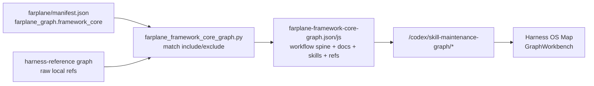

# TASK-0016: Render Manifest-Backed Framework Core Graph In Harness OS

## Summary
Harness OS Map currently approximates Framework Core with a UI keyword filter over the broad harness reference graph. Replace that with a generated `farplane-framework-core` projection driven by `farplane/manifest.json` so the map shows key framework docs, workflow lanes, ordered workflow skills, direct framework refs, and hot-skill weight.

## Scope
- In:
  - Add `farplane_graph.framework_core.include` / `exclude` config to the Farplane framework manifest.
  - Add a Farplane graph projection that reads the manifest config, matches source framework docs from the existing harness-reference graph, keeps direct framework file/spec refs, adds workflow spine nodes, connects ordered workflow skills, adds directly mentioned skills, and annotates projection role as `source`, `workflow`, `linked`, or `isolated`.
  - Swap Harness OS Map from UI keyword filtering to the generated framework-core graph artifact.
  - Capture browser evidence for the Harness OS Map after implementation.
- Out:
  - No new standalone framework-core registry file.
  - No script-policy hardcoding.
  - No graph editing UI.
  - No broad cleanup of unrelated dirty worktree changes.

## Delta
- Before: `FrameworkCoreMap` filters labels like `goal`, `template`, and `harness` inside Farplane-UI, which hides why a node is present and cannot report isolated source files.
- After: Farplane emits `farplane-framework-core-graph.json` from manifest include/exclude patterns, workflow spine config, ordered workflow skills, direct framework refs, and directly mentioned skills. Farplane-UI renders that graph directly and surfaces `source`, `workflow`, `linked`, `isolated`, and `other` roles.
- Why now: The operator wants Harness Map to explain how Farplane governs self-improvement from source docs through linked skills, templates, validators, and rollout surfaces without noisy scripts or hand-coded UI guesses.
- First-principles basis: The manifest owns framework membership and rollout state. The projection owns relationship shape. Framework docs explain the lifecycle; workflow lanes explain order; skill heat shows which skill nodes matter most in recent usage.

## Program

```text
signature:
  implement_framework_core_graph(manifest, harness_reference_graph, ui_map)
    -> projection_artifact + Harness OS map evidence + ticket_state_delta

vars:
  farplane_root = /Users/kenjipcx/Zanarkand Technologies/projects/Farplane
  ui_root = /Users/kenjipcx/Zanarkand Technologies/projects/Farplane-UI
  projection = farplane-framework-core

program:
  ground(vars)
    -> inspect manifest, graph generators, UI fetch/model/render seams
  change_farplane(vars)
    -> manifest config + projection profile + projection builder + generated JSON/JS
  change_ui(vars)
    -> fetch framework-core artifact + render graph without keyword filter
  verify(done_when, proof)
    -> Farplane generator tests/checks + UI type/build + browser screenshot
```

## Map



## Done / Proof

```text
done_when:
  - farplane/manifest.json contains manifest-owned framework_core include/exclude graph config.
  - graph projection dispatcher lists and generates farplane-framework-core.
  - generated framework-core graph includes key framework source docs, workflow nodes, ordered workflow skill edges, skill heat, direct framework refs, mentioned skills, connected edges, isolated source role, and other fallback role.
  - Harness OS Map fetches farplane-framework-core-graph.json, no longer uses keyword filtering, and defaults to a configurable directed depth lens from the framework README.
  - Browser evidence shows Harness OS Map rendering the projection.

proof:
  checks:
    - python3 -m py_compile skills/skill-maintenance/scripts/*.py
    - python3 skills/skill-maintenance/scripts/generate_graph_projection.py --projection farplane-framework-core --check
    - npm run typecheck:root
    - npm run ui:build
    - git diff --check in both repos
  manual:
    - Browser QA: open Harness OS Map and capture screenshot of the lifecycle/workflow projection.
  review:
    - rubric: local TAS-style self-review with explicit remaining risks
      required_tas: pass-ready
  evidence:
    - tickets/TASK-0016/artifacts/harness-framework-core-workflow-spine.png
```

## State
- `next_action:` review the generated Framework Core map for useful include/exclude tuning
- `blocked:` false
- `latest_verification:` Farplane projection check, focused Python unit/compile checks, UI typecheck/build, browser screenshot, and git diff checks passed on 2026-06-25
- `result:` done

## Links
- `program:` tickets/TASK-0016/program.md
- `progress:` tickets/TASK-0016/progress.md
- `artifacts:` tickets/TASK-0016/artifacts/
- `review:` local pass-ready review in final implementation turn
- `refs:`
  - /Users/kenjipcx/Zanarkand Technologies/projects/Farplane/farplane/manifest.json
  - /Users/kenjipcx/Zanarkand Technologies/projects/Farplane/skills/skill-maintenance/scripts/generate_harness_graph.py
  - /Users/kenjipcx/Zanarkand Technologies/projects/Farplane-UI/ui/src/modules/harness-os/harness-os-panel.tsx
  - /Users/kenjipcx/Zanarkand Technologies/projects/Farplane-UI/ui/src/modules/harness-os/use-harness-os-data.ts

## Notes
- Blast radius: one Farplane projection path plus one Harness OS Map fetch/render seam.
- Risks / rollback: if the projection is too noisy, tighten manifest include/exclude patterns rather than reintroducing UI keywords.
- Follow-ups: add richer layout/grouping only after the generated projection proves useful.
- Latest correction: Framework Core Map now uses key framework docs, workflow spine nodes, ordered workflow skills, direct framework refs, directly mentioned skills, and skill heat. The generated graph is 58 nodes / 176 edges before UI feature overlays; the default Harness OS lens shows 30 nodes / 62 edges from `workflow:lifecycle`.
