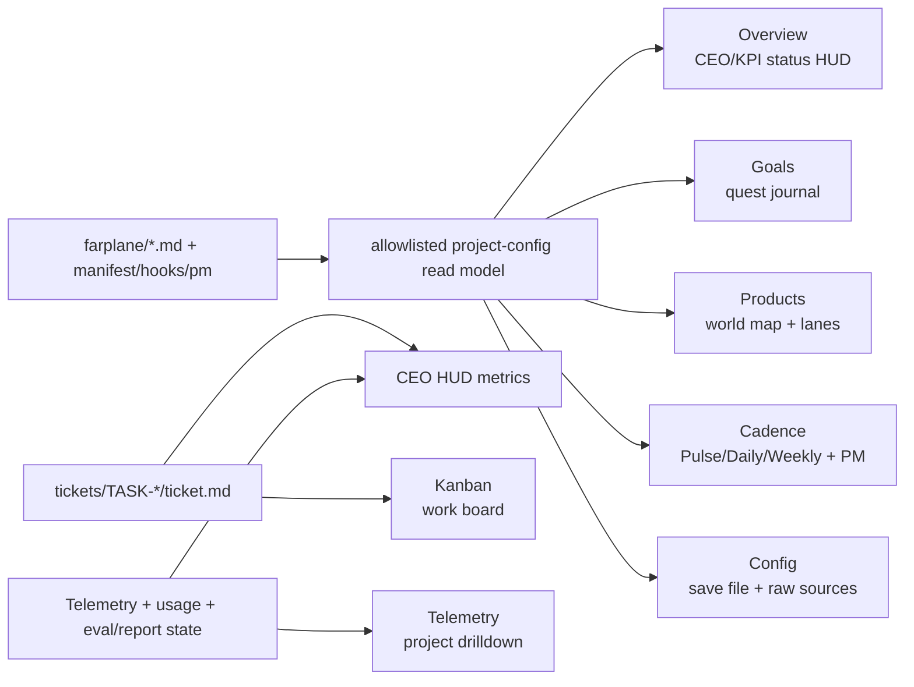

# TASK-0017: Render Game-Style Farplane Project HUD In Team Panel

## Summary
Redo the Team Panel as a project-backed game HUD for a Farplane team. Overview
must be the CEO first-glance screen: current goal, KPI gauges, ticket/agent
status, runtime burn, proof health, harness rules, and the PM in charge. The
other tabs render the canonical `farplane/` files as playable control surfaces:
quest journal, product world map, work board, cadence clock, telemetry drilldown,
and final manifest/config screen.

This plan supersedes the earlier config-constellation version of `TASK-0017`.
The file-backed read model still matters, but the first experience should feel
like Sims/KH-style status management for an autonomous team, not a manifest
browser.

## Scope
- In:
  - Add or reuse a lazy project-config read model for:
    `farplane/manifest.json`, `README.md`, `harness.md`, `goals.md`,
    `products.md`, `automations.md`, `bindings.md`, `evals.md`, `hooks.json`,
    and optional `pm.json`.
  - Render Team Panel top-level tabs as:
    `Overview`, `Goals`, `Products`, `Kanban`, `Cadence`, `Telemetry`, and
    `Config`.
  - Make `Overview` the CEO/KPI game HUD:
    current goal, current milestone, KPI gauges, ticket counts, active/done
    progress, queue pressure, AI burn, project telemetry headline, latest proof
    state, harness rules, and PM leader card.
  - Render `harness.md` primarily inside Overview as traits/rules/authority
    cards, with full detail under `Config > Harness`.
  - Render `goals.md` as a quest journal with KPI gauges, current bet, milestone,
    starting tasks, holds, and PM autonomy boundary.
  - Render `products.md` as a product/world map with product rows, work-lane
    weights, rewards, and ticket lane matching.
  - Keep `Kanban` as the primary work board.
  - Render `Cadence` from `automations.md`, `pm.json`, `.farplane/reports/`,
    and `hooks.json`.
  - Render `Telemetry` with the existing project/team-scoped telemetry surface.
  - Render `Config` as the final save-file/config screen: manifest, bindings,
    hooks, raw files, and source health.
  - Preserve source labels, freshness, empty/missing states, parse errors, and
    deep links to global Skill OS, Eval OS, Harness OS, Telemetry, and PM chat.
- Out:
  - No editing UI for Farplane config files.
  - No scheduler mutation, live automation activation, deploy, publish, spend,
    external mutation, or secret handling.
  - No new dynamic module loader or global panel registry redesign.
  - No recursive project filesystem browser beyond allowlisted config/runtime
    files.
  - No fake KPI, telemetry, report, eval, or weekly-progress claims when the
    backing source is absent.

## Delta
- `Before:` Team Panel is drifting toward a file/config viewer and generic
  cockpit. Overview risks becoming a manifest status page instead of the CEO
  screen.
- `After:` Overview behaves like a compact game HUD for the project: KPI gauges,
  current goal, party/team state, ticket progress, burn, proof, harness rules,
  and PM leader. Other tabs give one-click drilldown into Goals, Products,
  Kanban, Cadence, Telemetry, and Config.
- `Why now:` `farplane/manifest.json` is already at spec `1.6.1`, the project
  validator passes, and the meaning-heavy files now contain real PM/harness
  content. The useful migration is the Team Panel UI contract, not another
  substrate migration.
- `First-principles basis:` the operator opens a team panel to decide whether
  the project is winning, blocked, expensive, stale, or in need of steering.
  The highest-value first screen is therefore performance and judgment state,
  with config provenance underneath every claim.

## Map

- `Touch:`
  - `ui/src/modules/team-workspace/components/team-panel.tsx`
  - `ui/src/modules/team-workspace/components/overview-tab.tsx`
  - `ui/src/modules/team-workspace/components/farplane-project-config.tsx`
  - `ui/src/modules/team-workspace/components/operator-intelligence-tabs.tsx`
  - `ui/src/modules/team-workspace/components/team-panel-types.ts`
  - `ui/vite.config.ts` only if a project-config read endpoint is still missing
  - `qa/cookbook/team-panel-farplane-config.md`
- `Inspect / reuse first:`
  - `OverviewTab` for KPI, ticket, AI burn, roster, presence layout.
  - `TelemetryTab` and `TelemetryDashboardContent` for project/team usage.
  - `TelemetryMetricGrid` for compact HUD metric rail behavior.
  - `KanbanTab` for the work board.
  - Harness OS template/adoption types for manifest/template status.
- `Legend:` keep = existing behavior preserved; change = existing owner
  upgraded; add = narrow parser/summary helper; remove = stale tab model.



## Program

```text
signature:
  render_team_project_hud(projectPath, teamScope)
    -> hud_tabs + source_read_model + browser_evidence + ticket_state_delta

vars:
  projectPath = active project trackingContext or repo root fallback
  primaryTabs = Overview | Goals | Products | Kanban | Cadence | Telemetry | Config
  sourceFiles = farplane/{manifest.json,README.md,harness.md,goals.md,products.md,automations.md,bindings.md,evals.md,hooks.json,pm.json}

program:
  ground(projectPath)
    -> run Farplane validator, inspect current file shapes, inspect existing UI/Telemetry seams
  read_model(projectPath)
    -> allowlisted source rows, parsed frontmatter, sections, tables, raw text, freshness, errors
  overview_hud(read_model, tickets, telemetry, usage)
    -> KPI gauges, current goal, milestone, ticket counts, proof, burn, harness rules, PM card
  file_lenses(read_model)
    -> Goals quest journal, Products world map, Cadence clock, Config save file
  reuse_existing_surfaces()
    -> keep KanbanTab, wrap TelemetryTab, preserve deep links
  verify(done_when, proof)
    -> focused tests, UI build, desktop/mobile browser screenshots, visual/review evidence
```

## ASCII Mockups

### Overview - CEO / Party Status HUD

```text
+--------------------------------------------------------------------------------+
| Farplane UI                                      PM: Farplane UI PM        Codex |
| Goal: reliable local office for visible, steerable, reviewable AI work          |
+--------------------------------------------------------------------------------+
| [Overview] [Goals] [Products] [Kanban] [Cadence] [Telemetry] [Config]           |
+--------------------------------------------------------------------------------+
| KPI GAUGES                                                                      |
| Views / Attention          [------ missing provider ------] 25% weight          |
| Qualified Curiosity        [------ missing provider ------] 20% weight          |
| Feature Showcase Quality   [====== review-ready =====-----] 20% weight          |
| Runtime Visibility         [==== needs provenance ===-----] 10% weight          |
| Maintenance / Operability  [======== validator pass ======] 10% weight          |
+--------------------------------------------------------------------------------+
| PARTY STATUS                                                                    |
| Tickets: 22 total | 11 active | 3 building | 7 review | 7 done | 1 todo        |
| AI Burn 24h: $X | Agent Hours: project telemetry | Proof: latest eval missing  |
+--------------------------------------------------------------------------------+
| HARNESS TRAITS / RULES                                                          |
| Mission: local founder-control office                                           |
| Traits: visible artifacts | runtime inspectable | proof-first UI               |
| Locked Rules: no secrets | no deploy/spend | no hidden runtime state           |
+--------------------------------------------------------------------------------+
| PARTY LEADER                                                                    |
| Farplane UI PM | role: founder_operator | automation thread: 019ef4a0...      |
| [Open PM] [Latest Pulse] [Current Ticket]                                       |
+--------------------------------------------------------------------------------+
```

### Goals - Quest Journal

```text
+--------------------------------------------------------------------------------+
| Goals / Quest Journal                                  source: farplane/goals.md |
+--------------------------------------------------------------------------------+
| North Star                                                                      |
| Make Farplane UI the reliable local office where an operator can see AI work... |
+--------------------------------------------------------------------------------+
| Current Bet                                                                     |
| Viral agent-office product that still behaves like a serious harness cockpit    |
+--------------------------------------------------------------------------------+
| Active Milestone                                                                |
| PM reinit to viral feature-showcase loop                                        |
| proof: validator pass | root typecheck | next Pulse selects one bounded action |
+--------------------------------------------------------------------------------+
| KPI Towers                                                                      |
| Views 25 | Curiosity 20 | Showcase 20 | Handoff 15 | Runtime 10 | Ops 10       |
+--------------------------------------------------------------------------------+
| Starting Tasks                                                                  |
| distribution ledger | showcase rubric | pulse dry-read | stale ticket review   |
+--------------------------------------------------------------------------------+
| Holds                                                                           |
| no secrets | no deploy | no spend | no external mutation | no fake growth      |
+--------------------------------------------------------------------------------+
```

### Products - World Map / Product Board

```text
+--------------------------------------------------------------------------------+
| Products / World Map                              source: farplane/products.md  |
+--------------------------------------------------------------------------------+
| Team Archetype: founder_control_ai_office                                      |
| Core Product: playful local office cockpit                                      |
+--------------------------------------------------------------------------------+
| WORLDS                                                                         |
| [Viral Agent Office]  reward: views + curiosity      weight lane: 25            |
| [Feature Showcases]   reward: understand harness     weight lane: 20            |
| [Office Cockpit]      reward: next action obvious    weight lane: 20            |
| [PM Orchestration]    reward: one bounded action     weight lane: 15            |
+--------------------------------------------------------------------------------+
| Lane Allocation                                                                |
| viral_agent_office ===== 25 | feature_showcases ==== 20 | office_workflows ==== |
| runtime_adapters == 10 | proof_and_quality == 10 | product_learning = 5       |
+--------------------------------------------------------------------------------+
| Ticket Matching                                                                |
| TASK-0017 -> feature_showcases / office_workflows / proof_and_quality           |
+--------------------------------------------------------------------------------+
```

### Kanban - Work Board

```text
+--------------------------------------------------------------------------------+
| Kanban                                                        source: tickets/* |
+--------------------------------------------------------------------------------+
| Product lane filter v | Owner v | Status v | Proof v | Stale v                 |
+--------------------------------------------------------------------------------+
| Todo               | Building           | Review             | Done             |
| TASK-0017          | TASK-0002          | TASK-0011          | TASK-0016        |
| config HUD         | ...                | stale cockpit      | framework graph  |
+--------------------------------------------------------------------------------+
| Selected task: summary | product row | expected artifact | proof | PM/pulse refs |
+--------------------------------------------------------------------------------+
```

### Cadence - Clock Tower / Mission Recorder

```text
+--------------------------------------------------------------------------------+
| Cadence                                source: automations.md + pm.json + hooks |
+--------------------------------------------------------------------------------+
| PULSE      every 30m | one bounded action | target: 019ef4a0...                |
| DAILY      05:33    | report before mutation | next 24h plan                   |
| WEEKLY     Monday   | next-week plan | distribution + leverage review          |
+--------------------------------------------------------------------------------+
| Latest Reports                                                                 |
| Pulse: missing/loaded | Daily: missing/loaded | Weekly: missing/loaded          |
+--------------------------------------------------------------------------------+
| PM Card                                                                         |
| Farplane UI PM | founder_operator | chats: 0 | automations: 1 | [Open PM]     |
+--------------------------------------------------------------------------------+
| Hooks / Equipped Passives                                                       |
| file_growth: disabled | model: gpt-5.4-mini | timeout: 90s | rules: 1         |
+--------------------------------------------------------------------------------+
```

### Telemetry - Project Runtime Drilldown

```text
+--------------------------------------------------------------------------------+
| Telemetry                                      reuse: TelemetryDashboardContent |
+--------------------------------------------------------------------------------+
| Today hours | 30d total | Capacity | Peak parallel | Availability | Pings      |
+--------------------------------------------------------------------------------+
| Dashboard / Projects / Teams existing drilldown, scoped to projectId/teamId     |
+--------------------------------------------------------------------------------+
```

### Config - Save File / System Screen

```text
+--------------------------------------------------------------------------------+
| Config / Save File                                                              |
+--------------------------------------------------------------------------------+
| Manifest                                                                        |
| schema: farplane_project | spec: 1.6.1 | template: farplane-framework 1.6.1   |
| tracked: standard + optional | ignored: reports, eval runs, logs               |
+--------------------------------------------------------------------------------+
| Raw Source Files                                                                |
| farplane/harness.md       project-harness       active        2026-06-26       |
| farplane/goals.md         goal-portfolio        active        2026-06-26       |
| farplane/products.md      project-products      active        2026-06-26       |
| farplane/evals.md         project-evals         draft         2026-06-17       |
+--------------------------------------------------------------------------------+
| Bindings / Portals                                                              |
| GitHub locked | Notion locked | PostHog locked | Vercel locked | WorkOS locked |
+--------------------------------------------------------------------------------+
```

## File Rendering Contract

| File | Game metaphor | Primary UI |
| --- | --- | --- |
| `farplane/harness.md` | Sims traits + kingdom law | Overview traits/rules; full detail under Config > Harness |
| `farplane/goals.md` | quest journal + status gauges | Goals tab and Overview KPI gauges |
| `farplane/products.md` | world map / job board | Products tab and Kanban lane context |
| `farplane/automations.md` | clock tower / mission recorder | Cadence tab |
| `farplane/pm.json` | party leader card | Overview footer and Cadence PM card |
| `farplane/hooks.json` | equipped passives | Cadence hooks and Config status |
| `farplane/manifest.json` | save file / system config | Config tab and source health |
| `farplane/bindings.md` | locked/unlocked portals | Config bindings |
| `farplane/evals.md` | coliseum / training arena | Proof summary inside Overview and Config; future Proof tab if needed |
| `.farplane/reports/` | mission reports | Cadence report shelf |
| `.farplane/evals/runs/` | battle records | Overview proof health; future eval drilldown via Eval OS |

## Metric Contract

```text
overview_metrics:
  current_goal:
    source: farplane/goals.md North Star + active milestone
  kpi_gauges:
    source: farplane/goals.md KPI Axes
    states: measured | provider_missing | proxy | stale
  ticket_status:
    source: tickets/TASK-*/ticket.md + existing projectTasks read model
    values: total, active, todo, building, review, done, verified/implemented
  goal_progress:
    source: tickets linked to current milestone when available
    fallback: "goal link missing", not fake percentage
  runtime_burn:
    source: existing teamAiUsageSummary + TelemetryDashboardContent
  telemetry_headline:
    source: project/team scoped telemetry query when Convex is configured
  proof_health:
    source: farplane/evals.md + .farplane/evals/runs + ticket proof links
  cadence_health:
    source: automations.md + reports folder presence
  harness_readiness:
    source: validator result + harness.md required sections
```

## Agent Contract
- `Open:` run `npm run ui`, open `/office`, use existing QA bridge or in-world
  Team Workspace entrypoint to open Team Panel for the Farplane UI project/team.
- `Test hook:` add or reuse a deterministic project-config read endpoint plus
  the existing Team Workspace QA open hook. The read model should be assertable
  in Playwright without mutating files.
- `Stabilize:` use the repository root as the project path. Runtime/eval/report
  sections must render missing-source states when ignored files are absent.
- `Inspect:` stable role/text selectors for top-level tabs, KPI labels, PM
  leader card, source file paths, loaded/missing badges, and Config raw rows.
- `Key screens/states:`
  - Overview CEO/KPI HUD.
  - Goals quest journal.
  - Products world map.
  - Kanban board preserved.
  - Cadence mission recorder with PM card and hooks.
  - Telemetry project drilldown.
  - Config save-file/raw sources.
  - Missing config file, parse error, telemetry unavailable, and eval-runs absent
    states.
- `QA cookbook:` `qa/cookbook/team-panel-farplane-config.md`
- `Taste refs:` `docs/TASTE.md`; dense founder control room with game-status
  affordances, not a toy simulation and not a marketing dashboard.
- `Expected artifacts:` desktop screenshots for all seven top-level tabs, one
  mobile screenshot proving the tab rail behaves, and a QA report reconciling
  missing-source states.
- `Delegate with:` `tickets/TASK-0017/ticket.md`; write progress to
  `tickets/TASK-0017/progress.md` if execution becomes Goal-backed.

## Done / Proof

```text
done_when:
  - Farplane project validator still passes for the repo.
  - Team Panel top-level tabs are Overview, Goals, Products, Kanban, Cadence, Telemetry, and Config.
  - Overview renders CEO/KPI HUD with goal, KPI gauges, ticket status, AI burn, telemetry headline, proof health, harness traits/rules, and PM leader card.
  - Goals renders goals.md as a quest journal with current bet, KPI towers, current milestone, starting tasks, autonomy boundary, and holds.
  - Products renders products.md as product/world map plus lane weights and ticket matching.
  - Kanban preserves existing work-board behavior.
  - Cadence renders automations.md, pm.json, hooks.json, and report availability.
  - Telemetry reuses the existing project/team-scoped TelemetryDashboardContent path.
  - Config renders manifest, harness, bindings, hooks, and raw file rows with source path, owner/status, freshness, and parse/error states.
  - The panel reads canonical Farplane project config through an allowlisted read model, not broad recursive browsing.
  - Empty, missing-file, parse-error, unavailable-runtime, partial, stale, and max-content states are visible and source-labeled.

proof:
  metrics:
    - none mechanical for design quality; use source coverage, validator, browser evidence, and review.
  checks:
    - python3 /Users/kenjipcx/Zanarkand\ Technologies/projects/Farplane/bin/validators/check_farplane_project_files.py --root .
    - npm run test:once -- team-panel
    - npm run ui:build
    - git diff --check -- ui/src/modules/team-workspace ui/vite.config.ts tickets/TASK-0017 qa/cookbook/team-panel-farplane-config.md
  grounding_evidence:
    - local Farplane files and current Team Panel/Telemetry code are primary.
    - game dashboard patterns: Sims motives/needs bars and Kingdom Hearts HP/MP/Drive-style gauges/menus.
  manual:
    - Browser QA opens /office, opens Team Workspace, and captures Overview, Goals, Products, Kanban, Cadence, Telemetry, and Config.
    - Browser QA verifies Overview is not a manifest/config page and shows CEO/KPI status first.
    - Browser QA verifies no document-level horizontal overflow at desktop and mobile widths.
  review:
    - rubric: functional UI matches this ticket, data provenance is honest, existing Kanban/Telemetry reuse is preserved, and game-style affordances improve scanability without becoming decorative.
      required_tas: visual-qa or human review before closeout
  evidence:
    - QA report under docs/research/qa-testing/TASK-0017/<timestamp>_team-panel-farplane-config/
    - desktop screenshots for all seven top-level tabs
    - one mobile screenshot for tab rail behavior
    - final report includes best screenshot as 
```

## Documentation / Closeout

```text
docs_closeout:
  close_ticket: required
  documentation_skill: not_required
  docs_changed:
    - tickets/TASK-0017/ticket.md
    - qa/cookbook/team-panel-farplane-config.md
  documentation_reason: routine ticket/cookbook writeback only
  final_writeback:
    - update TASK-0017 progress/evidence links
    - note any follow-up tabs split from the first implementation
    - reconcile validator/test/build/browser proof
```

## State
- `next_action:` review screenshots and decide polish/split follow-up.
- `blocked:` false
- `latest_verification:` 2026-06-28 implementation verification:
  - `npx biome lint ...` on touched Team Panel/Vite files passed.
  - `npm run test:once -- ui/src/modules/team-workspace` passed: 5 files,
    16 tests.
  - `npm run ui:build` passed.
  - `python3 /Users/kenjipcx/Zanarkand\ Technologies/projects/Farplane/bin/validators/check_farplane_project_files.py --root .`
    returned `Farplane project file conventions OK`.
  - Playwright opened `/office`, selected `Farplane-UI`, visited all seven
    tabs, and saved screenshots under `.farplane/proof/`.
- `plan_qa:`
  - `minimal_required_version:` pass
  - `reuse_before_new_surface:` pass; reuse OverviewTab, KanbanTab,
    TelemetryTab/TelemetryDashboardContent, and existing runtime state hooks.
  - `least_parameters:` pass
  - `new_files_functions_justified:` pass; only a narrow allowlisted read model
    is justified if existing routes cannot provide source-file summaries.
  - `minimal_impl_plan_claim:` pass; this is the minimal implementation that
    satisfies the revised Overview/KPI HUD direction.
  - `existing_service_fit:` pass
  - `goal_packet_preview:` not_applicable until execution is explicitly
    Goal-backed.
  - `clarifying_questions:` pass; user chose Overview/KPI-first direction.
  - `proof_route_explicit:` pass
  - `documentation_closeout_route:` pass
  - `grounding_evidence:` pass
  - `highest_risk:` creating a stylish HUD that hides missing data or fakes KPI
    progress.
  - `fix_or_deferral:` missing providers must render as provider-missing,
    proxy, stale, or unavailable states.
- `result:` implemented first pass.
- `size_note:` `ui/src/modules/team-workspace/components/farplane-project-config.tsx`
  is 583 lines. Keep it together for this first UI pass while the contract is
  settling; split into model/helpers plus tab-specific files if the next polish
  pass keeps this direction.

## Links
- `program:` `tickets/TASK-0017/program.md`
- `progress:` `tickets/TASK-0017/progress.md`
- `artifacts:`
  - `.farplane/proof/TASK-0017-farplane-ui-overview.png`
  - `.farplane/proof/TASK-0017-farplane-ui-goals.png`
  - `.farplane/proof/TASK-0017-farplane-ui-products.png`
  - `.farplane/proof/TASK-0017-farplane-ui-kanban.png`
  - `.farplane/proof/TASK-0017-farplane-ui-cadence.png`
  - `.farplane/proof/TASK-0017-farplane-ui-telemetry.png`
  - `.farplane/proof/TASK-0017-farplane-ui-config.png`
- `review:`
- `refs:`
  - `farplane/manifest.json`
  - `farplane/harness.md`
  - `farplane/goals.md`
  - `farplane/products.md`
  - `farplane/automations.md`
  - `farplane/bindings.md`
  - `farplane/evals.md`
  - `farplane/hooks.json`
  - `farplane/pm.json`
  - `ui/src/modules/team-workspace/components/overview-tab.tsx`
  - `ui/src/modules/team-workspace/components/kanban-tab.tsx`
  - `ui/src/modules/team-workspace/components/telemetry-tab.tsx`
  - `ui/src/modules/telemetry/telemetry-dashboard-content.tsx`
  - `qa/cookbook/team-panel-farplane-config.md`

## Notes
- `Migration check:` no Farplane substrate migration is needed right now; the
  current manifest is `1.6.1` and the validator passes.
- `Design grounding:` Sims-style needs/motives establish readable status bars;
  Kingdom Hearts-style gauges/menus establish compact combat/status HUDs with
  resource state and command drilldown. Adapt the pattern, do not copy the art.
- `Risks / rollback:` if the HUD gets too busy, keep Overview to KPI gauges,
  ticket/proof/burn metrics, harness rules, and PM card; move extra file detail
  back into Goals/Products/Cadence/Config.
- `Follow-ups:` add distribution-ledger provider, feature-showcase rubric
  scoring, and runtime provenance instrumentation as separate tickets if the
  first implementation exposes those provider gaps.
- `Citations:` https://sims.fandom.com/wiki/Motive,
  https://www.khwiki.com/Gauges
