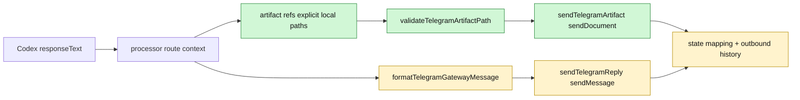

# TASK-0021: Add Telegram Gateway Session Identity and Artifact Delivery

## Summary

Telegram replies from Codex currently arrive as plain text with no stable source
label in the message body. Add a gateway-owned outbound presentation layer that
appends source identity to every Codex reply, safely enables Telegram formatting,
and can send explicit local artifacts as files instead of making Kenji follow a
local path.

Recommendation: implement the smallest useful slice first: identity footer,
MarkdownV2-safe text replies, and explicit `sendDocument` delivery for approved
local artifact paths. Treat Bot API 10.1 rich messages and streamed drafts as a
follow-up after the plain Bot API path is proven in the gateway tests and a live
smoke test.

## Scope

- In:
  - Append a stable source footer to gateway-delivered Codex replies and
    outbound notifications.
  - Prefer `title` when known, always include `threadId`, and include
    `sessionId` when present.
  - Preserve the existing reply chain and route mapping behavior.
  - Add safe `MarkdownV2` or entity-based formatting for gateway-generated
    footers without corrupting arbitrary assistant text.
  - Add explicit local artifact delivery through `sendDocument`, with caption
    carrying the same source identity.
  - Add CLI/test seams so a user or agent can request a file attachment instead
    of a text-only reply.
  - Cover text footer, Markdown escaping, source-thread fallback parsing, and
    document send behavior in `scripts/telegram-gateway.test.ts`.
- Out:
  - No automatic scraping of every local path or Markdown link in assistant
    output.
  - No arbitrary filesystem exfiltration; artifact paths must be explicit,
    readable, and inside allowed project/runtime roots.
  - No Bot API `sendRichMessage` dependency in the first slice.
  - No streaming draft replies in the first slice.
  - No UI redesign of the user communications panel beyond docs/config copy if
    implementation discovers a necessary operator setting.

## Delta

- `Before:` `processTelegramUpdate()` sends `sent.responseText` directly through
  `sendTelegramReply()`, which uses `sendMessage` with no `parse_mode` and no
  source footer. `sendTelegramNotification()` can accept a title and parse mode,
  but Codex response replies do not reuse that presentation context.
- `After:` all gateway-originated Telegram messages pass through a small
  presentation function:
  `formatTelegramGatewayMessage(response, routeContext) -> text + parseMode`.
  File artifacts pass through:
  `sendTelegramArtifact(token, chatId, replyToMessageId, artifact, context) -> messageId`.
- `Why now:` Telegram is becoming a real remote control surface for multiple
  Codex threads. Without a visible source label, replies are ambiguous; without
  file send support, artifact-heavy work degrades into local links that are poor
  on mobile.
- `First-principles basis:` the gateway knows the route, title, thread id,
  session id, and Telegram reply id, so identity should be injected at the
  gateway edge. The agent should not have to remember to self-label every
  Telegram response. Files should be delivered by the Bot API when explicitly
  requested, because Telegram is the user surface and local file paths are not.

## Map



- `Touch:`
  - `scripts/telegram-gateway/types.ts`
  - `scripts/telegram-gateway/telegram-api.ts`
  - `scripts/telegram-gateway/processor.ts`
  - `scripts/telegram-gateway/cli.ts`
  - `scripts/telegram-gateway.test.ts`
  - optional: `ui/src/modules/user-communications/lib/user-communications.ts`
    only if config copy needs to expose the artifact command
- `Inspect:`
  - `scripts/telegram-gateway/routing.ts`
  - `scripts/telegram-gateway/state.ts`
  - `ui/src/modules/user-communications/README.md`
- `Signature delta:`
  - `formatTelegramGatewayMessage(input: { text: string; title?: string; threadId: string; sessionId?: string; mode: "plain" | "MarkdownV2" }): { text: string; parseMode?: "MarkdownV2" }`
  - `sendTelegramReply(input: { ..., parseMode?: "MarkdownV2" | "HTML" | "none" }): Promise<...>`
  - `sendTelegramArtifact(input: { token; chatId; replyToMessageId?; filePath; caption; context }): Promise<...>`
  - `validateTelegramArtifactPath(filePath, roots): Promise<ValidatedArtifact>`

## Program

```text
signature:
  telegram_gateway_identity_artifacts(request, gateway_state)
    -> gateway_delta + tests + live_smoke_evidence

vars:
  identity_context = title? + threadId + sessionId?
  formatter = MarkdownV2-safe footer, plain assistant body
  artifact = explicit local file path only

program:
  1. ground(current gateway text send, notification send, routing, state mapping, tests)
     -> current_state
  2. add identity formatter and footer tests
     -> deterministic source label on Codex replies
  3. pass parse mode through reply send path without parsing arbitrary assistant
     text unsafely
     -> Telegram-safe footer formatting
  4. add explicit artifact send helper using Bot API sendDocument multipart
     upload and caption identity
     -> file delivered as Telegram document
  5. integrate artifact helper only at explicit seams:
     CLI --document/--artifact and, if needed, a structured Codex response
     marker recognized by the gateway
     -> no accidental local file leaks
  6. update tests and run narrow gateway tests
     -> proof before live smoke
  7. run one dry-run plus one real gateway smoke test from Telegram
     -> footer visible and document delivered
```

Recommendation: start with CLI-explicit artifact sending and source identity on
normal Codex replies. Add assistant-output artifact detection only if it uses a
strict marker such as:

```text
[telegram-artifact:/absolute/path/to/file]
```

and only after path validation, size checks, and allowed-root checks are in
place.

## Goal Packet Preview

```text
goal_packet:
  ticket: tickets/TASK-0021/ticket.md
  program: not_created
  progress: not_created
  files:
    - scripts/telegram-gateway/types.ts
    - scripts/telegram-gateway/telegram-api.ts
    - scripts/telegram-gateway/processor.ts
    - scripts/telegram-gateway/cli.ts
    - scripts/telegram-gateway.test.ts
  budget: not_set
  metric: gateway reply is distinguishable by source and can deliver one explicit local file
  proof_route: vitest gateway tests + live Telegram smoke
  drift_policy: block if implementation requires a broad gateway protocol rewrite or unbounded file discovery
  final_evidence: Telegram message id(s), request/response payload assertions, and artifact delivery proof
  native_goal_prompt: not compiled because this turn requested an implementation plan, not a native Goal run
  approval:
    status: pending
    rule: approve or revise this ticket before implementation
```

## Done / Proof

```text
done_when:
  - Codex replies sent through the Telegram gateway include a stable source footer with title/thread id and session id when known
  - outbound notification sends keep mapping behavior and include the same source identity convention
  - Markdown rendering is enabled only where escaping/entity handling is deterministic
  - explicit local artifact paths can be sent to Telegram as documents with an identity caption
  - artifact delivery rejects missing files, directories, paths outside allowed roots, and oversized files with clear errors
  - unknown Telegram replies can still recover source threads from the footer text

proof:
  checks:
    - npm run test:once -- scripts/telegram-gateway.test.ts
    - npm run typecheck:root
  manual:
    - run gateway --check-config
    - send one text smoke reply from Telegram and confirm footer shows source title/thread id
    - send one explicit local markdown/text artifact and confirm Telegram receives it as a document
    - reply to the delivered document/message and confirm routing maps back to the same source thread
  review:
    - rubric: identity clarity, Telegram formatting safety, file exfiltration risk, route mapping preservation, local-root validation, minimal gateway surface
      required_tas: TAS-B
  evidence:
    - gateway unit-test output
    - live Telegram message ids for text reply and document delivery
    - representative outbound Bot API payload assertions with token redacted
```

Grounding evidence:
- Local files checked: `scripts/telegram-gateway/telegram-api.ts`,
  `scripts/telegram-gateway/processor.ts`, `scripts/telegram-gateway/routing.ts`,
  `scripts/telegram-gateway/cli.ts`, `scripts/telegram-gateway.test.ts`,
  `ui/src/modules/user-communications/README.md`.
- Official docs checked:
  - https://core.telegram.org/bots/api#sendmessage
  - https://core.telegram.org/bots/api#formatting-options
  - https://core.telegram.org/bots/api#senddocument
  - https://core.telegram.org/bots/api#sendrichmessage
  - https://core.telegram.org/bots/api-changelog

## Documentation / Closeout

```text
docs_closeout:
  close_ticket: required
  documentation_skill: not_required
  docs_changed:
    - tickets/TASK-0021/ticket.md
    - optional ui/src/modules/user-communications/README.md if command/config copy changes
  documentation_reason: none unless the gateway operator contract changes beyond the ticket
  final_writeback:
    - update ticket proof with test results and Telegram smoke ids
    - archive or mark done only after live smoke passes
```

## State

- `next_action:` monitor one inbound reply to a footer/document message if
  deeper E2E proof is needed
- `blocked:` false
- `latest_verification:` `npm run test:once -- scripts/telegram-gateway.test.ts cli/gateway-commands.test.ts`;
  `npm run typecheck:root`; live Telegram text send `2265`; live Telegram
  document send `2266`
- `result:` done
- `plan_qa:`
  - `minimal_required_version:` pass
  - `reuse_before_new_surface:` pass; extends existing gateway send, route, and
    state helpers
  - `least_parameters:` pass; only identity context, parse mode pass-through,
    and explicit artifact path are needed
  - `new_files_functions_justified:` pass; no new source file required unless
    implementation shows formatter/path validation would bloat an existing
    owner file
  - `minimal_impl_plan_claim:` pass; rich messages and streaming drafts are
    intentionally follow-up scope
  - `existing_service_fit:` pass; gateway edge helpers already own Telegram
    sends and state mapping
  - `goal_packet_preview:` not_applicable for this planning-only turn
  - `clarifying_questions:` pass; no blocking question, because the first slice
    can be safely scoped and proofed
  - `proof_route_explicit:` pass
  - `documentation_closeout_route:` pass
  - `grounding_evidence:` pass
  - `highest_risk:` accidental local file exfiltration if artifact discovery is
    too permissive
  - `fix_or_deferral:` require explicit artifact paths and allowed-root checks;
    defer rich messages and draft streaming

## Links

- `program:`
- `progress:`
- `artifacts:`
- `review:`
- `refs:`
  - Telegram Bot API: https://core.telegram.org/bots/api
  - Telegram Bot API changelog: https://core.telegram.org/bots/api-changelog

## Notes

- `Blast radius:` local Telegram gateway only; no Convex/backend migration.
- `Risks / rollback:` if MarkdownV2 escaping causes rendering failures, keep
  plain text body and append an unformatted source footer. If document upload
  fails, reply with a clear delivery error and do not expose local paths beyond
  the user-requested artifact name.
- `Follow-ups:`
  - evaluate `sendRichMessage` for structured implementation plans, tables, and
    AI draft streaming after text/document support is stable
  - consider `sendPhoto` for image evidence once document delivery is proven
  - add UI copy for artifact commands if Telegram gateway setup needs it

## Completion Receipt

- Implemented gateway-owned identity footer for Telegram notifications,
  Codex replies, retry replies, and document captions.
- Added `gateway telegram send --document <path>` and `--artifact <path>` for
  explicit local document delivery via Telegram `sendDocument`.
- Added artifact validation for explicit file paths, allowed roots, regular
  files only, and Telegram document size limit.
- Hardened outbound send persistence by merging current disk state before
  writing new mappings, preventing concurrent send commands from clobbering
  each other.
- Added tests for footer formatting, footer-based route recovery, document
  upload payloads, path rejection, archived-session terminal errors, malformed
  Codex JSONL, and state-merge persistence.
- Proof:
  - `npm run test:once -- scripts/telegram-gateway.test.ts cli/gateway-commands.test.ts`
    passed with 28 tests.
  - `npm run typecheck:root` passed.
  - Live Telegram text smoke sent `messageId=2265` with footer.
  - Live Telegram document smoke sent `messageId=2266` for
    `tickets/TASK-0021/ticket.md` with footer caption.
  - Gateway state contains both `2265` and `2266` mappings after the merge fix.
