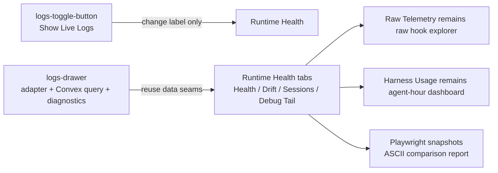

# TASK-0022: Replace Live Logs With Runtime Health Panel

## Summary

The bottom-right `Show Live Logs` drawer is outdated now that Harness Usage and
Raw Telemetry own usage and hook-event exploration. Replace it with a Runtime
Health panel that answers why the office/runtime does not look right right now:
connection health, ingest freshness, reconciliation drift, office integrity,
session tail, and a sanitized debug tail.

The approved direction is the functional-ui ASCII design from 2026-06-28:
Runtime Health Console with Health, Drift, Sessions, and Debug Tail states.

## Scope

- In:
  - Rename the bottom-right launcher from live logs to Runtime Health.
  - Rework `LogsDrawer` into a Runtime Health modal using the existing adapter,
    Convex recent event query, session timeline, and unified office diagnostics.
  - Preserve existing refresh, reload config, reload sidecar, and validate
    layout actions.
  - Add operator-focused status cards, current findings, evidence/actions,
    drift diagnostics, session tail, and debug-tail views.
  - Add screenshot evidence matching the ASCII designs for Health, Drift,
    Sessions, and Debug Tail.
- Out:
  - No new telemetry schema, Convex storage, hook endpoint, gateway API, or
    runtime adapter contract.
  - No replacement of Raw Telemetry or Harness Usage.
  - No raw transcript, prompt, secret, or unredacted hook payload display.
  - No broad office navigation redesign.

## Delta

- `Before:` `LogsDrawer` presents `Office Live Logs` with Live Events,
  Sessions, and Diagnostics tabs. The drawer duplicates event feeds and does
  not prioritize root-cause debugging.
- `After:` the same entrypoint opens `Runtime Health`, a dense operational
  console with Health, Drift, Sessions, and Debug Tail tabs. It summarizes
  gateway/auth/Convex/hook freshness/outbox-like status, calls out current
  findings, links to Raw Telemetry and Harness Usage conceptually through
  action labels where possible, and keeps raw detail sanitized.
- `Why now:` telemetry has grown into separate canonical surfaces. The bottom
  right affordance should fill the missing job: explain current runtime drift
  and failure cause.
- `First-principles basis:` operators debug by deciding whether a symptom is
  connectivity, ingestion, runtime reconciliation, layout integrity, or an
  active-session issue. The UI should rank those categories before showing
  line-oriented logs.

## Map

  - `Touch:`
    - `ui/src/components/hud/logs-toggle-button.tsx`
    - `ui/src/components/hud/logs-drawer.tsx`
    - `ui/src/components/hud/runtime-health-model.ts`
    - `ui/src/components/hud/runtime-health-model.test.ts`
    - `tickets/TASK-0022/*`
- `Inspect:`
  - `ui/src/components/office-simulation.tsx`
  - `ui/src/modules/runtime/AGENTS.md`
  - `qa/README.md`
  - `qa/cookbook/office.md`
  - `docs/TASTE.md`
- `Legend:` keep existing adapter/query seams, change presentation and labels,
  add ticket Goal Packet only.



## Program

```text
signature:
  runtime_health_drawer(existing_adapter_state, convex_recent_events?)
    -> operator_status_panel + screenshot_evidence + ticket_progress

vars:
  target = bottom-right office Runtime Health entrypoint
  owner = ui/src/components/hud
  proof_weight = ui_snapshot_review

program:
  ground(current LogsDrawer, launcher, runtime adapter data, QA route) -> current_state
  implement(current_state) -> Runtime Health tabs and labels
  verify(typecheck, browser snapshots, visual comparison) -> evidence
  writeback(evidence) -> progress.md + final report
```

## Goal Packet Preview

```text
goal_packet:
  ticket: tickets/TASK-0022/ticket.md
  program: tickets/TASK-0022/program.md
  progress: tickets/TASK-0022/progress.md
  files:
    - ui/src/components/hud/logs-drawer.tsx
    - ui/src/components/hud/logs-toggle-button.tsx
    - ui/src/components/office-simulation.tsx
    - qa/README.md
    - qa/cookbook/office.md
    - docs/TASTE.md
  budget:
    time: current implementation window
    token/model/compute: native Codex local execution; no explicit token cap
    spend/deploy/account changes: none
  metric:
    ui_snapshot_review: screenshots visibly match the ASCII structure and
    preserve runtime diagnostic utility
  proof_route:
    checks: focused typecheck/build where feasible
    qa: Playwright browser snapshots for Health, Drift, Sessions, Debug Tail
    review: compare screenshots against ASCII designs before final
  drift_policy:
    inline compare changed files against this ticket before final
  final_evidence:
    final report includes best screenshot as 
  native_goal_prompt: |
    /goal Run the following files as one Goal Packet.
    Files:
    - tickets/TASK-0022/ticket.md
    - tickets/TASK-0022/program.md
    - tickets/TASK-0022/progress.md

    Task: Complete the Runtime Health replacement defined in the listed files.
    Preserve the ticket scope, non-goals, Done / Proof, and snapshot review
    route. Keep Raw Telemetry and Harness Usage as separate surfaces.

    Logging: Before ending each turn, append compact progress to
    tickets/TASK-0022/progress.md when state changes.

    Metric: Satisfy the ui_snapshot_review proof route declared in the packet.
    Self-certification is not enough for final UI proof; browser screenshots
    must exist and be compared against the ASCII designs.

    After each turn: Compare progress against the listed files, continue while
    useful, otherwise stop complete or stop blocked with the exact missing
    proof. Grounding must name local files plus official docs/maintained
    evidence checked, or state a local-only reason.

    Final evidence: include , or
    block/revise with the missing screenshot proof.
  approval:
    status: approved
    rule: operator explicitly requested impl-plan then implementation via Goal
```

## Done / Proof

```text
done_when:
  - Bottom-right launcher reads Runtime Health rather than Show Live Logs.
  - Runtime Health health view prioritizes status cards, findings, evidence,
    actions, and breadcrumb tail.
  - Drift view shows runtime reconciliation and office integrity.
  - Sessions view shows recent sessions and selected session tail.
  - Debug Tail view shows sanitized warnings/errors/breadcrumbs rather than a
    duplicate raw telemetry table.
  - Raw Telemetry and Harness Usage remain separate conceptual destinations.

proof:
  checks:
    - npm run ui:typecheck
  manual:
    - start npm run ui
    - open /office and Runtime Health
    - capture Health, Drift, Sessions, and Debug Tail screenshots
    - compare screenshot structure against ASCII designs
  review:
    - rubric: visual snapshot review against functional-ui ASCII layouts
      required_tas: screenshot evidence is required; self-certification alone is not enough
  evidence:
    - docs/research/qa-testing/TASK-0022/<run>/screens/runtime-health-health.png
    - docs/research/qa-testing/TASK-0022/<run>/screens/runtime-health-drift.png
    - docs/research/qa-testing/TASK-0022/<run>/screens/runtime-health-sessions.png
    - docs/research/qa-testing/TASK-0022/<run>/screens/runtime-health-debug-tail.png
    - docs/research/qa-testing/TASK-0022/<run>/report.md
    - Final report: include the best screenshot/image evidence as
      , or block/revise with the
      missing proof reason.

Grounding evidence:
  - local files: current LogsDrawer, launcher, office QA docs, taste guidance
  - official docs: Radix Dialog accessibility docs for modal keyboard/focus behavior
```

## Documentation / Closeout

```text
docs_closeout:
  close_ticket: required
  documentation_skill: not_required
  docs_changed:
    - tickets/TASK-0022/ticket.md
    - tickets/TASK-0022/program.md
    - tickets/TASK-0022/progress.md
  documentation_reason: none; ticket writeback and evidence report are enough
  final_writeback:
    - append verification and screenshot evidence to progress.md
    - keep durable docs unchanged unless implementation discovers a real rule
```

## State

- `next_action:` optional follow-up can add a browser-facing hook outbox count if desired
- `blocked:` false
  - `latest_verification:` runtime-health-model Vitest passed; touched-file typecheck filter clean; Playwright snapshots captured under docs/research/qa-testing/TASK-0022/20260628_035322_runtime_health/ and Codex-mode fix proof captured under docs/research/qa-testing/TASK-0022/20260628_035322_runtime_health_codex_fix/
- `result:` done
- `plan_qa:`
  - `minimal_required_version:` pass
  - `reuse_before_new_surface:` pass
  - `least_parameters:` pass
  - `new_files_functions_justified:` pass
  - `minimal_impl_plan_claim:` pass
  - `existing_service_fit:` pass
  - `goal_packet_preview:` pass
  - `clarifying_questions:` pass
  - `proof_route_explicit:` pass
  - `documentation_closeout_route:` pass
  - `grounding_evidence:` pass
  - `highest_risk:` browser snapshot path may need app bootstrapping if the office scene blocks
  - `fix_or_deferral:` use `/office` QA bridge and screenshot modal states; record blocker if app cannot boot

## Links

- `program:` tickets/TASK-0022/program.md
- `progress:` tickets/TASK-0022/progress.md
- `artifacts:` docs/research/qa-testing/TASK-0022/
- `review:` screenshot comparison report in artifact run folder
- `refs:`
  - `ui/src/components/hud/logs-drawer.tsx`
  - `ui/src/components/hud/logs-toggle-button.tsx`
  - `ui/src/components/hud/runtime-health-model.ts`
  - `ui/src/components/hud/runtime-health-model.test.ts`
  - `qa/cookbook/office.md`
  - `docs/TASTE.md`
  - Radix Dialog accessibility docs

## Notes

- `Blast radius:` office HUD modal presentation only.
- `Risks / rollback:` revert the HUD drawer/launcher and runtime health model
  files to restore the old drawer.
- `Follow-ups:` if useful, add first-class actions that open Raw Telemetry and
  Harness Usage from inside Runtime Health.
