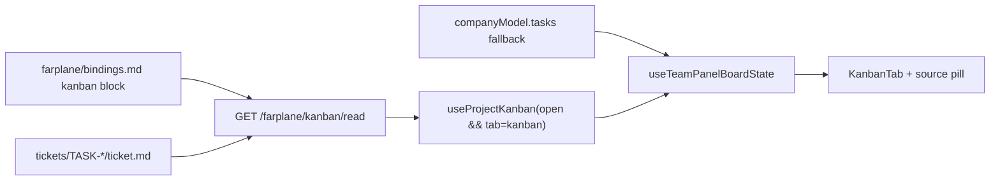

# TASK-0023: Add Filesystem Kanban Provider For Team Panel Tickets

## Summary
Make the Team Panel Kanban read the project `tickets/` folder through a
single-provider Kanban adapter boundary. The first provider is
`filesystem_tickets`, configured in `farplane/bindings.md`, with future Notion
or Linear providers able to replace it without changing the Kanban board UI.

## Scope
- In:
  - Add `kanban { ... }` to `farplane/bindings.md`.
  - Add a read-only `/farplane/kanban/read` endpoint that resolves the active
    provider config and returns a normalized Kanban snapshot.
  - Reuse the existing ticket markdown parser for filesystem tickets.
  - Add a `useProjectKanban` hook that polls while the Team Panel Kanban tab is
    open and refreshes on focus/visibility.
  - Wire Team Panel/Kanban to use the provider snapshot first, with current
    `companyModel.tasks` as fallback.
  - Show provider, task count, refreshed time, source version, read-only/error
    state in the Kanban tab.
- Out:
  - No Notion/Linear implementation.
  - No multi-provider merge layer.
  - No filesystem ticket write-back yet.
  - No Convex board behavior changes outside preserving fallback.

## Delta
- Before: Kanban indirectly reads ticket tasks through the whole office
  read-model path, and Convex/sidecar state can make the board feel detached
  from the actual `tickets/` folder.
- After: Kanban has one explicit active provider per project. For this slice,
  `filesystem_tickets` reads `tickets/TASK-*/ticket.md` directly and refreshes
  while the Kanban tab is open.
- Why now: `TASK-0017` made the Team Panel a Farplane project HUD, so the work
  board needs to reliably show local tickets before richer PM/agent progress can
  be trusted.
- First-principles basis: a project has one canonical board source. Local
  Farplane projects should default to tracked ticket files; shared projects can
  later choose Notion/Linear in `bindings.md`.

## Map
- Touch:
  - `farplane/bindings.md`
  - `ui/vite.config.ts`
  - `ui/src/modules/team-workspace/components/use-project-kanban.ts`
  - `ui/src/modules/team-workspace/components/team-panel.tsx`
  - `ui/src/modules/team-workspace/components/use-team-panel-board.ts`
  - `ui/src/modules/team-workspace/components/kanban-tab.tsx`
  - `tickets/TASK-0023/ticket.md`
- Inspect:
  - `readProjectTicketTasks` and `/farplane/projects/read-model` in
    `ui/vite.config.ts`
  - `useTeamPanelBoardState`
  - `KanbanTab`
- Legend: keep = current Kanban columns/details; add = provider read/hook/status;
  change = task source selection.



## Program

```text
signature:
  project_kanban(projectPath, activeTab) -> provider_snapshot + kanban_tasks + proof

vars:
  provider = filesystem_tickets
  config_owner = farplane/bindings.md
  poll_seconds = 60

program:
  configure_provider()
    -> add kanban block with filesystem tickets defaults
  add_server_read()
    -> parse bindings, read ticket markdown, return KanbanSnapshot
  add_client_hook()
    -> poll on active Kanban tab, focus, visibility, manual refresh
  wire_board()
    -> prefer provider tasks; fallback to existing companyModel tasks
  prove()
    -> tests/build/browser evidence
```

## Done / Proof

```text
done_when:
  - `farplane/bindings.md` declares the Kanban provider.
  - `/farplane/kanban/read` returns filesystem ticket tasks for the active project.
  - Team Panel Kanban uses provider tasks while the tab is open.
  - Kanban displays provider/source/refreshed/read-only status.
  - Existing Kanban column/detail behavior remains intact.

proof:
  checks:
    - npx biome format --write touched files
    - npx biome lint touched files
    - npm run test:once -- ui/src/modules/team-workspace
    - npm run ui:build
    - python3 /Users/kenjipcx/Zanarkand\ Technologies/projects/Farplane/bin/validators/check_farplane_project_files.py --root .
    - git diff --check -- touched files
  manual:
    - Browser QA opens /office, selects Farplane-UI, opens Team Workspace Kanban,
      and sees filesystem tickets with source status.
  review:
    - rubric: provider boundary is single-source, filesystem default is honest,
      no multi-provider merge complexity, no fake write-back.
      required_tas: none
  evidence:
    - `.farplane/proof/TASK-0023-kanban-filesystem-provider.png`
```

## State
- `next_action:` review proof and decide whether filesystem write-back is worth
  adding after the read-only board has been used in the Team Panel.
- `blocked:` false
- `latest_verification:` 2026-06-28; `npx biome format --write` on touched
  files, `npx biome lint --diagnostic-level=error` on touched files,
  `npm run test:once -- ui/src/modules/team-workspace`, `npm run ui:build`,
  Farplane project-file validator, focused `git diff --check`, live endpoint
  probe, and browser QA all passed.
- `plan_qa:`
  - `minimal_required_version:` pass
  - `reuse_before_new_surface:` pass; reuse existing ticket parser and Kanban UI.
  - `least_parameters:` pass; only provider, tickets/archive dir,
    write_policy, poll_seconds.
  - `new_files_functions_justified:` pass; hook isolates polling and provider
    source state.
  - `minimal_impl_plan_claim:` pass
  - `existing_service_fit:` pass
  - `goal_packet_preview:` not_applicable
  - `clarifying_questions:` pass; user selected filesystem provider for now.
  - `proof_route_explicit:` pass
  - `documentation_closeout_route:` pass
  - `grounding_evidence:` local_only; this is repo-local provider wiring.
  - `highest_risk:` building a merge layer or write-back before source-of-truth
    behavior is stable.
  - `fix_or_deferral:` one active provider only; writes deferred.
- `result:` implemented; ready for review. Team Panel Kanban reads
  `tickets/TASK-*/ticket.md` through the configured filesystem provider and
  renders source/read-only/refresh status.

## Links
- `artifacts:`
  - `.farplane/proof/TASK-0023-kanban-filesystem-provider.png`
- `review:`
- `refs:`
  - `farplane/bindings.md`
  - `ui/vite.config.ts`
  - `ui/src/modules/team-workspace/components/use-team-panel-board.ts`
  - `ui/src/modules/team-workspace/components/kanban-tab.tsx`

## Notes
- `Config decision:` `farplane/bindings.md` owns Kanban provider selection
  because it is a non-secret project coordinate. `manifest.json` only tracks the
  standard file set.
- `Future:` Notion/Linear become new provider adapters selected by this same
  block; no multiple-board merge is planned.
