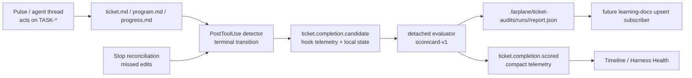

# TASK-0025: Add ticket completion auditor for realtime harness scoring

## Summary

Add a ticket-based completion auditor that scores each ticket as the primary
unit of realtime harness health. The first slice should detect terminal ticket
transitions, launch a detached evaluator, write ticket-scoped scorecard
artifacts, and publish compact telemetry for timeline views without mutating
`docs/LESSONS.md` or `docs/TROUBLES.md`.

Recommendation: build this as a new `ticket-completion-auditor` program that
reuses the existing hook telemetry, event-miner, and thread-data mining
patterns. Keep the older cadence miner as a fallback/background learner, but
make ticket completion the high-signal eval window.

## Scope

- In:
  - Detect completion candidates when `tickets/TASK-*/ticket.md` changes or a
    ticket is archived.
  - Treat completion as a terminal-state transition, not one magic string.
  - Store small watcher state under `.farplane/ticket-audits/` for dedupe and
    missed-hook reconciliation.
  - Launch a detached evaluator with a bounded context packet.
  - Score ticket execution against `ticket.md`, `program.md`, `progress.md`,
    invoked skill telemetry, proof artifacts, and the session transcript when
    available.
  - Produce local scorecard artifacts under
    `.farplane/ticket-audits/runs/<run-id>/`.
  - Publish compact `ticket.completion.*` telemetry through the existing
    `hookTelemetryEvents` path.
  - Add timeline/query projection support for ticket score events.
  - Add tests for terminal-state parsing, dedupe, launch packets, report
    projection, and telemetry payload privacy.
- Out:
  - No automatic writes to `docs/LESSONS.md`, `docs/TROUBLES.md`, skills,
    tickets, or memory files in the first slice.
  - No inline LLM work inside the PostToolUse hook.
  - No raw prompts, transcripts, assistant messages, tool output, or full
    ticket bodies in Convex telemetry.
  - No business-outcome scoring beyond implementation/process health.
  - No replacement of the cadence miner until scorecards have proven useful.

## Delta

- `Before:` Farplane has a cadence-based `codex-event-miner` Stop hook and a
  historical thread-data mining platform. These can find lessons, troubles, and
  decisions, but they are not keyed to the moment a ticket closes.
- `After:` ticket completion becomes the primary realtime evaluation trigger.
  A deterministic hook detects terminal transitions, a detached evaluator
  scores the ticket unit of work, and the Team Timeline/Harness Health surfaces
  can show ticket score, skipped steps, proof quality, and skill-obligation
  misses.
- `Why now:` Pulse already pushes work into ticket-shaped units and new threads.
  The end of that unit is the cleanest moment to judge whether the agent
  followed the ticket, used the intended skills, gathered proof, and finished
  efficiently.
- `First-principles basis:` chat-level learning is noisy because many chats are
  exploratory or casual. Ticket completion carries objective context:
  accepted scope, expected program, progress evidence, proof contract, and
  actual changed artifacts. That makes it a stronger reward window for harness
  health than raw conversation cadence.

## Change Plan

### Change 1: terminal ticket detector

```text
fixes:
  - Detect closed tickets reliably without depending on one exact frontmatter value.
before:
  - file-change-listener summarizes tracked file edits, including ticket files,
    but does not produce ticket lifecycle candidates.
  - codex-event-miner runs on Stop cadence, not on ticket terminal transitions.
after:
  - ticket-completion-auditor identifies terminal transitions from ticket edits,
    archive moves, and reconciliation scans.
read:
  - path: hooks/file-change-listener/handler.ts
    reason: reuse PostToolUse metadata and tracked ticket path extraction.
  - path: hooks/shared/project-hook-config.ts
    reason: ticket.md/program.md/progress.md are already tracked defaults.
  - path: tickets/templates/ticket.md
    reason: terminal-state fields live in frontmatter and body conventions.
write:
  - path: hooks/ticket-completion-auditor/
    change: add deterministic detector, state, telemetry, launcher, report
      parser, and tests.
  - path: scripts/install-farplane-hooks.mjs
    change: install the auditor beside existing PostToolUse/Stop hooks.
operation:
  - Parse changed paths from PostToolUse payloads.
  - For each `tickets/TASK-*/ticket.md` or archive path, read current ticket
    frontmatter/body and compare against `.farplane/ticket-audits/watch/*.json`.
  - Mark terminal when any approved completion signal is present:
    `status: done|complete|completed|closed`, `phase: done|complete|completed`,
    `next_action: done`, archive path, or explicit closeout marker.
  - Emit one `ticket.completion.candidate` per ticket terminal hash.
  - Add a Stop-hook reconciliation pass that scans terminal tickets without a
    completed audit to catch missed PostToolUse edits.
signature_or_type_impact:
  - `detectTicketCompletionCandidate(payload, state) -> candidate[] + next_state`
  - `TicketAuditWatchState { ticketId, ticketPath, lastContentHash,
    lastTerminalHash?, lastAuditRunKey?, updatedAt }`
routes:
  docs: update_docs
  qa: tests
  review: reviewer
qa:
  - Unit tests cover status, phase, next_action, archive moves, non-terminal
    edits, first-seen terminal tickets, and duplicate suppression.
failure_modes:
  - False positives from stale done tickets; use content hash plus audit run key.
  - Missed archive moves; reconciliation scans terminal tickets as backup.
  - Slow hook path; detector stays deterministic and launches detached work only.
```

### Change 2: detached scorecard evaluator

```text
fixes:
  - Turn a completion candidate into high-quality ticket execution data without
    blocking Codex hooks or leaking raw transcript content.
before:
  - event miner programs extract decisions/learning on cadence.
  - thread-data mining can process historical sessions, but no live ticket
    completion scorecard exists.
after:
  - a detached evaluator reads ticket/program/progress/session context and
    writes a local scorecard report plus compact telemetry.
read:
  - path: hooks/codex-event-miner/launcher.ts
    reason: reuse detached Codex exec pattern, run dirs, output schema, and
      privacy rules.
  - path: hooks/codex-event-miner/report.schema.json
    reason: mirror report validation style for fallback telemetry.
  - path: ui/src/modules/thread-data/
    reason: reuse transcript/source selection concepts from mining platform.
write:
  - path: hooks/ticket-completion-auditor/launcher.ts
    change: build evaluator input and spawn `codex exec --disable codex_hooks`.
  - path: hooks/ticket-completion-auditor/report.schema.json
    change: validate scorecard reports for fallback projection.
  - path: .farplane/ticket-audits/runs/<run-id>/
    change: ignored local run artifacts: input.json, prompt.md, report.json,
      stdout.log, stderr.log.
operation:
  - Build context packet with ticket refs, terminal snapshot, session/thread ids,
    optional transcript path/source ref, invoked skills summary, proof refs, and
    privacy rules.
  - Evaluate obligations from ticket Done/QA Strategy, `program.md`,
    `progress.md`, invoked skill todo lists, and project invariants.
  - Return a scorecard with `status`, `overallScore`, dimension scores,
    missing/partial obligations, evidence refs, efficiency metrics when
    available, and weak-skill attribution candidates.
signature_or_type_impact:
  - `ticket_completion_audit(ticket_ref, session_ref?, program_ref?,
    skill_invocations?) -> scorecard + telemetry_events + local_report`
  - `TicketScoreDimension = ticket_following | program_completion |
    skill_todo_coverage | proof_quality | efficiency | correction_load |
    privacy_safety`
routes:
  docs: update_docs
  qa: tests
  review: reviewer
qa:
  - Fixture report validates against schema.
  - Dry-run launch writes input/prompt/report without spawning Codex.
  - Privacy tests ensure telemetry omits raw ticket bodies and transcript text.
failure_modes:
  - Transcript unavailable; evaluator must score artifact-only and mark
    `transcriptCoverage: unavailable`.
  - Over-attribution to skills; only attribute weakness when an obligation is
    clearly linked to an invoked or required skill.
```

### Change 3: telemetry projection and timeline value

```text
fixes:
  - Make ticket score visible as realtime harness health instead of a hidden
    local report.
before:
  - hookTelemetryEvents can store raw compact hook rows, and learning timeline
    projections show lesson/trouble/decision events.
after:
  - ticket completion score events appear in the same telemetry/logging layer
    and can power Team Timeline and Harness Health views.
read:
  - path: convex/modules/hookTelemetry/learningTimeline.ts
    reason: extend the existing projection style instead of adding a raw table.
  - path: convex/modules/hookTelemetry/queries.ts
    reason: expose bounded ticket audit rows to UI surfaces.
  - path: ui/src/modules/team-workspace/components/timeline-tab.tsx
    reason: timeline is the likely first user-visible surface.
write:
  - path: convex/modules/hookTelemetry/learningTimeline.ts
    change: include compact ticket score rows.
  - path: convex/modules/hookTelemetry/queries.ts
    change: add or extend query for per-ticket/per-session score events.
  - path: ui/src/modules/team-workspace/components/timeline-tab.tsx
    change: render score events only if the existing timeline model can absorb
      them cleanly; otherwise defer UI to a follow-up.
operation:
  - Publish `ticket.completion.candidate`, `ticket.completion.audit_launched`,
    `ticket.completion.scored`, and `ticket.completion.audit_failed` events.
  - Keep payloads compact: ids, status, scores, missing obligation counts,
    weak skill ids, artifact paths, and sanitized summaries only.
signature_or_type_impact:
  - `TicketCompletionTelemetryPayload { eventName, ticketId, sessionId?,
    runPath?, overallScore?, status?, dimensions?, missingCount?,
    weakSkillIds?, evidenceRefs? }`
routes:
  docs: update_docs
  qa: tests
  review: reviewer
qa:
  - Convex projection tests cover score rows, sort order, missing optional ids,
    and redaction.
failure_modes:
  - UI score fetish without context; timeline row must link to local report path
    and show missing-proof/missing-obligation counts.
```

### Change 4: keep learning docs out of the first scoring loop

```text
fixes:
  - Avoid polluting durable lessons/troubles before scorecards prove which
    metrics are predictive.
before:
  - cadence miner may append lessons/troubles when signal is strong.
after:
  - ticket completion auditor emits scorecards and learning candidates only.
    Promotion into LESSONS/TROUBLES remains a later reviewed subscriber.
read:
  - path: docs/LESSONS.md
    reason: current lesson doc is intentionally distilled and should not become
      a per-ticket dump.
  - path: docs/TROUBLES.md
    reason: current trouble doc is append-only for repeated failures.
write:
  - path: hooks/ticket-completion-auditor/HOOK.md
    change: document that docs mutation is out of scope for v1.
operation:
  - Include `learningCandidates[]` in local reports for later upsert review.
  - Do not write learning docs from the auditor.
signature_or_type_impact:
  - `LearningCandidate { kind, summary, evidenceRefs, dedupeHint, confidence }`
routes:
  docs: update_docs
  qa: tests
  review: reviewer
qa:
  - Tests assert no docs write happens in detector or launcher paths.
failure_modes:
  - Missing durable learning; acceptable for v1 because scorecards are the
    cleaner raw material and the cadence miner still exists.
```



## Deliberative Advice

```text
Decision:
  Should realtime harness health move from cadence/chat mining to ticket-based
  completion scoring, and should learning docs be skipped in v1?

Stakes:
  This changes the main reward window for Farplane agent improvement,
  telemetry semantics, and future skill attribution.

Budget Program:
  caller skill: advise
  budget route: ensemble_lanes + review_depth
  template refs:
    - /Users/kenjipcx/.codex/skills/budget-advisor/references/ensemble-lanes.md
    - /Users/kenjipcx/.codex/skills/budget-advisor/references/review-depth.md
  resolved params:
    ensemble.count: 5
    perspective_mode: different
    aggregation: synthesize
    personas: OperatorValue, EngineeringRisk, EvidenceSkeptic, SystemsFit, Chair
    review_depth: 1
    max_budget_depth: 0

Options:
  1. Keep cadence miner primary.
     Pro: simplest and already built.
     Con: noisy reward window; casual chats dilute learning.
  2. Replace cadence miner with ticket completion scoring.
     Pro: strongest data quality and direct skill/ticket attribution.
     Con: loses ambient learning and is riskier if closure detection is brittle.
  3. Hybrid: ticket completion scoring primary, cadence miner fallback.
     Pro: best signal quality while preserving ambient learning and rollback.
     Con: more moving parts and requires clear telemetry ownership.

Recommendation:
  Option 3. Make ticket completion scoring the primary realtime harness-health
  signal. Keep cadence mining as background/fallback until scorecards prove
  stable.

Dissent:
  Engineering-risk dissent: the first slice can overreach if it tries to solve
  UI, learning-doc upserts, skill attribution, and transcript mining at once.
  Keep v1 to detection, scorecard artifact, compact telemetry, and projection.

Tradeoff accepted:
  More infrastructure than the current simple miner, in exchange for a much
  cleaner ticket-level reward signal.

Confidence:
  Medium-high from local architecture fit. The main evidence gap is how
  reliably PostToolUse/Stop payloads expose session/transcript refs across all
  pulse-spawned ticket threads.

Next owner:
  goal-advisor after approval; implementation should be ticket-backed and
  reviewer-gated.
```

## Done

```text
done_when:
  - terminal ticket edits and archive moves produce exactly one completion
    candidate per terminal ticket content hash
  - missed terminal tickets can be found by a bounded reconciliation scan
  - completion candidates launch detached evaluator runs without inline LLM
    work in hook paths
  - evaluator dry-run writes a valid scorecard report under
    `.farplane/ticket-audits/runs/<run-id>/`
  - `ticket.completion.scored` telemetry ingests through existing hook telemetry
    and projects into a ticket/session timeline row
  - scorecard includes ticket/program/progress coverage, skill todo coverage,
    proof quality, efficiency fields when available, correction-load fields
    when available, and privacy-safe evidence refs
  - docs mutation to LESSONS/TROUBLES is explicitly absent from v1 and covered
    by tests or docs
```

## QA Strategy

```text
qa_strategy:
  proof_weight: agent_qa
  checks:
    - npm run test:once -- hooks/ticket-completion-auditor scripts/install-farplane-hooks.test.ts
    - npm run test:once -- convex/modules/hookTelemetry
    - npm run typecheck:root
  manual:
    - run auditor dry-run against a fixture ticket that transitions from review
      to done
    - run auditor dry-run against an archived fixture ticket
    - inspect `.farplane/ticket-audits/runs/<run-id>/input.json`,
      `prompt.md`, and `report.json`
    - inspect Raw Telemetry or timeline projection for compact score event
  delegated_lanes:
    - agent-qa-test on closure detection and duplicate suppression
    - review lane on telemetry privacy, score rubric quality, and skill
      attribution claims
  review:
    - rubric: closure detection reliability, hook latency, transcript privacy,
      scorecard usefulness, event dedupe, projection correctness, no premature
      docs mutation
      required_tas: TAS-B
  evidence:
    - focused test output
    - dry-run report path
    - sample compact telemetry payload
    - projection test fixture output
  goal_advisor_inputs:
    proof_route: deterministic hook tests + evaluator dry-run + Convex
      projection tests + reviewer/agent QA lanes
    final_evidence: ticket audit report path, telemetry payload sample, and
      projection test output
    final_checkpoint: reviewer verifies that no raw transcript/ticket body/tool
      output is published and that duplicate terminal edits do not spawn repeat
      audits
  residual_risk:
    - full transcript coverage may be unavailable for some PostToolUse-only
      closures; evaluator must mark coverage instead of guessing
    - score dimensions may need calibration after real pulse tickets produce
      data
```

## Docs Strategy

```text
docs_strategy:
  outcome: update_docs
  doc_targets:
    - hooks/ticket-completion-auditor/HOOK.md
    - docs/features/FEAT-0002-harness-product-model.md
    - docs/HISTORY.md
  no_docs_reason:
  validation:
    - hook docs state trigger, privacy, state path, and no-docs-mutation v1 rule
    - feature docs explain ticket score as realtime harness-health signal
```

## Links

- `program:`
- `progress:`
- `artifacts:`
- `review:`
- `refs:`
  - `tickets/TASK-0019/ticket.md`
  - `tickets/TASK-0020/ticket.md`
  - `hooks/file-change-listener/handler.ts`
  - `hooks/shared/project-hook-config.ts`
  - `hooks/codex-event-miner/launcher.ts`
  - `hooks/codex-event-miner/handler.ts`
  - `hooks/codex-event-miner/report.schema.json`
  - `convex/modules/hookTelemetry/learningTimeline.ts`
  - `ui/src/modules/thread-data/`
  - `tickets/templates/ticket.md`
  - `docs/MEMORY.md`
  - `docs/TROUBLES.md`
  - `docs/LESSONS.md`

## Notes

- `Detection answer:` use PostToolUse to catch ticket edits quickly, but do not
  rely on PostToolUse alone. Add watcher state and Stop/reconciliation fallback.
- `Closure signals:` terminal frontmatter, terminal `next_action`, archive path,
  and explicit closeout markers count. Candidate emission is deduped by ticket
  id plus terminal content hash.
- `Timeline value:` ticket scores are realtime harness-health events, not
  private learning notes. They should be queryable by ticket, session, skill,
  score dimension, and time.
- `Lessons/Troubles stance:` skip direct docs writes in v1. Later, a reviewed
  subscriber can upsert scorecard-derived learning candidates if repeated
  failures become clear.
- `Metric posture:` scorecards are operational evals, not final truth. The
  first month of data should calibrate weights before any automated policy
  changes depend on score.
- `plan_qa:`
  - `minimal_required_version:` pass; v1 is detection, detached scorecard,
    telemetry, projection, and docs, not auto-learning mutation.
  - `reuse_before_new_surface:` pass; reuses PostToolUse patterns, event-miner
    launcher shape, telemetry outbox, and thread-data mining concepts.
  - `least_parameters:` pass; no new broad config knobs in v1.
  - `new_files_functions_justified:` pass; a dedicated hook package isolates
    latency/privacy-sensitive scoring from generic file-change summaries.
  - `minimal_impl_plan_claim:` pass.
  - `existing_service_fit:` pass; existing hooks are reused but not overloaded.
  - `goal_advisor_ready:` pass after approval.
  - `clarifying_questions:` pass; no blocking input remains for the first
    implementation slice.
  - `change_plan_locality:` pass.
  - `qa_strategy_explicit:` pass.
  - `docs_strategy:` pass.
  - `grounding_evidence:` local_only; this is repo-local harness architecture
    built on existing hooks, ticket contracts, and telemetry surfaces.
  - `highest_risk:` closure detection duplicates or misses terminal tickets.
  - `fix_or_deferral:` use dedupe state plus reconciliation, and mark transcript
    coverage explicitly when unavailable.
