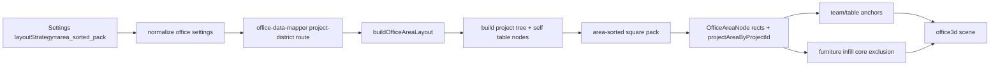

# TASK-0026: Add Area-Sorted Square Pack Office Layout Mode

## Summary
Add a new `area_sorted_pack` office layout strategy that sorts node children by expected footprint, seeds the largest child at the bottom-left, and grows a roughly square parent hull by placing the remaining children in a deterministic top-left / bottom-right / top-right / gap-fill order. This should make project districts read like compact ownership clusters derived from real table/child footprint demand instead of preallocated rectangles with awkward empty space.

Recommendation: implement this as a new explicit mode first, not as an immediate replacement for every existing project-district alias. Keep the first slice pure and testable in the office area layout module, then verify that table anchors and furniture infill consume the new area centers without adding persistence keys, env vars, or renderer-specific state.

## Scope
- In:
  - Add `area_sorted_pack` to the office layout strategy type, settings normalization, Settings UI, and canonical auto-layout routing.
  - Implement recursive child-first packing in `ui/src/modules/office/lib/office-area-layout.ts`.
  - Preserve self table areas for parent projects such as `Zanarkand Technologies Tables` and `Farplane Tables`.
  - Sort packed children by footprint area, then weight, then stable label.
  - Place the largest child at the local bottom-left seed.
  - Place later children through deterministic candidate slots that prefer top-left, bottom-right, top-right, then legal gap fills that improve square-ness.
  - Derive each parent area hull from packed child rectangles plus padding.
  - Keep project table anchors centered in their allocated packed area through existing mapper anchoring.
  - Add unit tests and an ASCII/debug probe path for inspecting the pack before browser QA.
- Out:
  - No new browser `localStorage` keys, root env vars, or ad hoc durable config fallback.
  - No physics solver, force layout, or stochastic optimizer.
  - No furniture persistence rewrite.
  - No replacement of manual layout.
  - No broad office renderer refactor.

## Delta
```text
overall_before:
  - Project-district strategies route through a centered/cardinal packer that still tends to create large parent rectangles, uneven visual spacing, and unclear empty pockets.
  - Parent project tables exist as self areas, but child placement is not explicitly "sort by expected area, then grow a square-ish hull."
overall_after:
  - `area_sorted_pack` recursively packs children by their expected table/cluster footprint, grows parent hulls from those children, and gives debug/test output that explains why every child landed where it did.
why_now:
  - Recent visual QA showed that the current compact layout improved hierarchy but still makes empty space and object centering hard to reason about.
problems:
  - before: Farplane, Farplane UI, Valefor, Life, and peer projects can look arbitrary because parent area shape is optimized separately from child placement order.
    after: placement order is inspectable: largest child first at bottom-left, then top-left, bottom-right, top-right, then best square-preserving gap.
    why_now: the user is actively tuning the spatial mental model and wants ASCII proof before accepting another rendered mode.
first_principles_basis:
  objective: make project areas compact, predictable, and visually explainable in the isometric office.
  need: users should understand why each table/cluster appears where it appears without reverse-engineering a treemap.
  assumptions: table footprint demand is a better primary weight than activity/open-ticket weight for spatial size in project-district modes.
  root_cause: allocating or centering area rectangles before enforcing an ordered child pack creates empty pockets and unintuitive parent-child relationships.
  constraints: preserve existing sidecar/config persistence rules, fit inside the current office layout bounds, and avoid disrupting manual layout.
  first_viable_slice: pure recursive packer plus strategy wiring, focused tests, ASCII probe, and one visual office smoke check.
  proof_or_falsification: pass if tests show deterministic bottom-left seeding, square-ish hull growth, self table preservation, no overlaps, and screenshot/debug proof reads closer to the intended cluster model; fail if the layout still forms strips or bloated empty rectangles.
  tradeoff: this adds one explicit strategy id while the mode is still being tasted, instead of silently changing every existing strategy again.
  non_goals: exact optimal bin packing, pathfinding optimization, or long-term furniture design.
```

## Change Plan

### Change 1: wire the new strategy as an explicit mode

```text
fixes:
  - Let the new algorithm be selected and compared without overwriting every existing project-district strategy.
before:
  - Office layout strategies are `manual`, `legacy`, `team_neighborhoods`, `activity_treemap`, `hierarchical_treemap`, and `command_districts`.
  - Settings currently resolves the project-district option to `hierarchical_treemap`.
after:
  - `area_sorted_pack` is a valid normalized strategy and appears in Settings as the experimental compact project pack mode.
  - The existing strategy ids keep their current behavior unless deliberately aliased later.
read:
  - path: ui/src/modules/runtime/lib/openclaw/types.ts
    reason: extend the canonical `OfficeLayoutStrategyId` union.
  - path: ui/src/modules/runtime/lib/openclaw/normalize.ts
    reason: accept persisted config/sidecar values without adding new storage surfaces.
  - path: ui/src/modules/runtime/lib/openclaw/normalize-office-settings.test.ts
    reason: update strategy normalization proof.
  - path: ui/src/modules/settings/settings-dialog.tsx
    reason: keep default strategy behavior intentional.
  - path: ui/src/modules/settings/settings-dialog-panels.tsx
    reason: add the selectable mode through the existing settings control.
  - path: ui/src/providers/office-data-mapper.ts
    reason: route the new strategy through existing project-district planning and canonical solver branches.
write:
  - path: ui/src/modules/runtime/lib/openclaw/types.ts
    change: add `area_sorted_pack`.
  - path: ui/src/modules/runtime/lib/openclaw/normalize.ts
    change: normalize `area_sorted_pack`; unknown values still fall back to `team_neighborhoods`.
  - path: ui/src/modules/runtime/lib/openclaw/normalize-office-settings.test.ts
    change: prove the strategy survives normalization.
  - path: ui/src/modules/settings/settings-dialog-panels.tsx
    change: expose the new strategy option without new localStorage/env keys.
  - path: ui/src/providers/office-data-mapper.ts
    change: include `area_sorted_pack` in `usesProjectDistricts` / canonical auto-layout checks.
operation:
  - Add the mode to the existing type/normalization/settings path.
  - Keep durable persistence in canonical config/sidecar state bridge only.
  - Do not add a new settings key; this is a value of the existing `layoutStrategy`.
signature_or_type_impact:
  - `OfficeLayoutStrategyId |= "area_sorted_pack"`
routes:
  docs: no_docs
  qa: tests
  review: inline
qa:
  - Focused normalization/settings tests prove the strategy round-trips and unknown values still fall back safely.
failure_modes:
  - Persisted settings could be ignored if normalization misses the new id.
  - Settings could imply persistence through browser storage if implemented outside the existing bridge.
```

### Change 2: implement recursive area-sorted square packing

```text
fixes:
  - Replace arbitrary-looking centered/cardinal child placement with an inspectable area-sorted square-growth rule for the new mode.
before:
  - `packAreaNode` sorts child packs, centers the largest child, then uses root-cardinal or compact-ring candidate placement.
  - Parent hulls can remain visually large or unintuitive because packing is not explicitly anchored to the bottom-left seed and square-growth order.
after:
  - `packAreaNode` delegates to an `area_sorted_pack` packer when requested.
  - The new packer sorts by child footprint area and places the largest child at bottom-left, then chooses legal placements from top-left, bottom-right, top-right, and gap-fill candidates by square-ness score.
  - Parent area rectangles are derived from packed child bounds plus padding.
read:
  - path: ui/src/modules/office/lib/office-area-layout.ts
    reason: reuse tree construction, project demand, self-area cloning, rect utilities, overlap checks, and flattening.
  - path: ui/src/modules/office/lib/office-area-layout.test.ts
    reason: preserve existing hierarchy, self-table, lane, and growth guarantees.
write:
  - path: ui/src/modules/office/lib/office-area-layout.ts
    change: add the `area-sorted-square` packing mode and use it only for `area_sorted_pack`.
  - path: ui/src/modules/office/lib/office-area-layout.test.ts
    change: add fixtures for bottom-left seeding, deterministic placement order, no overlaps, self-table preservation, and larger-table footprint growth.
operation:
  - Keep `buildAreaTree` and `cloneNodeForSelfAwareTreemap` unchanged unless a test exposes a real mismatch.
  - Extend the internal packing mode type from the current root/cardinal/ring options to include the new area-sorted mode.
  - Define packed object size as the existing `packingSizeForNode(node)` for leaves and recursively computed child hulls for parents.
  - Sort children by `width * depth`, then `node.weight`, then stable self-area/label tie-breakers.
  - Seed the first child at a bottom-left local origin.
  - Generate candidate rects against existing packed bounds:
    1. top-left aligned to the current bounds,
    2. bottom-right aligned to the current bounds,
    3. top-right aligned to the current bounds,
    4. edge-adjacent gap candidates around placed rectangles.
  - Reject overlap with `CENTER_PACK_GAP`.
  - Score by resulting bounding-box area, absolute width-depth delta, distance from local origin, and mild isometric readability penalty.
  - Normalize children to positive local coordinates and return the parent hull with padding.
signature_or_type_impact:
  - internal: `AreaPackingMode |= "area-sorted-square"`
  - internal: `chooseAreaSortedSquareRect(input) -> OfficeAreaRect`
  - internal: `scoreAreaSortedPackCandidate(candidate, placed) -> number`
routes:
  docs: no_docs
  qa: tests
  review: reviewer
qa:
  - Unit test: with Farplane largest, `Farplane` or its cluster lands in the bottom-left quadrant of `Zanarkand Technologies`.
  - Unit test: equal small siblings occupy at least three corners before stacking into shelves/strips.
  - Unit test: parent project self-table areas remain children of parent districts and do not escape their parent hulls.
  - Unit test: a larger team footprint produces a larger packed leaf than a one-agent table.
  - Unit test: packed siblings do not overlap and remain inside root office bounds after scaling.
failure_modes:
  - A strict bottom-left seed can make the full root hull harder to center inside odd-shaped office floors.
  - Square scoring can accidentally choose top-heavy placements that look wrong in isometric projection.
  - Too much gap-fill can make hierarchy less legible if small children nest into every notch.
```

### Change 3: add ASCII/debug proof before visual QA

```text
fixes:
  - Make the new layout inspectable before trusting the 3D render.
before:
  - Debug judgment relies heavily on screenshots where camera, walls, furniture, and labels can obscure the underlying pack.
after:
  - A focused test/debug helper can render the packed area tree to ASCII with labels, weights, and order indices.
read:
  - path: ui/src/modules/office/lib/office-area-layout.test.ts
    reason: colocate the representative fixture with existing layout behavior tests.
  - path: ui/src/modules/office/lib/office-area-layout.ts
    reason: expose only the minimum debug data needed through tests, avoiding a public runtime API unless necessary.
write:
  - path: ui/src/modules/office/lib/office-area-layout.test.ts
    change: add a representative `Zanarkand / Farplane / Skills / Valefor / Life / Reels / Ai Brain / Absorcerer` fixture that logs or snapshots a compact ASCII map when explicitly enabled.
operation:
  - Prefer an internal test helper over a committed production debug module.
  - Render labels into a coarse 2D grid from final `OfficeAreaNode.rect` values.
  - Keep ASCII proof opt-in or assertion-focused so normal tests stay stable and readable.
signature_or_type_impact:
  - test-only: `renderOfficeAreaAscii(layout) -> string`
routes:
  docs: no_docs
  qa: tests
  review: inline
qa:
  - Add an assertion-oriented ASCII fixture that fails if the largest cluster is not bottom-left or if siblings collapse into one long line.
  - During implementation, paste the ASCII map into the ticket progress or final report for human taste review.
failure_modes:
  - Snapshotting exact ASCII can become brittle; prefer semantic assertions plus optional printed debug output.
```

### Change 4: verify table/furniture consumption without broad mapper churn

```text
fixes:
  - Ensure generated tables and center-biased furniture use the new areas rather than drifting away from them.
before:
  - `office-data-mapper.ts` consumes `projectAreaByProjectId` anchors and later furniture infill consumes area cores.
after:
  - The new strategy produces anchors that table placement can center on, and furniture still fills remaining legal space close to the office center without entering project core areas.
read:
  - path: ui/src/providers/office-data-mapper.ts
    reason: verify the new strategy flows through planning/fitted/final area layouts and team cluster anchor resolution.
  - path: ui/src/providers/office-data-provider.test.ts
    reason: extend existing provider-level layout strategy coverage.
  - path: ui/src/modules/office/lib/office-furniture-placement.ts
    reason: confirm no new furniture algorithm is needed for the first slice.
  - path: ui/src/modules/office/lib/office-furniture-placement.test.ts
    reason: preserve center-biased empty-space fill behavior.
write:
  - path: ui/src/providers/office-data-provider.test.ts
    change: add/extend a focused strategy coverage case for `area_sorted_pack`.
  - path: ui/src/providers/office-data-mapper.ts
    change: only add strategy routing if required; avoid mapper algorithm churn.
operation:
  - First prove the layout areas independently.
  - Then prove provider output places project team-cluster/table objects within their `area_sorted_pack` areas.
  - Do not touch persisted sidecar object positions unless an object is already unlocked and auto-packable.
signature_or_type_impact:
  - none beyond the strategy id.
routes:
  docs: no_docs
  qa: tests | visual-qa
  review: reviewer
qa:
  - Provider test covers `area_sorted_pack` as an automatic project-district strategy.
  - Browser smoke opens `/office`, selects the new mode, saves through existing Settings, and captures the best screenshot evidence.
  - Final report includes the best screenshot/image evidence as ``, or blocks/revises with the missing proof reason.
failure_modes:
  - Table placement can be blocked by reservation/collision fallback and appear offset even when the area anchor is correct.
  - Furniture infill may visually exaggerate empty areas; this ticket should not tune furniture again unless it breaks the new strategy's proof.
```



## Done
```text
done_when:
  - `area_sorted_pack` is a valid normalized `OfficeLayoutStrategyId`.
  - Settings can select the new mode through the existing settings persistence path.
  - The new strategy routes through project-district layout and canonical auto-layout solver branches.
  - The largest child pack in a representative parent node is seeded bottom-left.
  - Remaining siblings are placed by top-left, bottom-right, top-right, then square-preserving gap-fill candidates rather than a straight line or arbitrary ring.
  - Parent project self table areas remain present and contained.
  - Larger team/table footprint demand grows leaf areas.
  - Packed siblings do not overlap and stay within root office bounds after scaling.
  - ASCII/debug output for the representative Zanarkand/Farplane fixture is available in implementation proof.
  - Browser screenshot evidence shows the mode rendered in `/office`, or the implementation blocks with the exact visual-proof blocker.
```

## QA Strategy
```text
qa_strategy:
  proof_weight: visual_qa
  checks:
    - npm run test:once -- ui/src/modules/office/lib/office-area-layout.test.ts ui/src/modules/runtime/lib/openclaw/normalize-office-settings.test.ts ui/src/providers/office-data-provider.test.ts ui/src/modules/office/lib/office-furniture-placement.test.ts
    - npm run typecheck:root -- --pretty false
    - git diff --check
  manual:
    - Render or print the representative ASCII map for the `area_sorted_pack` fixture and confirm it matches the bottom-left largest-cluster / square-growth model.
    - Open `/office`, choose `area_sorted_pack`, save through Settings, and inspect that project tables are visually centered in their allocated packed areas.
    - Capture one best screenshot of the final office view with the new strategy active.
  delegated_lanes:
    - visual-qa recommended after implementation because this changes a user-visible spatial layout.
    - reviewer recommended before completion because the algorithm is nontrivial and easy to overfit to one screenshot.
  review:
    - rubric: layout remains deterministic, inspectable, minimal, and does not add persistence/config surfaces.
      required_tas: pass-ready or revise with concrete failing layout evidence.
  evidence:
    - ASCII/debug map pasted into ticket progress or final report.
    - Browser screenshot path for `/office` with `area_sorted_pack` active.
    - Focused Vitest/typecheck/diff-check command results.
  goal_advisor_inputs:
    proof_route: tests plus ASCII debug proof plus visual QA screenshot.
    final_evidence: focused command results and best screenshot/image evidence.
    final_checkpoint: reviewer/visual QA verifies the new mode reads closer to the requested area-sorted square pack than the current centered/cardinal pack.
  residual_risk:
    - The mathematically square-ish pack may still need taste tuning after the first screenshot because isometric readability is partly visual.
    - Browser WebGL proof can be flaky in headless mode; if blocked, use the existing office QA lane and report the exact renderer blocker.
grounding_evidence:
  source_class: local files
  sources_checked:
    - AGENTS.md project rules in current prompt
    - PROJECT_RULES.md
    - ui/src/modules/office/README.md
    - ui/src/modules/office/lib/office-area-layout.ts
    - ui/src/modules/office/lib/office-area-layout.test.ts
    - ui/src/providers/office-data-mapper.ts
    - ui/src/modules/office/lib/office-furniture-placement.ts
    - ui/src/modules/runtime/lib/openclaw/types.ts
    - ui/src/modules/runtime/lib/openclaw/normalize.ts
    - ui/src/modules/settings/settings-dialog-panels.tsx
    - docs/MEMORY.md
    - docs/TROUBLES.md
    - docs/LESSONS.md
  local_only_reason: this is a project-specific deterministic layout mode and does not depend on external library/API behavior.
```

## Docs Strategy
```text
docs_strategy:
  outcome: no_docs
  doc_targets: []
  no_docs_reason: First slice is an experimental office layout strategy with behavior captured in the ticket, tests, ASCII proof, and screenshot evidence; update module docs only if the mode becomes the accepted default.
  validation:
    - Verify no README/system spec is required for selecting the mode in Settings.
```

## Agent Contract
- `Open:` run `npm run ui`, then open `/office`.
- `Test hook:` focused Vitest layout/provider tests plus the ASCII fixture in `office-area-layout.test.ts`.
- `Stabilize:` use the live sidecar-backed company model; do not reset sidecars unless implementation proof explicitly needs a seeded fixture.
- `Inspect:` office area debug overlay, ASCII map, and generated `OfficeAreaNode.rect` assertions.
- `Key screens/states:` `/office` with Settings strategy set to `area_sorted_pack`; project districts visible with labels/table clusters.
- `Design baseline:` current user screenshots and requested area-sorted square packing behavior in this ticket.
- `QA cookbook:` start from `qa/README.md`; use the office/browser proof lane if a specific cookbook exists for office rendering.
- `Taste refs:` compact project ownership clusters, centered tables, no shared plaza, no bloated one-table areas.
- `Expected artifacts:` ASCII map text, focused test output summary, and one browser screenshot.
- `Delegate with:` this ticket path, expected output as pass-ready/revise with concrete layout evidence.

## Run Hints
- `Likely size:` normal
- `Goal recommendation:` recommend
- `Budget hint:` local TypeScript implementation plus visual QA; no spend/deploy/external credentials
- `Compute hint:` local_shared
- `Planning hint:` impl_plan
- `QA source:` QA Strategy
- `Batchability:` single-ticket
- `Batch reason:` one coherent layout-mode build/proof loop
- `Human inputs/assets:` user taste review of ASCII map and screenshot is valuable but not blocking after approval.
- `Credentials / external access:` none

## Links
- `program:`
- `progress:`
- `artifacts:`
- `review:`
- `refs:`
  - `ui/src/modules/office/lib/office-area-layout.ts`
  - `ui/src/modules/office/lib/office-area-layout.test.ts`
  - `ui/src/providers/office-data-mapper.ts`
  - `ui/src/modules/runtime/lib/openclaw/types.ts`
  - `ui/src/modules/runtime/lib/openclaw/normalize.ts`
  - `ui/src/modules/settings/settings-dialog-panels.tsx`

## Notes
- `Blast radius:` medium. The new strategy touches layout strategy normalization/settings, area calculation, provider routing, and visible office placement, but should remain opt-in.
- `Risks / rollback:` remove `area_sorted_pack` from the strategy union/settings and route persisted unknown values back through the existing fallback. No new durable config key should exist.
- `Follow-ups:` if screenshots validate the taste, consider making existing project-district aliases point to `area_sorted_pack` or making it the Settings default.
- `Implementation result:` added `area_sorted_pack` as an explicit strategy, implemented the recursive area-sorted square packer, wired provider/settings routing, and added focused semantic tests plus an ASCII test helper.
- `Correction:` initial implementation missed `ui/office-settings-bridge.ts`, so the Vite state bridge normalized persisted `area_sorted_pack` back to `team_neighborhoods`. This made the UI selection appear to have no effect after save/read.
- `Tile-pruning correction:` solver edge pruning now protects the one-tile padded square around required `team-cluster` table footprints so the floor mask does not bite into generated office table areas.
- `Verification:` `npm run test:once -- ui/office-settings-bridge.test.ts ui/src/modules/office/lib/office-area-layout.test.ts ui/src/modules/runtime/lib/openclaw/normalize-office-settings.test.ts ui/src/providers/office-data-provider.test.ts ui/src/modules/office/lib/office-furniture-placement.test.ts`; `npm run test:once -- ui/src/modules/office/lib/office-layout-solver.test.ts ui/src/modules/office/lib/office-area-layout.test.ts ui/src/providers/office-data-provider.test.ts`; `npm run typecheck:root -- --pretty false`; `git diff --check`.
- `Browser smoke:` `/office` loaded at `http://127.0.0.1:5200/office` and screenshot artifact was written to `.farplane/proof/TASK-0026-area-sorted-pack-office.png`, but existing 502 app-server bridge noise remained and headless Settings interaction did not expose the `Area Sorted Pack` button, so final visual selected-mode proof remains pending.
- `Plan QA:`
  - `minimal_required_version:` pass
  - `reuse_before_new_surface:` pass; reuses existing strategy field, area layout owner, mapper route, tests, and settings bridge.
  - `least_parameters:` pass; one new strategy value, no new config key.
  - `new_files_functions_justified:` pass; new helpers should stay inside `office-area-layout.ts` unless extraction is required by line count or testability.
  - `minimal_impl_plan_claim:` pass
  - `existing_service_fit:` pass; ownership remains in the existing office area layout module.
  - `goal_advisor_ready:` pass
  - `clarifying_questions:` pass; assumptions recorded.
  - `change_plan_locality:` pass
  - `qa_strategy_explicit:` pass
  - `docs_strategy:` pass
  - `grounding_evidence:` local_only
  - `highest_risk:` the first deterministic pack can still look visually wrong under the isometric camera.
  - `fix_or_deferral:` prove with ASCII first, then screenshot; revise scoring/order if the screenshot contradicts the intended mental model.
