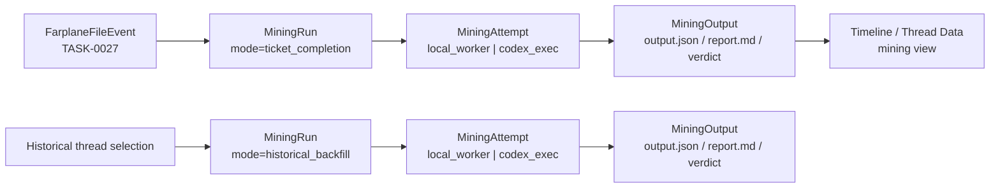

# TASK-0028: Unify Backfill And Event-Triggered Mining Runs

## Summary

Promote the current Thread Data backfill shape into a cleaner reusable
`MiningProgram` / `MiningRun` / `MiningOutput` model under `.farplane/mine`.
The mining run itself is the job-like primitive: it owns input, status,
attempt metadata, executor metadata, outputs, redaction, verdicts, telemetry
events, and replay.

Recommendation: do not introduce a separate generic `Job` abstraction yet.
Backfill, post-ticket review, hook-triggered mining, and manual selected-thread
mining are all modes of the same mining system. Codex threads or `codex exec`
runs are executors attached to a mining run, not records of truth.

## Scope

- In:
  - Define `MiningProgram`, `MiningRun`, `MiningSource`, `MiningOutput`, and
    `MiningAttempt`.
  - Move the conceptual runtime root from `.farplane/backfill` toward
    `.farplane/mine`.
  - Migrate current Thread Data backfill behavior to `.farplane/mine` directly.
  - Support run sources from historical backfill, Farplane file events,
    ticket completion, manual selected threads, and future provider webhooks.
  - Make mining runs replayable from their `input.json` / source records.
  - Define executor metadata for `local_worker`, `codex_exec`, and
    `codex_thread` without making executor identity the primary model.
  - Define how hook programs and historical programs share the same program
    registry and output contract.
- Out:
  - No separate generic queue/job primitive in the first slice.
  - No full daemon, distributed queue, or hidden background autonomy.
  - No requirement to rename every UI string before the model is proven.
  - No provider webhook implementation.
  - No replacement of eval runs; evals remain separate because they judge
    known cases against expected outcomes rather than mine flexible signals
    from source material.

## Current Backfill Baseline

```text
current_thread_data_backfill:
  program_registry:
    .farplane/backfill/programs/index.json
    .farplane/backfill/programs/<program-id>/program.json
  run_index:
    .farplane/backfill/jobs/index.json
  run:
    .farplane/backfill/jobs/<runId>/job.json
    .farplane/backfill/jobs/<runId>/sources.json
    .farplane/backfill/jobs/<runId>/parent-prompt.md
    .farplane/backfill/jobs/<runId>/report.md
    .farplane/backfill/jobs/<runId>/outputs/index.json
    .farplane/backfill/jobs/<runId>/outputs/<thread-id>/output.md
    .farplane/backfill/jobs/<runId>/outputs/<thread-id>/output.json
    .farplane/backfill/jobs/<runId>/outputs/<thread-id>/redaction.md
```

Observed implementation:
- `readBackfillThreadSources()` fetches recent threads from Codex app-server
  `thread/list`, with filesystem-observed thread fallback.
- `createBackfillRun()` chooses a program, filters sources by `limit`,
  `lastDays`, and selected thread ids, then creates one run directory.
- Current implemented execution is `dry-run`: Vite loops over selected sources,
  builds bounded evidence spans from `.farplane/state/message-windows/<id>.json`
  or source preview, and writes output files immediately.
- `parent-prompt.md` describes an intended orchestrator workflow where a parent
  Codex thread can fan out workers per source, but that is not the active
  implementation.
- Outputs are row-like artifacts under `outputs/<thread-id>/`; the run summary
  counts sources, outputs, reviewed/promoted/rejected, privacy issues,
  duplicates, and rejected sources.

Conclusion: the stable primitive is already a run with sources and outputs. It
does not need a new `Job` layer to become replayable.

## Delta

- `Before:` Farplane has a Thread Data backfill runtime under
  `.farplane/backfill`, a Stop miner runtime under `.farplane/event-miner`, and
  an earlier ticket-completion scoring idea that now needs the shared mining
  model.
- `After:` flexible signal extraction uses one mining model:
  `.farplane/mine/programs`, `.farplane/mine/runs`, and outputs under each run.
  Backfill is one run mode; ticket completion review is one run mode;
  hook-triggered mining is one run mode.
- `Why now:` Farplane file events in TASK-0027 need a downstream processing
  target, and the backfill system already has most of the right shape.
- `First-principles basis:` events are facts, mining runs are interpretations
  over sources, outputs are reviewable artifacts, and threads are optional
  executors. The cleanest model avoids a separate job vocabulary until there is
  a proven need for queue-specific machinery.

## System Model

```text
MiningProgram
  id
  version
  objective
  prompt_or_local_handler
  output_contract

MiningRun
  runId
  mode: historical_backfill | event_triggered | ticket_completion | manual_selected
  source: hook | backfill | manual | provider | automation
  programId
  programVersion
  status: queued | running | complete | failed | canceled
  sources[]
  attempts[]
  outputs[]
  telemetryEvents[]
  createdAt
  completedAt?

MiningSource
  sourceId
  sourceKind: codex_thread | message_window | ticket_packet | file_event | provider_event
  ticketId?
  sessionId?
  threadId?
  sourceEventKey?
  provider?
  externalId?
  inputRef

MiningOutput
  outputId
  sourceId
  status
  verdict: unreviewed | promoted | rejected
  redactionStatus
  outputJsonPath
  outputMarkdownPath
  redactionMarkdownPath?
  telemetryEvents?

MiningAttempt
  attemptId
  executorKind: local_worker | codex_exec | codex_thread
  executorRef?
  startedAt
  completedAt?
  status
  logsPath?
```

## Storage Shape

```text
.farplane/mine/
  programs/
    index.json
    <program-id>/program.json
  runs/
    index.json
    <run-id>/
      run.json
      input.json
      sources.json
      attempts.json
      report.md
      outputs/
        index.json
        <source-id>/
          output.md
          output.json
          redaction.md
          telemetry.json
```

Migration:
- New runs use `.farplane/mine` only.
- Do not add a dual-read legacy compatibility layer.
- Existing `.farplane/backfill` proof samples may remain as historical local
  artifacts unless a small one-time migration fixture is useful for tests.

## Change Plan

### Change 1: define Mining Program and Run contracts

```text
fixes:
  - Replace separate job/backfill/ticket-audit vocabulary with one mining run
    contract.
before:
  - backfill has programs/runs/outputs, but the model name is tied to
    historical chat mining.
after:
  - mining runs can be triggered by backfill, hooks, ticket completion, manual
    selection, or provider events.
read:
  - path: ui/vite.config.ts
    reason: current source of backfill program/run/output contracts.
  - path: ui/src/modules/thread-data/types.ts
    reason: current UI types for programs, runs, and outputs.
  - path: ui/src/modules/thread-data/lib/backfill-artifacts.ts
    reason: current run/output helper patterns that should move behind or
      adapt to mining view models.
  - path: tickets/TASK-0020/ticket.md
    reason: original Thread Data platform contract.
write:
  - path: ui/src/lib/mining/
    change: add shared mining types, storage helpers, idempotency helpers, and
      run readers/writers.
  - path: ui/src/lib/mining/types.ts
    change: define MiningProgram, MiningRun, MiningSource, MiningOutput,
      MiningAttempt, and API response shapes.
  - path: ui/src/lib/mining/storage.ts
    change: implement root resolution, index reads/writes, run creation,
      attempt updates, output attachment, and replay reads.
  - path: ui/src/lib/mining/storage.test.ts
    change: cover run creation, replay, idempotency, and output attachment.
  - path: ui/src/modules/thread-data/types.ts
    change: optionally alias or adapt existing Thread Data types to mining
      types without a broad UI rename.
operation:
  - Define the `.farplane/mine` storage contract.
  - Add `FARPLANE_MINE_ROOT` support in the Vite server with default
    `.farplane/mine`; do not add browser env vars or localStorage.
  - Keep `runId + programId + source ids + sourceEventKey` as replay identity.
  - Treat `attempts[]` as run execution metadata, not a separate queue/job.
  - Use atomic-ish write order: write run directory artifacts first, then update
    `runs/index.json`.
signature_or_type_impact:
  - `resolveMiningRoot(env?) -> string`
  - `createMiningRun(input) -> MiningRun`
  - `readMiningRun(runId) -> MiningRunDetail`
  - `readMiningRunIndex(options?) -> MiningRunIndexEntry[]`
  - `replayMiningRun(runId, options?) -> MiningRun`
  - `attachMiningOutput(runId, output) -> MiningRunDetail`
routes:
  docs: update_docs
  qa: tests
  review: reviewer
qa:
  - Unit tests cover run creation, idempotent event-triggered creation, source
    indexing, attempt recording, output attachment, and replay from input.
  - Unit tests confirm no hidden dependency on live Codex transcripts when
    replaying from stored input/source records.
failure_modes:
  - Renaming everything to "mining" at once could churn UI; keep visible UI copy
    stable where useful, but move storage and APIs directly to `.farplane/mine`.
  - Duplicate event-triggered runs could appear; use sourceEventKey +
    programId + source ids as the idempotency key.
```

### Change 2: normalize run modes and sources

```text
fixes:
  - Let historical and realtime mining use the same program/output path.
before:
  - backfill sources are Codex threads; ticket completion audits were heading
    toward a separate audit runtime.
after:
  - both become `MiningSource` rows inside a `MiningRun`.
read:
  - path: tickets/TASK-0027/ticket.md
    reason: file events produce `sourceEventKey` and job-worthy hints.
  - path: hooks/codex-event-miner/launcher.ts
    reason: current event-miner run packet shape.
  - path: ui/vite.config.ts
    reason: current `readBackfillThreadSources()` and message-window evidence
      span behavior define the current historical source shape.
write:
  - path: ui/src/lib/mining/sources.ts
    change: add source normalizers for codex thread, message window, file event,
      provider event, and ticket packet.
  - path: ui/src/lib/mining/sources.test.ts
    change: cover source normalization fixtures for historical backfill, file
      event, ticket completion, and provider event.
operation:
  - `historical_backfill`: many `codex_thread` or `message_window` sources.
  - `ticket_completion`: one `ticket_packet` source plus optional thread/session
    refs.
  - `event_triggered`: one file/provider event source, with optional source
    expansion if the program needs related ticket/progress files.
  - `manual_selected`: user-selected source rows.
signature_or_type_impact:
  - `normalizeMiningSource(input) -> MiningSource`
  - `sourceEventToMiningRunRequest(event, programId) -> CreateMiningRunInput`
  - `backfillThreadSourceToMiningSource(source) -> MiningSource`
  - `ticketCompletionEventToMiningSource(event) -> MiningSource`
routes:
  docs: update_docs
  qa: tests
  review: reviewer
qa:
  - Fixtures cover backfill thread source, ticket completion event, and provider
    event source.
failure_modes:
  - Too many source kinds can become vague; keep each source kind tied to a
    concrete input ref and parser.
```

### Change 3: executor attempts without a separate job layer

```text
fixes:
  - Track how a run executed without making executor state the primary model.
before:
  - dry-run backfill executes synchronously in Vite; event-miner has its own
    detached Codex exec runtime.
after:
  - each mining run records one or more attempts with executor metadata.
read:
  - path: hooks/shared/codex-summary.ts
    reason: injectable Codex exec pattern for bounded LLM work.
  - path: hooks/codex-event-miner/launcher.ts
    reason: detached Codex exec pattern and report schema.
  - path: ui/vite.config.ts
    reason: current backfill dry-run builder can become the first local worker
      implementation.
write:
  - path: ui/src/lib/mining/executors.ts
    change: add local worker and Codex exec executor helpers for mining runs.
  - path: ui/src/lib/mining/programs.ts
    change: define built-in mining program registry and default programs.
  - path: ui/src/lib/mining/executors.test.ts
    change: cover local worker attempt and injectable Codex exec attempt.
operation:
  - `local_worker`: deterministic extraction, parsing, dry-run fixture output.
  - `codex_exec`: one-shot LLM mining program with output schema.
  - `codex_thread`: optional long-running executor, referenced by thread id.
  - Attempt metadata stores executor kind, ref, logs, status, and timestamps.
  - First implementation may support only local worker + injectable codex exec
    helper; codex_thread can be typed but not actively launched.
signature_or_type_impact:
  - `runMiningAttempt(run, executorKind) -> MiningAttemptResult`
  - `MiningAttempt { attemptId, executorKind, executorRef?, status, logsPath? }`
  - `BuiltInMiningProgramId = decision-v1 | trajectory-v1 | learning-v1 |
    ticket-completion-audit-v1`
routes:
  docs: update_docs
  qa: tests
  review: reviewer
qa:
  - Dry-run/local attempt writes deterministic output.
  - Codex exec attempt is covered through injectable runner.
failure_modes:
  - Background execution remains a later capability; first slice can support
    manual run/replay and hook-triggered enqueue.
```

### Change 4: migrate Thread Data backfill to mining runs

```text
fixes:
  - Move current Thread Data backfill behavior onto the shared mining run
    storage directly.
before:
  - Thread Data reads `.farplane/backfill`.
after:
  - Thread Data reads and writes `.farplane/mine` records.
read:
  - path: ui/src/modules/thread-data/README.md
    reason: artifact-first runtime contract and current `.farplane/backfill`
      wording that must move to `.farplane/mine`.
  - path: ui/src/modules/thread-data/components/thread-data-panel.tsx
    reason: UI run/output browsing.
  - path: ui/src/modules/thread-data/lib/backfill-artifacts.test.ts
    reason: existing helper tests should remain stable or be adapted cleanly.
write:
  - path: ui/vite.config.ts
    change: replace the backfill runtime root and endpoints with
      `/farplane/mine/*` equivalents and migrate callers in the same slice.
  - path: ui/src/modules/thread-data/
    change: point data calls and copy at the mining endpoints/storage.
  - path: ui/src/modules/thread-data/README.md
    change: document `.farplane/mine` as the runtime contract.
operation:
  - Add new Vite bridge endpoints:
    - `GET /farplane/mine/programs`
    - `POST /farplane/mine/programs`
    - `GET /farplane/mine/runs`
    - `POST /farplane/mine/runs`
    - `GET /farplane/mine/runs/:runId`
    - `POST /farplane/mine/runs/:runId/replay`
    - `POST /farplane/mine/runs/:runId/outputs/:outputId/verdict`
  - Remove `/farplane/backfill/*` product codepaths in the same slice.
  - New and future backfill-like runs target `.farplane/mine`.
  - Leave old `.farplane/backfill` sample artifacts alone unless a small
    one-time migration fixture is needed for tests.
signature_or_type_impact:
  - `readMiningRuns() -> MiningRunIndexEntry[]`
  - `createMiningBackfillRun(input) -> MiningRunDetail`
routes:
  docs: update_docs
  qa: tests
  review: reviewer
qa:
  - Existing Thread Data tests continue passing.
  - A new mining run appears in the Thread Data run view model.
failure_modes:
  - Any UI still calling `/farplane/backfill/*` will break; update the module
    calls and tests in the same implementation.
```

### Change 5: event-triggered ticket completion run fixture

```text
fixes:
  - Prove the model can support the original ticket-completion use case without
    implementing the full scoring agent yet.
before:
  - ticket completion scoring was planned under separate ticket-audit runtime
    language.
after:
  - a terminal Farplane file event can become a `MiningRun` with
    `mode=ticket_completion`, `source=hook`, and one `ticket_packet` source.
read:
  - path: tickets/TASK-0027/ticket.md
    reason: source event shape for terminal ticket events.
  - path: tickets/TASK-0025/ticket.md
    reason: earlier completion-auditor scoring dimensions and privacy concerns.
write:
  - path: ui/src/lib/mining/ticket-completion-fixtures.test.ts
    change: add fixture that converts terminal ticket event into a mining run
      request and stores replayable input.
operation:
  - Use a compact fixture event with ticket id, path, sourceEventKey,
    terminal=true, changed frontmatter fields, session/thread ids when present.
  - Create run with program `ticket-completion-audit-v1`.
  - Store input/source records without raw ticket body.
  - Attach deterministic local-worker placeholder output proving the storage
    and replay path, not final scoring quality.
signature_or_type_impact:
  - `createTicketCompletionMiningRun(event) -> MiningRunDetail`
routes:
  docs: update_docs
  qa: tests
  review: reviewer
qa:
  - Fixture proves terminal ticket event -> mining run -> output -> replay.
failure_modes:
  - This can look like final scoring even though it is only the storage/run
    model; ticket-completion scoring quality remains follow-up scope.
```



## Done

```text
done_when:
  - `.farplane/mine` storage contract is documented and implemented for new
    mining runs
  - MiningProgram, MiningRun, MiningSource, MiningOutput, and MiningAttempt are
    typed and covered by tests
  - historical backfill, ticket completion, hook-triggered, and manual-selected
    modes are represented in the model
  - replay uses the same run input/source records and records a new attempt
  - executor metadata is stored as attempts, not as a separate job primitive
  - Thread Data backfill creation writes `.farplane/mine` runs
  - ticket completion mining can be represented as a mining run sourced from a
    Farplane file event
  - `/farplane/mine/*` bridge endpoints can create, list, read, replay, and
    update verdicts for mining runs
  - old `/farplane/backfill/*` calls are removed in the same implementation
```

## State

- Current: implemented and ready for review/proof.
- Changed:
  - Added browser-safe mining contracts and source normalizers under
    `ui/src/lib/mining/`.
  - Moved Thread Data bridge/storage defaults from `.farplane/backfill/jobs` to
    `.farplane/mine/runs`.
  - Added `run.json`, `input.json`, `sources.json`, `attempts.json`, output
    `telemetry.json`, and `/farplane/mine/runs/:runId/replay`.
  - Updated Thread Data UI calls/docs from `/farplane/backfill/*` to
    `/farplane/mine/*`.
  - Documented the Mining Run layer in FP02 and logged MEM-0244.
- Verification:
  - `npm run test:once -- ui/src/lib/mining ui/src/modules/thread-data`
  - `npx biome check --files-ignore-unknown=true ui/src/lib/mining ui/src/modules/thread-data ui/vite.config.ts`
  - `npm run typecheck:root`
- Remaining proof gap:
  - Browser/manual creation of one `.farplane/mine` run was not executed in this
    pass.

## QA Strategy

```text
qa_strategy:
  proof_weight: tests
  checks:
    - npm run test:once -- ui/src/lib/mining ui/src/modules/thread-data
    - npx biome check --files-ignore-unknown=true ui/src/lib/mining ui/src/modules/thread-data ui/vite.config.ts
    - npm run typecheck:root
  manual:
    - create a fixture mining run from a backfill-like source
    - create a fixture mining run from a ticket completion event
    - replay one run and inspect attempt metadata
    - confirm Thread Data creates and reads a `.farplane/mine` run
    - use the Vite bridge endpoints to list/read the fixture mining run
  delegated_lanes:
    - review lane for model cleanliness, replay semantics, and migration
  review:
    - rubric: minimal vocabulary, artifact-first storage, replayability,
      executor separation, direct backfill migration
      required_tas: TAS-B
  evidence:
    - sample `.farplane/mine/runs/<runId>/` folder
    - tests for source modes and replay
    - Thread Data proof for one `.farplane/mine` historical_backfill run
    - Vite bridge endpoint response sample with local paths redacted if needed
  goal_advisor_inputs:
    proof_route: mining storage tests + replay tests + Thread Data mine-run
      test
    final_evidence: sample mining run directory and test output
    final_checkpoint: reviewer confirms no separate generic job primitive was
      introduced unnecessarily
  residual_risk:
    - UI naming may lag behind architecture; acceptable if the storage/model
      boundary is clean and documented
    - Full ticket scoring quality is not proven in this ticket; this ticket
      proves the shared run substrate.
```

## Docs Strategy

```text
docs_strategy:
  outcome: update_docs
  doc_targets:
    - ui/src/modules/thread-data/README.md
    - docs/features/FEAT-0002-harness-product-model.md
    - docs/HISTORY.md
  no_docs_reason:
  validation:
    - docs explain event -> mining run -> attempt -> output relationship
```

## Links

- `program:` none yet; create with `goal-advisor` after approval
- `progress:` none yet; create with `goal-advisor` after approval
- `artifacts:`
- `review:`
- `refs:`
  - `tickets/TASK-0020/ticket.md`
  - `tickets/TASK-0020/design.md`
  - `tickets/TASK-0027/ticket.md`
  - `ui/vite.config.ts`
  - `ui/src/modules/thread-data/README.md`
  - `ui/src/modules/thread-data/types.ts`
  - `hooks/codex-event-miner/launcher.ts`
  - `hooks/shared/codex-summary.ts`
  - `.farplane/backfill/jobs/`

## Notes

- `Implementation stance:` this is the minimal implementation plan that
  satisfies the selected ticket. It lands the shared MiningRun substrate,
  bridge endpoints, fixture ticket-completion run, Thread Data migration, and
  docs. It intentionally does not implement full autonomous background workers
  or final ticket scoring quality.
- `Current backfill answer:` it fetches recent threads by timeframe/limit or
  selected ids, loops sources in Vite for dry-run mode, writes one output row
  folder per source, and stores run counts in `job.json` plus `jobs/index.json`.
  The orchestrator/fan-out agent is designed in `parent-prompt.md`, but not the
  active implementation yet.
- `Primitive decision:` MiningRun is the job-like unit. Do not add a separate
  generic `Job` entity until queue-specific behavior has a proven need.
- `Replayable means:` same `input.json` / `sources.json`, same program
  id/version, same source event key when present, new attempt metadata/output,
  no hidden transcript-memory dependency.
- `Naming:` `mine` is shorter and clearer than `backfill` for the shared
  runtime root; `backfill` remains a run mode.
- `Grounding evidence:` local-only. This is a repo-internal storage and
  storage/API refactor grounded in current Thread Data/backfill files,
  hook/event-miner patterns, and Farplane memory invariants.
- `Run Hints:`
  - `Likely size:` normal
  - `Goal recommendation:` recommend
  - `Budget hint:` local Codex implementation with focused tests and reviewer
    lane; no external spend/deploy
  - `Compute hint:` local_shared
  - `Planning hint:` ready for goal-advisor after approval
  - `QA source:` QA Strategy
  - `Batchability:` single-ticket
  - `Batch reason:` shared storage/API surface should land coherently
  - `Human inputs/assets:` none
  - `Credentials / external access:` none
- `plan_qa:`
  - `minimal_required_version:` pass; no daemon, no generic Job entity, no full
    scoring agent, and no broad UI rename beyond endpoint/storage migration.
  - `reuse_before_new_surface:` pass; reuses current backfill run/output shape,
    Thread Data types, Vite bridge style, and Codex executor patterns.
  - `least_parameters:` pass; only `FARPLANE_MINE_ROOT` server-side override is
    introduced, matching existing `FARPLANE_BACKFILL_ROOT` style.
  - `new_files_functions_justified:` pass; `ui/src/lib/mining` is justified as
    a cross-module contract used by Thread Data, file-event hooks, and ticket
    completion mining.
  - `minimal_impl_plan_claim:` pass.
  - `existing_service_fit:` pass; current `thread-data` module stays UI owner,
    while shared storage/model logic moves to `ui/src/lib/mining`.
  - `goal_advisor_ready:` pass after approval.
  - `clarifying_questions:` pass; user selected MiningRun as job-like primitive
    and `.farplane/mine` as the new root direction.
  - `change_plan_locality:` pass.
  - `qa_strategy_explicit:` pass.
  - `docs_strategy:` pass.
  - `grounding_evidence:` local_only.
  - `highest_risk:` stale `/farplane/backfill/*` references after the storage
    move.
  - `fix_or_deferral:` migrate endpoint callers and tests in the same ticket;
    defer only cosmetic UI renaming if needed.
