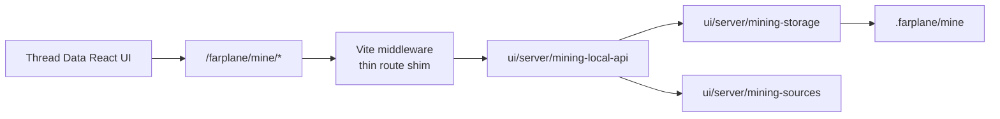

# TASK-0029: Extract Farplane Local API Logic Out Of Vite Config

## Summary

Move Farplane's local filesystem-backed API implementation out of
`ui/vite.config.ts` while keeping Vite as the thin development-time route shim.
The first slice should extract the Thread Data / mining route implementation
into server-owned modules with focused tests, then leave `vite.config.ts`
responsible only for wiring HTTP routes to handlers.

Recommendation: do not replace Vite yet and do not introduce a separate
long-running backend process in this ticket. Use the existing Vite middleware
as the transport boundary, but move business logic, storage logic, source
normalization, replay semantics, and path hardening into testable local API
modules.

## Scope

- In:
  - Extract mining program/run/source/output logic from `ui/vite.config.ts` to
    a server-side local API module.
  - Keep `/farplane/mine/*` route behavior stable for Thread Data.
  - Centralize mining source normalization so tests exercise the production
    path instead of only a parallel browser helper.
  - Harden source ids and run/output ids before filesystem reads or writes.
  - Make replay semantics honest: either regenerate outputs from stored input
    or record replay as a non-complete placeholder attempt.
  - Add tests for server-side mining storage, route handler behavior, unsafe
    ids, event/ticket sources, and replay behavior.
  - Update Thread Data docs to describe Vite as a route shim, not the logic
    owner.
- Out:
  - No new daemon, gateway process, Electron/Tauri bridge, or app-server split.
  - No replacement of Vite as the frontend dev server.
  - No broad extraction of every existing `/farplane/*` route in
    `ui/vite.config.ts`.
  - No final ticket-completion scoring quality work.
  - No external provider webhook implementation.

## Delta

```text
overall_before:
  - `ui/vite.config.ts` owns both Vite config and a large amount of local
    Farplane API behavior.
  - Mining routes work through Vite, but storage/replay/source logic lives in
    the config file and duplicates source normalization from `ui/src/lib/mining`.
overall_after:
  - `ui/vite.config.ts` registers thin route shims.
  - Mining local API behavior lives in server-owned modules with tests and
    explicit filesystem boundaries.
  - The browser-safe mining types remain importable from React, while Node
    filesystem code stays out of the browser bundle.
why_now:
  - TASK-0028 moved Thread Data onto `.farplane/mine`, making mining the next
    owner surface for event-triggered work and ticket scoring.
  - Keeping implementation in Vite config will make the next source mode,
    replay, and hardening changes harder to test and easier to drift.
first_principles_basis:
  objective: keep Vite as transport, not business logic owner
  need: local browser UI needs HTTP access to filesystem state
  assumptions: one-process local dev remains desirable for now
  root_cause: Vite middleware became the easiest place to put local API logic
  constraints: browser code cannot import Node fs modules; local state remains
    `.farplane` file-backed
  first_viable_slice: extract only mining/Thread Data local API behavior
  proof_or_falsification: existing `/farplane/mine/*` flows still work and
    server-side tests cover unsafe ids plus replay
  tradeoff: Vite remains in the request path, but no longer owns the domain
    implementation
  non_goals: new backend process, desktop shell migration, broad API rewrite
```

## Change Plan

### Change 1: create a server-owned mining local API module

```text
fixes:
  - Move mining storage and run behavior out of `vite.config.ts` without
    changing the browser route contract.
before:
  - Vite config defines mining/backfill program types, defaults, source reads,
    run creation, report building, output reads, verdict updates, and replay.
after:
  - Vite config imports a small mining API object or functions and delegates
    route handling.
read:
  - path: ui/vite.config.ts
    reason: current route, storage, filesystem, and response behavior.
  - path: ui/src/modules/thread-data/types.ts
    reason: browser response contracts consumed by Thread Data.
  - path: ui/src/lib/mining/types.ts
    reason: browser-safe mining contracts to reuse or align with.
write:
  - path: ui/server/mining-local-api.ts
    change: add server-owned API functions for programs, sources, runs,
      replay, run reads, and output verdict updates.
  - path: ui/server/mining-storage.ts
    change: add filesystem helpers for `.farplane/mine` programs/runs, atomic
      write order, id validation, and path construction.
  - path: ui/vite.config.ts
    change: replace inline mining implementation with thin route calls.
operation:
  - Keep `FARPLANE_MINE_ROOT` resolution in Vite or pass it into a server API
    factory.
  - Keep `readJsonFile`, `writeJsonFile`, and request/response glue local to
    the server side; do not import Node modules from `ui/src`.
  - Return the same response envelopes currently consumed by Thread Data:
    `{ ok, mineRoot, programs }`, `{ ok, threads }`, `{ ok, detail }`, and
    run list responses.
signature_or_type_impact:
  - `createMiningLocalApi(deps) -> MiningLocalApi`
  - `MiningLocalApi.listPrograms()`
  - `MiningLocalApi.saveProgram(input)`
  - `MiningLocalApi.listThreadSources({ limit, lastDays })`
  - `MiningLocalApi.createRun(input)`
  - `MiningLocalApi.readRun(runId)`
  - `MiningLocalApi.replayRun(runId)`
  - `MiningLocalApi.updateOutputVerdict(input)`
routes:
  docs: update_docs
  qa: tests
  review: reviewer
qa:
  - Server module tests can call API functions without starting Vite.
  - Existing Thread Data helper tests still pass.
failure_modes:
  - Import alias or tsconfig mismatch between Vite runtime and `ui/server`.
  - Accidentally bundling server code into React if files are placed under
    `ui/src` instead of a server-only folder.
```

### Change 2: centralize mining source normalization and path hardening

```text
fixes:
  - Remove duplicate source normalization and close the filesystem path trust
    gap for app-server thread ids.
before:
  - `ui/src/lib/mining/sources.ts` normalizes sources for tests/browser-safe
    use, while Vite has a separate production normalizer.
  - App-server thread ids are interpolated into
    `.farplane/state/message-windows/<id>.json` before a safe filename check.
after:
  - One production normalization path feeds storage, UI view models, and tests.
  - Thread/source ids that become filenames are rejected or mapped through a
    safe filename field.
read:
  - path: ui/src/lib/mining/sources.ts
    reason: existing browser-safe normalizer and tests.
  - path: ui/vite.config.ts
    reason: production source normalization and message-window path reads.
write:
  - path: ui/src/lib/mining/sources.ts
    change: keep browser-safe pure normalizers only if they remain shared by UI
      and tests.
  - path: ui/server/mining-sources.ts
    change: add production normalizers for Codex thread sources, stored mining
      sources, file events, provider events, and ticket packets.
  - path: ui/server/mining-sources.test.ts
    change: cover unsafe ids, message-window path building, provider events,
      and completed ticket events.
operation:
  - Treat display ids and filesystem filename ids as separate values when
    necessary.
  - Allow only `^[A-Za-z0-9._-]+$` for ids used as filenames.
  - Preserve stable event ids/source ids for non-filesystem provider events.
signature_or_type_impact:
  - `normalizeCodexThreadSource(input) -> MiningSource | null`
  - `messageWindowPathForSource(source, cwd) -> string | null`
  - `assertSafeFileId(id, kind) -> string`
routes:
  docs: no_docs
  qa: tests
  review: reviewer
qa:
  - Unsafe source ids such as `../escape` and `a/b` never produce filesystem
    reads or writes.
  - Safe source ids still produce the same output ids and source refs.
failure_modes:
  - Over-sanitizing ids can break legitimate historical rows; preserve display
    id separately from safe file id.
```

### Change 3: make mining replay behavior honest and testable

```text
fixes:
  - Avoid recording fake completed replay attempts that did not actually
    rerun extraction.
before:
  - `/farplane/mine/runs/:runId/replay` appends a completed attempt and returns
    the existing run without regenerating outputs.
after:
  - Replay either reruns the deterministic local worker from stored
    `input.json` / `sources.json`, or records a `skipped` / `queued` attempt
    with a clear reason.
read:
  - path: ui/vite.config.ts
    reason: current replay placeholder.
  - path: tickets/TASK-0028/ticket.md
    reason: replayability contract and proof gap.
write:
  - path: ui/server/mining-local-api.ts
    change: implement honest replay through local-worker regeneration or
      non-complete attempt recording.
  - path: ui/server/mining-local-api.test.ts
    change: cover replay attempt status, attempt append, input reuse, and
      output count behavior.
operation:
  - Preferred first slice: local-worker replay regenerates deterministic dry-run
    outputs from stored input/source records.
  - If a source cannot be expanded without live external data, record
    `status: queued` or `status: failed` with a reason rather than `complete`.
signature_or_type_impact:
  - `replayMiningRun(runId, options?) -> MiningRunDetail`
  - `MiningAttempt.status` may need `skipped` if local conventions prefer it;
    otherwise use existing `queued|failed` with reason metadata.
routes:
  docs: update_docs
  qa: tests
  review: reviewer
qa:
  - Replay test proves a second attempt is added and outputs are regenerated or
    clearly not claimed complete.
failure_modes:
  - Regenerating outputs can overwrite review state; preserve verdicts unless
    the replay explicitly creates new output versions.
```

### Change 4: thin Vite route shim and route-level tests

```text
fixes:
  - Keep Vite in the request path while preventing it from owning mining
    implementation details.
before:
  - Route branches in `vite.config.ts` parse, execute, persist, and format
    mining responses directly.
after:
  - Route branches only read request/query params, enforce bridge write access,
    call the mining local API, and write JSON responses.
read:
  - path: ui/vite.config.ts
    reason: existing bridge middleware shape and access checks.
write:
  - path: ui/vite.config.ts
    change: replace mining route internals with delegation to
      `createMiningLocalApi(...)`.
  - path: ui/server/mining-routes.test.ts
    change: test route-handler functions if extracted, or API-level behavior
      if Vite middleware remains awkward to instantiate.
operation:
  - Preserve route paths:
    - `GET /farplane/mine/programs`
    - `POST /farplane/mine/programs`
    - `GET /farplane/mine/threads`
    - `GET /farplane/mine/runs`
    - `POST /farplane/mine/runs`
    - `GET /farplane/mine/runs/:runId`
    - `POST /farplane/mine/runs/:runId/replay`
    - `POST /farplane/mine/runs/:runId/outputs/:outputId/verdict`
signature_or_type_impact:
  - Vite config should expose no mining domain types beyond route glue.
routes:
  docs: update_docs
  qa: tests
  review: reviewer
qa:
  - Existing Thread Data UI fetches still target the same endpoints.
  - Route shim rejects writes without bridge write access.
failure_modes:
  - Moving code can break Vite startup if imports use browser-only aliases.
```



## Done

```text
done_when:
  - `ui/vite.config.ts` no longer contains mining storage/run/source/output
    implementation logic
  - `/farplane/mine/*` route paths and response envelopes remain compatible
    with Thread Data
  - mining local API modules own `.farplane/mine` storage behavior
  - production source normalization is covered by tests and rejects unsafe
    filesystem ids
  - replay behavior is either real regeneration or explicitly non-complete
  - Thread Data still creates, lists, reads, replays, and updates verdicts for
    mining runs through the same browser routes
  - docs identify Vite as a route shim rather than the mining logic owner
```

## Implementation Result

```text
implemented:
  - `ui/server/mining-local-api.ts` now owns program CRUD, thread source
    listing, run creation, run reads, replay, output generation, verdict
    updates, and `.farplane/mine` index writes.
  - `ui/server/mining-sources.ts` now owns server-side source normalization and
    safe message-window path construction.
  - `ui/vite.config.ts` now creates `createMiningLocalApi(...)` and delegates
    `/farplane/mine/*` route branches to that API.
  - Thread Data helper names and file names now use mining terminology:
    `mining-artifacts.ts`, `sortMiningRuns`, `formatMiningDate`, and
    `MiningEvidenceRow`.
  - Browser-safe source helpers now use
    `historicalThreadSourceToMiningSource(...)` instead of the old backfill
    helper name.
  - Replay regenerates deterministic local outputs from stored sources,
    appends a new completed attempt with
    `reason: replayed_from_stored_input`, and preserves reviewer verdicts.
  - Unsafe message-window ids are rejected before filesystem path construction.
deviation_from_plan:
  - A separate `ui/server/mining-storage.ts` was not added in this slice.
    Storage helpers stayed module-local inside `mining-local-api.ts` because
    there is only one real caller today; split later when a second caller or
    queue worker needs it.
evidence:
  - `npm run test:once -- ui/server ui/src/lib/mining ui/src/modules/thread-data`
    passed: 4 files, 16 tests.
  - `npx biome check --files-ignore-unknown=true ui/server/mining-sources.ts ui/server/mining-local-api.ts ui/server/mining-sources.test.ts ui/server/mining-local-api.test.ts ui/src/lib/mining ui/src/modules/thread-data ui/vite.config.ts`
    passed.
  - `npm run typecheck:root` passed.
residual_risk:
  - No browser manual proof was run in this pass; server/API tests cover the
    critical storage and replay path.
  - Other non-mining `/farplane/*` local API branches still live in
    `ui/vite.config.ts` and should be extracted only after this pattern holds.
```

## QA Strategy

```text
qa_strategy:
  proof_weight: tests
  checks:
    - npm run test:once -- ui/server ui/src/lib/mining ui/src/modules/thread-data
    - npx biome check --files-ignore-unknown=true ui/server ui/src/lib/mining ui/src/modules/thread-data ui/vite.config.ts
    - npm run typecheck:root
  manual:
    - start `npm run ui`
    - open Thread Data
    - create one mining run through the UI
    - inspect `.farplane/mine/runs/<runId>/run.json`, `input.json`,
      `sources.json`, `attempts.json`, and `outputs/index.json`
    - replay the run and inspect attempt semantics
    - update one output verdict and confirm counts persist
  delegated_lanes:
    - reviewer lane for boundary cleanliness and hardening findings
  review:
    - rubric: Vite remains transport-only; no browser import of Node fs code;
      ids are safe before filesystem paths; replay is honest; route compatibility
      is preserved
      required_tas: TAS-B
  evidence:
    - test output
    - sample `.farplane/mine/runs/<runId>/` folder from manual proof
    - before/after diff showing `vite.config.ts` mining logic reduction
  goal_advisor_inputs:
    proof_route: server module tests + focused Thread Data tests + manual UI
      route proof
    final_evidence: checks output and sample mining run directory
    final_checkpoint: reviewer confirms Vite config is a thin shim and source
      id hardening is covered
  residual_risk:
    - broader non-mining `/farplane/*` routes still live in Vite config; leave
      extraction for later tickets after the mining pattern is proven
    - full UI workspace typecheck may still be blocked by unrelated existing
      debt; report separately if unchanged
```

## Docs Strategy

```text
docs_strategy:
  outcome: update_docs
  doc_targets:
    - ui/src/modules/thread-data/README.md
    - docs/features/FEAT-0002-harness-product-model.md
    - docs/HISTORY.md
  no_docs_reason:
  validation:
    - docs state Vite is only a local route shim for mining
    - docs state `.farplane/mine` remains the runtime contract
```

## Links

- `program:` none yet; create with `goal-advisor` after approval
- `progress:` none yet; create with `goal-advisor` after approval
- `artifacts:`
- `review:`
- `refs:`
  - `tickets/TASK-0028/ticket.md`
  - `ui/vite.config.ts`
  - `ui/src/lib/mining/types.ts`
  - `ui/src/lib/mining/sources.ts`
  - `ui/src/modules/thread-data/README.md`
  - `ui/src/modules/thread-data/components/thread-data-panel.tsx`

## Notes

- `Implementation stance:` this is the minimal implementation plan that
  satisfies the selected architecture cleanup. It keeps Vite because it is the
  current local browser bridge, but removes mining domain ownership from
  `vite.config.ts`.
- `Options considered:`
  - Keep all logic in `vite.config.ts`: rejected because mining is now a
    reusable substrate and needs focused tests/hardening.
  - Add a separate backend process now: rejected because process orchestration
    is unnecessary for the first cleanup and would expand blast radius.
  - Extract only pure helpers but leave routes/storage mixed in Vite: rejected
    because replay and id hardening need server-side proof around the real
    filesystem boundary.
- `Grounding evidence:` local-only. This plan is grounded in current
  `ui/vite.config.ts`, TASK-0028, Thread Data module docs, and the mining source
  helper/tests.
- `Run Hints:`
  - `Likely size:` normal
  - `Goal recommendation:` recommend
  - `Budget hint:` local implementation with focused tests and reviewer lane
  - `Compute hint:` local_shared
  - `Planning hint:` ready for goal-advisor after approval
  - `QA source:` QA Strategy
  - `Batchability:` single-ticket
  - `Batch reason:` route/storage extraction should land coherently to avoid
    mixed ownership
  - `Human inputs/assets:` none
  - `Credentials / external access:` none
- `plan_qa:`
  - `minimal_required_version:` pass; extracts mining only, not all Vite routes
    or a new backend process.
  - `reuse_before_new_surface:` pass; reuses the existing Vite bridge and
    Thread Data endpoints while moving logic to server modules.
  - `least_parameters:` pass; no new runtime config beyond existing
    `FARPLANE_MINE_ROOT`.
  - `new_files_functions_justified:` pass; server modules are justified by
    filesystem boundary isolation and focused tests.
  - `minimal_impl_plan_claim:` pass.
  - `existing_service_fit:` pass; Vite remains route owner, mining local API
    becomes domain owner.
  - `goal_advisor_ready:` pass after approval.
  - `clarifying_questions:` pass; no blocking input remains.
  - `change_plan_locality:` pass.
  - `qa_strategy_explicit:` pass.
  - `docs_strategy:` pass.
  - `grounding_evidence:` local_only.
  - `highest_risk:` route compatibility and unsafe source id handling.
  - `fix_or_deferral:` harden mining source ids in this ticket; defer broader
    Vite route extraction.
