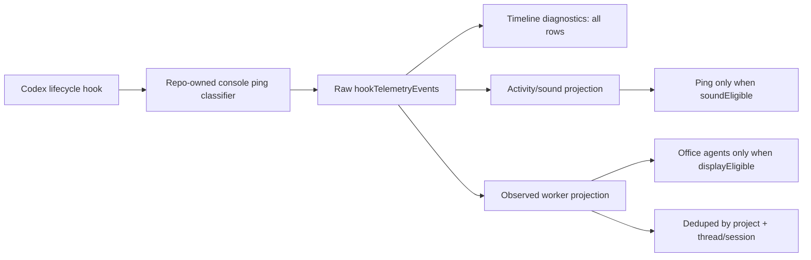

# TASK-0032: classify lifecycle hooks and hide ephemeral observed workers

## Summary
Farplane currently treats too many Codex lifecycle hook rows as user-visible agent activity. Recent telemetry showed Stop/UserPromptSubmit spam from internal helper prompts, and the office HUD showed `AGENTS 29` with `4 PERSIST / 25 EPH` even though the operator expected about three real threads. This ticket makes lifecycle hook telemetry carry explicit sound/display eligibility, dedupes observed Codex workers by thread/session, and keeps ephemeral/internal helper threads out of the office agent roster while preserving raw telemetry for diagnosis.

This is feasible because the repo already has the necessary seams: global hook installation, raw hook telemetry ingestion, projection helpers, local fallback mappers, and runtime adapter filters for internal auxiliary threads. The implementation should extend those seams rather than inventing a new agent registry.

## Scope
- In:
  - Add a repo-owned source and install path for the lifecycle console ping hook currently installed as `~/.codex/hooks/farplane_console_ping.py`.
  - Classify lifecycle hook rows as user-visible, sound-eligible, internal helper, or ephemeral before telemetry consumers act on them.
  - Ensure Stop rows inherit the classification of their paired UserPromptSubmit/turn when the Stop payload cannot classify itself.
  - Update Convex/local observed worker projections so internal helper and ephemeral lifecycle rows do not become office agents.
  - Deduplicate observed workers for the same project/thread/session across hook sources such as machine pings, file-change listener, skill listener, and codex-event-miner.
  - Update the sound/display consumer to use explicit eligibility instead of raw Stop event presence.
  - Keep Project Timeline/raw telemetry able to show all hook events, including hidden/internal rows, with classification reasons.
- Out:
  - Rewriting the full Codex hook system.
  - Removing codex-event-miner, file-change-listener, or skill-invocation-listener telemetry.
  - Hiding real user-owned Codex threads from app-server thread lists.
  - Changing native Codex app hook semantics outside Farplane-managed hooks.
  - Treating the installed `~/.codex/hooks/farplane_console_ping.py` as the durable source of truth.

## Delta

```text
overall_before:
  - Raw UserPromptSubmit and Stop pings can trigger sound/display behavior without knowing whether the turn is a real user thread or an internal helper.
  - Observed worker IDs include sourceInstanceId, so one Codex thread can appear as multiple office agents from different hook sources.
  - Office merge allows parented rows when isEphemeral is true, which is the opposite of the desired "hide ephemeral threads" behavior.
overall_after:
  - Lifecycle rows carry explicit classification fields: isInternalHelper, isLikelyEphemeral, soundEligible, displayEligible, and classificationReasons.
  - Stop rows can reuse paired turn classification from a small local classification cache when the Stop payload lacks the original prompt.
  - Observed workers are grouped by project/thread/session and filtered by display eligibility before office merge.
  - Raw telemetry remains inspectable, but only real user-visible threads can produce the ping sound or office agent rows.
why_now:
  - Recent office evidence showed AGENTS 29 / 25 EPH and repeated Stop hook pings while only about three real threads were expected.
problems:
  - before: Internal helper prompts such as file summaries, review agents, ambient suggestions, and heartbeat workers look like user-facing Codex threads.
    after: Those rows are classified as internal helpers and excluded from sound/office presence.
    why_now: These helpers are frequent enough to spam the operator.
  - before: Same-session rows from multiple hooks create duplicate observed agents.
    after: Same project/thread/session collapses to one observed worker with the latest useful status.
    why_now: The visible office roster is inflated and hard to trust.
first_principles_basis:
  objective: Preserve observability while making attention surfaces represent only work the operator should notice.
  need: Stop hooks should not play a sound or create a visible office agent when they belong to ephemeral/internal helper work.
  assumptions: Real user Codex turns have stable session/thread identity; internal helper turns can be classified from prompt patterns, command metadata, parent/session hints, or missing transcript characteristics.
  root_cause: Raw lifecycle hook events are projected directly into attention surfaces without an eligibility layer.
  constraints: Keep raw hook telemetry; avoid patching installed Codex home files as source; do not hide real persistent user threads; keep local fallback and Convex paths consistent.
  first_viable_slice: Classify Farplane lifecycle pings, filter/dedupe observed worker projections, and prove with the current office route.
  proof_or_falsification: A 5-minute window containing helper turns still shows raw telemetry, but helper Stop rows have soundEligible/displayEligible false and do not increase office agent count.
  tradeoff: Some unusual legitimate headless Codex exec turns may be hidden until they gain an explicit user-visible marker.
  non_goals: Full historical telemetry migration, full process supervisor replacement, or audio-system redesign.
```

## Change Plan

### Change 1: own and classify the lifecycle console ping hook

```text
fixes:
  - The current ping hook source lives in Codex home, while the repo only references it from hook config.
before:
  - scripts/install-farplane-hooks.mjs installs repo-managed TypeScript hooks but leaves farplane_console_ping.py as an unmanaged external dependency.
  - The lifecycle ping payload has hookType/eventType/session/turn fields but no display or sound eligibility.
after:
  - The repo owns the lifecycle console ping hook source and installer entry.
  - UserPromptSubmit and Stop pings include lifecycleClassification with isInternalHelper, isLikelyEphemeral, soundEligible, displayEligible, and classificationReasons.
  - Stop classification can be recovered from a TTL-limited local cache keyed by stable session/turn identity when the Stop payload lacks prompt context.
read:
  - path: scripts/install-farplane-hooks.mjs
    reason: extend managed hook install/prune behavior without drifting global hook config.
  - path: scripts/install-farplane-hooks.test.ts
    reason: preserve installer idempotence and command assertions.
  - path: ~/.codex/hooks/farplane_console_ping.py
    reason: inspect installed behavior as migration input only, not as source of truth.
  - path: hooks/shared/telemetry-outbox.ts
    reason: reuse established outbox/telemetry resilience patterns if practical.
write:
  - path: hooks/farplane-console-ping/HOOK.md
    change: document lifecycle ping ownership, classification rules, cache, and telemetry payload contract.
  - path: hooks/farplane-console-ping/run.py or hooks/farplane-console-ping/run.ts
    change: add repo-owned lifecycle ping hook implementation.
  - path: hooks/farplane-console-ping/handler.test.* or equivalent
    change: cover prompt classification, Stop cache inheritance, malformed payloads, and privacy-safe cache contents.
  - path: scripts/install-farplane-hooks.mjs
    change: install the repo-owned lifecycle ping hook and prune the old unmanaged command if safe.
  - path: scripts/install-farplane-hooks.test.ts
    change: assert managed lifecycle hook install and idempotent migration from the old command.
operation:
  - Prefer TypeScript if it can reuse existing hook helpers and tsx is already installed; keep Python only if preserving existing Codex hook runtime behavior is materially safer.
  - Write only classification metadata to local cache, not full prompts.
  - Classify known helper prompts observed in telemetry: file summary bubbles, read-only pre-push diff reviewer, lightweight post-change review, heartbeat automation prompts, hyperpersonalized suggestions, safety/compliance ambient suggestions, and codex exec --ephemeral turns.
signature_or_type_impact:
  - Adds optional payload fields under lifecycleClassification and mirrored top-level booleans for projection compatibility.
routes:
  docs: update_docs
  qa: tests
  review: reviewer
qa:
  - Unit test classification for real user prompt, helper prompt, codex exec --ephemeral, and Stop without prompt but with cache hit.
  - Unit test cache TTL/truncation and no raw prompt persistence.
failure_modes:
  - Over-filtering legitimate headless work.
  - Cache miss on Stop rows causing a hidden helper Stop to remain soundEligible.
  - Installer leaves duplicate lifecycle ping commands in hooks.json.
```

### Change 2: gate sound and display semantics from telemetry payload

```text
fixes:
  - Attention surfaces respond to raw Stop events instead of explicit operator-relevance.
before:
  - Any farplane-console-ping Stop/turn_end row can be treated as a user-facing event by downstream consumers.
after:
  - Sound consumers only respond when soundEligible is true.
  - Display consumers only create office presence when displayEligible is true.
  - Timeline/debug panels still show raw events and classification reasons.
read:
  - path: ui/src
    reason: locate the exact audio/ping consumer; initial search did not find a direct new Audio call, so implementation must trace the app notification path.
  - path: convex/modules/hookTelemetry/projections.ts
    reason: central projection surface for lifecycle rows, activity pings, observed workers, and bubble messages.
  - path: ui/src/modules/hook-telemetry/README.md
    reason: module-level contract for hook telemetry views.
write:
  - path: ui/src/... audio or notification consumer
    change: require soundEligible true for lifecycle Stop ping playback.
  - path: convex/modules/hookTelemetry/projections.ts
    change: expose eligibility helpers used by activity/observed-worker projections.
  - path: ui/src/modules/hook-telemetry/*
    change: show classification reason fields in diagnostic views where useful.
operation:
  - Treat missing soundEligible as legacy-compatible true only for user-owned lifecycle rows, not for rows already classified internal/ephemeral by other signals.
signature_or_type_impact:
  - Optional telemetry projection fields may need type updates for eligibility metadata.
routes:
  docs: update_docs
  qa: tests
  review: reviewer
qa:
  - Unit test Stop rows with soundEligible false do not produce sound-trigger state.
  - Unit test raw timeline still renders hidden/internal rows.
failure_modes:
  - Sound code path may live outside the initially searched UI modules.
  - Legacy rows without classification could still ping until the hook update is installed.
```

### Change 3: dedupe and filter observed Codex workers

```text
fixes:
  - Same thread/session can produce multiple visible observed workers, and ephemeral rows are allowed into office merge.
before:
  - hookTelemetryRowsToObservedCodexWorkers builds workerId from sourceInstanceId + projectId + sessionKey.
  - mergeObservedCodexWorkersIntoUnifiedOfficeModel keeps rows with no parent, or rows with parent when isEphemeral is true.
  - Recent evidence showed one thread represented by machine, file-change-listener, skill-invocation-listener, and codex-event-miner rows.
after:
  - Observed worker identity is stable by projectId + thread/session key, with source instances kept as metadata rather than identity.
  - Rows marked displayEligible false, isInternalHelper true, or isLikelyEphemeral true are excluded from office agent merge.
  - Parent/child ephemeral rows are not promoted into visible office agents by default.
read:
  - path: convex/modules/hookTelemetry/projections.ts
    reason: worker projection, lifecycle state, and bubble conversion logic.
  - path: convex/modules/hookTelemetry/hookTelemetry.test.ts
    reason: existing projection and ingestion coverage.
  - path: ui/src/providers/office-data-refresh.ts
    reason: merge/dedupe office observed workers into unified model.
  - path: ui/src/providers/office-data-provider.tsx
    reason: Convex/local observed worker data path.
  - path: ui/src/modules/runtime/lib/codex-app-server/normalizers.ts
    reason: reuse existing internal auxiliary/headless thread classification patterns.
  - path: ui/src/modules/runtime/lib/adapters/runtime-adapters.test.ts
    reason: keep parity with existing app-server thread filtering tests.
write:
  - path: convex/modules/hookTelemetry/projections.ts
    change: add eligibility helpers, session-level grouping, source metadata merge, and hidden-row filtering for observed workers.
  - path: convex/modules/hookTelemetry/hookTelemetry.test.ts
    change: cover hidden helper rows, Stop cache metadata, same-session source dedupe, and parented ephemeral exclusion.
  - path: ui/src/providers/office-data-refresh.ts
    change: filter display-ineligible workers and dedupe by stable project/thread/session key before office merge.
  - path: ui/src/providers/office-data-refresh.test.ts or nearest provider test
    change: assert hidden ephemeral/internal rows do not increase agent count.
operation:
  - Keep raw hook telemetry rows unchanged; filtering happens at projection/office merge.
  - Prefer a compatibility helper so local fallback and Convex queries share the same observed-worker semantics.
signature_or_type_impact:
  - ObservedCodexWorker may gain sourceInstanceIds/classification fields while preserving existing consumer fields.
routes:
  docs: update_docs
  qa: tests
  review: reviewer
qa:
  - Projection test where four hook sources for one session produce one observed worker.
  - Office merge test where displayEligible false and isLikelyEphemeral true rows create zero observed agents.
  - Regression test that a normal user-owned running Codex thread still appears once.
failure_modes:
  - Deduping too aggressively across distinct concurrent turns in one session.
  - Hiding useful child-agent rows that should remain visible as subordinate status, not office agents.
```

### Change 4: align local fallback discovery with Convex semantics

```text
fixes:
  - Local observed fallback can surface stale running workers from older UserPromptSubmit-only rows.
before:
  - localFarplaneEventsToObservedCodexWorkers defaults to a 3-day discovery range and relies on the same projection identity issue.
  - The local endpoint returned no recent rows for 5 minutes but older rows for 3 days, including stale running states.
after:
  - Local fallback uses the same classification/filtering semantics as Convex and avoids promoting stale unmatched starts as live agents.
  - The provider passes the same 15-minute observed presence range to local and Convex paths.
read:
  - path: ui/src/providers/local-observed-codex-workers.ts
    reason: local JSONL-to-telemetry mapper and range defaults.
  - path: ui/src/providers/local-observed-codex-workers.test.ts
    reason: existing local fallback coverage.
  - path: ui/src/providers/office-data-provider.tsx
    reason: actual local fallback endpoint invocation and range configuration.
write:
  - path: ui/src/providers/local-observed-codex-workers.ts
    change: map classification fields and avoid stale running rows.
  - path: ui/src/providers/local-observed-codex-workers.test.ts
    change: cover hidden helper rows, stale unmatched starts, and same-session dedupe.
  - path: ui/src/providers/office-data-provider.tsx
    change: ensure local fallback requests use OBSERVED_CODEX_PRESENCE_RANGE_MS or an equivalent bounded range.
operation:
  - Keep 3-day discovery only for debug endpoints if still useful, not for visible office presence.
signature_or_type_impact:
  - No public API change expected; internal helper options may gain classification fields.
routes:
  docs: update_docs
  qa: tests
  review: inline
qa:
  - Local mapper unit test for 3-day-old UserPromptSubmit without Stop not becoming a running office worker.
  - Local endpoint smoke with rangeMs=300000 and rangeMs=900000 after fixture rows.
failure_modes:
  - Debug views may lose older local rows if visible and diagnostic ranges are conflated.
```

### Change 5: document and prove the operator-facing behavior

```text
fixes:
  - The intended distinction between raw telemetry, sound eligibility, and office presence is not documented as a contract.
before:
  - Hook telemetry docs describe raw events and projections, but not lifecycle attention rules.
after:
  - Docs state that raw telemetry is complete, sound is gated by soundEligible, and office observed workers are gated by displayEligible.
read:
  - path: convex/modules/hookTelemetry/README.md
    reason: raw hook telemetry and projection ownership.
  - path: ui/src/modules/hook-telemetry/README.md
    reason: Project Timeline ownership and diagnostics.
  - path: docs/MEMORY.md
    reason: MEM-0228 already defines hook-originated raw events and projections.
  - path: docs/TROUBLES.md
    reason: previous hook telemetry misses require proof through local event file and UI provider chain.
  - path: qa/README.md
    reason: browser QA artifact expectations.
write:
  - path: convex/modules/hookTelemetry/README.md
    change: add lifecycle classification/projection contract.
  - path: ui/src/modules/hook-telemetry/README.md
    change: describe visible diagnostics for hidden/internal rows.
  - path: tickets/TASK-0032/artifacts/
    change: store browser screenshots, telemetry samples, and QA reports during implementation.
operation:
  - Keep docs concise and linked to the ticket evidence, not as a second implementation spec.
signature_or_type_impact:
  - Documentation-only.
routes:
  docs: update_docs
  qa: visual-qa
  review: reviewer
qa:
  - Browser QA on /office proving the visible agent count no longer includes helper/ephemeral rows.
  - Project Timeline/telemetry sample proving hidden rows are still inspectable with classification.
failure_modes:
  - Browser evidence may be noisy if real concurrent agents are active during QA; use controlled fixture rows when possible.
```



## Gap Analysis
- Current state: Farplane captures raw hook telemetry and projects it into activity pings, observed Codex workers, and bubbles. App-server thread normalization already filters many internal auxiliary/headless threads, but lifecycle hook projections do not share that classification layer.
- Production expectation: Attention surfaces should be opt-in by relevance. Raw event logs can be complete and noisy; sounds and office avatars should represent operator-actionable or user-owned work.
- Missing gaps:
  - No repo-owned lifecycle console ping hook source.
  - No explicit sound/display eligibility in lifecycle payloads.
  - Stop rows cannot reliably classify helper turns without paired-turn memory.
  - Observed worker identity includes source instance, creating duplicate agents.
  - Office merge currently promotes some ephemeral rows.
  - Local fallback can surface stale starts as running workers.
- Comparable implementations:
  - Local app-server runtime filtering in `ui/src/modules/runtime/lib/codex-app-server/normalizers.ts`.
  - Existing hook telemetry projection pattern in `convex/modules/hookTelemetry/projections.ts`.
  - Existing installer idempotence in `scripts/install-farplane-hooks.mjs`.
- Recommendation: Land a narrow lifecycle classification and projection-gating slice now. Defer broader agent roster UX or historical telemetry backfill until after the current Stop spam is suppressed.

## Done

```text
done_when:
  - farplane-console-ping is repo-owned and installed through scripts/install-farplane-hooks.mjs without duplicate global hook commands.
  - lifecycle telemetry rows include classification metadata with privacy-safe reasons and no raw prompt cache persistence.
  - Stop rows for classified helper turns emit soundEligible=false and displayEligible=false.
  - observed worker projection collapses multiple hook sources for one project/thread/session into one worker.
  - office merge excludes display-ineligible, internal helper, and likely ephemeral workers.
  - normal user-owned Codex threads still appear once in the office and can still produce eligible attention signals.
  - Project Timeline/raw telemetry can still inspect hidden/internal lifecycle rows.
  - tests, browser QA, and reviewer pass are linked from this ticket.
```

## QA Strategy

```text
qa_strategy:
  proof_weight: qa
  checks:
    - npm run test:once -- scripts/install-farplane-hooks.test.ts hooks/farplane-console-ping convex/modules/hookTelemetry/hookTelemetry.test.ts ui/src/providers/local-observed-codex-workers.test.ts
    - npm run test:once -- ui/src/providers/office-data-refresh.test.ts ui/src/modules/runtime/lib/adapters/runtime-adapters.test.ts
    - npm run typecheck:root
  manual:
    - Run npm run ui or the active dev gateway.
    - Open http://127.0.0.1:5199/office with Convex dev telemetry enabled.
    - Capture the office HUD and visible agent labels before/after a controlled helper turn.
    - Query recent hook telemetry and confirm helper rows remain raw-visible but carry soundEligible=false and displayEligible=false.
    - Query getObservedCodexWorkers for the same window and confirm helper sessions do not appear as workers.
    - Trigger or wait for a real user-owned Codex turn and confirm it can still appear once.
  delegated_lanes:
    - lane: reviewer
      focus: over-filtering risk, privacy of classification cache, installer migration safety, and projection compatibility.
    - lane: visual-qa
      focus: office roster count, absence of helper labels, and raw timeline visibility.
  review:
    - rubric: implementation review must verify sound/display gates are explicit and raw telemetry is not dropped.
      required_tas: pass-ready
  evidence:
    - tickets/TASK-0032/artifacts/office-before.png
    - tickets/TASK-0032/artifacts/office-after.png
    - tickets/TASK-0032/artifacts/recent-hook-telemetry.json
    - tickets/TASK-0032/artifacts/observed-workers.json
    - tickets/TASK-0032/artifacts/review.md
  goal_advisor_inputs:
    proof_route: classify hook -> ingest telemetry -> project observed workers -> render office -> inspect timeline
    final_evidence: tests, telemetry samples, office screenshots, and reviewer receipt under tickets/TASK-0032/artifacts/
    final_checkpoint: reviewer TAS pass-ready plus browser QA showing hidden helper rows do not inflate office agent count
  residual_risk:
    - Live concurrent agents may make office counts noisy; controlled fixture rows should be used for deterministic proof.
    - Native Codex may change Stop payload shape; classifier should tolerate missing fields and fail closed for helper evidence only.
```

## Docs Strategy

```text
docs_strategy:
  outcome: update_docs
  doc_targets:
    - hooks/farplane-console-ping/HOOK.md
    - convex/modules/hookTelemetry/README.md
    - ui/src/modules/hook-telemetry/README.md
  no_docs_reason:
  validation:
    - Docs state raw telemetry remains complete while sound/display projections are eligibility-gated.
    - Docs identify the repo-owned install path for lifecycle ping hooks.
```

## Agent Contract
- Open: `npm run ui`, then `http://127.0.0.1:5199/office`.
- Test hook: `npx convex run modules/hookTelemetry/queries:getHookTelemetryExplorer` and `npx convex run modules/hookTelemetry/queries:getObservedCodexWorkers` with a recent range.
- Stabilize: Prefer controlled fixture telemetry rows for deterministic projection/provider tests; avoid relying only on live concurrent agents.
- Inspect: Office HUD agent count, visible agent labels, visible status bubbles, Project Timeline row details, and query JSON artifacts.
- Key screens/states: `/office` HUD, observed agents in project clusters, Project Timeline hook details.
- Design baseline: none needed; this ticket changes roster semantics, not visual design.
- QA cookbook: `qa/README.md`; no narrower cookbook identified yet.
- Taste refs: existing office renderer behavior and shared Tailwind theme tokens only if UI diagnostics change.
- Expected artifacts: screenshots, query JSON, test logs, review report.
- Delegate with: this ticket path, especially `Change Plan` and `QA Strategy`.

## Run Hints
- Likely size: normal
- Goal recommendation: recommend
- Budget hint: one implementation pass plus reviewer and visual QA lanes
- Compute hint: local_shared
- Planning hint: impl_plan
- QA source: QA Strategy
- Batchability: single-ticket
- Batch reason: crosses hook install, telemetry projection, and office rendering; should land as one coherent behavior change.
- Human inputs/assets: approval of this plan before implementation.
- Credentials / external access: Convex dev deployment from `.env.local`; no new external credentials expected.
- Compute/runtime needs: local UI dev server and Convex query access.
- Tooling gaps: exact audio/ping consumer path must be traced during implementation because initial repo search did not show a direct `new Audio` call.
- QA risks: live agent activity may make counts fluctuate; use fixture rows and capture exact telemetry samples.
- Human gates: approve implementation; confirm whether headless user-invoked `codex exec` should ever be sound/display eligible.
- Agent decision boundaries: do not hide raw telemetry; do not edit installed Codex home hook as source of truth; do not broaden into full office agent roster redesign.

## Links
- `program:` `none`
- `progress:` `none`
- `artifacts:`
  - `tickets/TASK-0032/artifacts/` (to be created during implementation)
- `review:`
  - `none`
- `refs:`
  - `scripts/install-farplane-hooks.mjs`
  - `convex/modules/hookTelemetry/projections.ts`
  - `ui/src/providers/office-data-refresh.ts`
  - `ui/src/providers/local-observed-codex-workers.ts`
  - `ui/src/modules/runtime/lib/codex-app-server/normalizers.ts`

## Notes
- Investigation sample: recent telemetry included helper prompts for file summary labels, pre-push diff review, post-change review, heartbeat automation, suggestion generation, and compliance checks alongside the real user prompt.
- Investigation sample: `/office` showed `AGENTS 29`, `4 PERSIST / 25 EPH`, and labels such as `Codex Stop hook observed without a transcript path; likely ephemeral worker.`
- The implementation should reuse the existing app-server internal thread filters as a classification reference, but lifecycle hook telemetry needs its own payload-level eligibility because Stop rows may not have app-server thread metadata.
