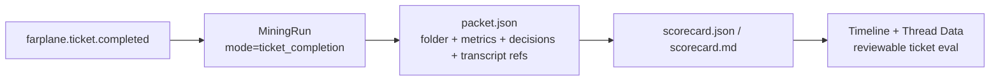

# TASK-0034: Upgrade Ticket Completion Audits Into Scored Evaluation Packets

## Summary

Ticket completion now creates a replayable `.farplane/mine` run, but the
`ticket-completion-audit-v1` program is still only a generic dry-run scorecard
prompt. Upgrade the completion audit into a real per-ticket evaluation packet:
deterministic telemetry metrics, ticket-folder context, mined decisions, and a
session/transcript reference feed a structured scorecard artifact.

Recommended path: keep the hook lightweight and idempotent, build the rich
packet in the mining layer, and let the evaluator read bounded transcript
context by default with a full-session reference available for follow-up.

## Scope

- In:
  - Define `ticket_completion_packet(ticketId, sessionId, eventKey)` as the
    durable input contract for ticket audits.
  - Include ticket folder context: `ticket.md`, `program.md`, `progress.md`,
    linked artifact metadata, and terminal frontmatter diff.
  - Include deterministic metrics derivable from telemetry and local runtime
    data: elapsed time, turn count, hook/file event count, proof artifact count,
    review/fix loops when inferable, and token usage only when reliably present.
  - Include mined decisions for the ticket and session.
  - Include transcript access by reference plus bounded transcript/window
    excerpts by default.
  - Update `ticket-completion-audit-v1` to output `scorecard.json`,
    `scorecard.md`, and telemetry-ready summary events.
  - Add tests for packet building, privacy bounds, idempotent replay, and score
    artifact shape.
- Out:
  - No full LLM worker execution inside the file-change hook.
  - No automatic writes to `docs/LESSONS.md` or `docs/TROUBLES.md`.
  - No broad lifecycle policy change that treats `status: review` as completed.
  - No UI redesign beyond ensuring Thread Data/Timeline can read the new
    artifacts if existing readers already support them.

## Delta

```text
overall_before:
  - farplane.ticket.completed can create a mining run, but the run contains
    generic dry-run output rather than a true ticket eval packet.
  - ticket-completion-audit-v1 names useful rubric ideas but does not receive
    ticket folder context, decisions, telemetry metrics, or transcript refs.
overall_after:
  - completion audits have a stable packet and scorecard contract.
  - deterministic metrics are computed by code, not guessed by the model.
  - qualitative rubric scoring can inspect the ticket, progress, decisions, and
    bounded transcript context, with a full-session ref available.
why_now:
  - realtime harness health needs actual per-ticket eval rows, not only decision
    mining and route previews.
problems:
  - before: ticket audits are shallow and hard to compare across tickets.
    after: each audit stores comparable metrics and rubric scores.
    why_now: ticket-completion events are now wired, so the next bottleneck is
      audit quality.
first_principles_basis:
  objective: score how well an autonomous ticket run executed against its own
    contract.
  need: learn from high-quality ticket units instead of noisy general chats.
  assumptions: ticket folders and session telemetry are the strongest available
    local evidence; transcript access is useful but must be bounded and
    replayable.
  root_cause: the current program is prompt-shaped, not packet-shaped.
  constraints: hook stays fast; raw secrets/full transcripts are not blindly
    duplicated into every run artifact; metrics must be derived deterministically
    where possible.
  first_viable_slice: packet builder + scorecard output for one completed
    ticket run.
  proof_or_falsification: a temp/completed ticket run produces a scorecard with
    deterministic metrics and bounded context; replay preserves the same
    sourceEventKey and output shape.
  tradeoff: more packet-building code now, less hidden prompt magic later.
  non_goals: lesson upserts, provider webhook routing, and final UI polish.
```

## Change Plan

### Change 1: Define The Ticket Completion Packet

```text
fixes:
  - The audit program lacks a durable, typed input contract.
before:
  - createRun stores source metadata and dry-run evidence, but no ticket-specific
    packet is assembled.
after:
  - ticket_completion_packet is written into the run artifacts and used as the
    evaluator input.
read:
  - path: ui/server/mining-local-api.ts
    reason: run creation, replay, artifact writing, output lifecycle.
  - path: ui/server/mining-sources.ts
    reason: ticket_packet source normalization and safe ids.
  - path: hooks/file-change-listener/handler.ts
    reason: current completion event to run bridge.
write:
  - path: ui/server/mining-ticket-packet.ts
    change: add packet builder for ticket folder, telemetry refs, decisions,
      transcript refs, and deterministic metric placeholders.
  - path: ui/server/mining-local-api.ts
    change: call packet builder for ticket_completion runs and write
      packet.json/packet.md artifacts.
operation:
  - buildTicketCompletionPacket({ projectPath, ticketId, sessionId, eventKey,
    sourceEvent, runId }) -> TicketCompletionPacket
  - include safe file existence/status for ticket.md, program.md, progress.md,
    and artifacts without copying large arbitrary files.
signature_or_type_impact:
  - add TicketCompletionPacket and TicketCompletionMetric types.
  - extend MiningRun artifacts to include packet.json and packet.md for
    ticket_completion runs.
routes:
  docs: update_docs
  qa: tests
  review: reviewer
qa:
  - unit test packet creation from fixture ticket folder with missing optional
    files.
  - unit test privacy bounds: no raw full transcript body in packet.json.
failure_modes:
  - missing ticket folder should create a failed/partial packet with explicit
    reason, not throw late.
  - unsafe ticket ids or source ids must not escape .farplane/mine.
```

### Change 2: Derive Metrics Outside The Model

```text
fixes:
  - Turns, elapsed time, proof count, and similar metrics should not be inferred
    from prose.
before:
  - ticket-completion-audit-v1 prompt mentions scoring but has no deterministic
    metric inputs.
after:
  - packet metrics carry known, unknown, and evidence-ref states.
read:
  - path: convex/modules/hookTelemetry/queries.ts
    reason: available event shapes and filters.
  - path: hooks/codex-event-miner/reports.ts
    reason: local miner reports for decisions/troubles.
  - path: .farplane/event-miner/runs/
    reason: local run report shape, read-only sample context.
write:
  - path: ui/server/mining-ticket-packet.ts
    change: derive local metrics from run source, available event rows/reports,
      ticket folder files, and artifact metadata.
  - path: ui/server/mining-types.ts
    change: document metric ids and nullable/unknown semantics if needed.
operation:
  - deriveTicketMetrics(packetInputs) -> {
      timeToComplete?: MetricValue;
      turnsTaken?: MetricValue;
      toolOrHookEvents?: MetricValue;
      proofArtifacts?: MetricValue;
      reviewIterations?: MetricValue;
      reworkSignals?: MetricValue;
      tokenUsage?: MetricValue;
    }
  - token usage remains unknown unless the session source exposes reliable usage.
signature_or_type_impact:
  - metrics must support value, unit, confidence, evidenceRefs, and reason when
    unknown.
routes:
  docs: update_docs
  qa: tests
  review: reviewer
qa:
  - fixtures prove known metrics are computed and missing metrics are marked
    unknown instead of fabricated.
failure_modes:
  - telemetry unavailable should degrade to unknown metrics, not block scorecard
    creation.
```

### Change 3: Upgrade The Audit Program And Scorecard Output

```text
fixes:
  - Current output is generic dry-run mining output, not a ticket eval.
before:
  - ticket-completion-audit-v1 has a short prompt and generic output shape.
after:
  - evaluator consumes packet.json and writes scorecard.json plus scorecard.md
    with comparable metrics and rubric fields.
read:
  - path: ui/server/mining-output.ts
    reason: output generation, redaction, telemetry output.
  - path: ui/src/modules/thread-data/lib/mining-artifacts.ts
    reason: existing artifact categorization and display expectations.
write:
  - path: ui/server/mining-output.ts
    change: branch ticket-completion-audit-v1 output into ticket scorecard
      artifact generation.
  - path: .farplane/mine/programs/ticket-completion-audit-v1/program.json
    change: update local default/installed program prompt if program defaults
      are materialized.
  - path: ui/server/mining-types.ts
    change: update DEFAULT_MINING_PROGRAMS prompt/objective for
      ticket-completion-audit-v1.
operation:
  - buildTicketCompletionScorecard(packet) -> {
      overallScore;
      rubricScores;
      deterministicMetrics;
      missedSteps;
      proofAssessment;
      decisionAssessment;
      userCorrectionHandling;
      nextImprovements;
      evidenceRefs;
    }
signature_or_type_impact:
  - scorecard JSON is a stable artifact, not a hidden paragraph in output.md.
routes:
  docs: update_docs
  qa: tests
  review: reviewer
qa:
  - snapshot-like unit test for scorecard.json keys and evidence refs.
  - replay test confirms scorecard artifacts are regenerated without duplicate
    run rows.
failure_modes:
  - evaluator must not report precise token usage when unavailable.
  - model/judge fields must cite packet evidence refs where possible.
```

### Change 4: Transcript And Decisions Access Policy

```text
fixes:
  - The evaluator needs the session, decisions, and chat context without copying
    unbounded private chat into every artifact.
before:
  - source metadata may include thread/session ids, but the audit program does
    not define how transcript context is resolved.
after:
  - packet includes sessionId/threadId, transcriptRef, bounded transcript window
    if locally available, and decision/trouble events related to ticketId.
read:
  - path: ui/server/mining-sources.ts
    reason: message-window and codex-thread source refs.
  - path: .farplane/state/message-windows/
    reason: local bounded transcript summary shape when present.
  - path: .farplane/event-miner/runs/
    reason: mined decisions/troubles shape.
write:
  - path: ui/server/mining-ticket-packet.ts
    change: resolve bounded transcript window and mined decision refs.
operation:
  - resolveTicketTranscriptContext({ sessionId, threadId, projectPath }) ->
    transcriptRef + boundedWindow + unavailableReason?
  - resolveTicketDecisionContext({ ticketId, sessionId }) -> decision events and
    report refs.
signature_or_type_impact:
  - transcript context is by reference plus bounded excerpts; full session body
    is not copied by default.
routes:
  docs: update_docs
  qa: tests
  review: reviewer
qa:
  - fixture with no message window still produces a valid packet with
    transcriptRef/unavailableReason.
  - fixture with mined decisions includes only matching ticket/session rows.
failure_modes:
  - session id absent should not block folder-only audit, but scorecard should
    mark transcript coverage as weak.
```

### Change 5: Surface The Contract And Proof

```text
fixes:
  - Future maintainers need to know what ticket eval rows mean and how to test
    them.
before:
  - Hook Telemetry docs say Event Programs are preview-only; Thread Data docs
    describe runs but not ticket scorecard packet semantics.
after:
  - docs identify ticket completion audit packet, metrics, scorecard outputs,
    and residual limits.
read:
  - path: ui/src/modules/hook-telemetry/README.md
    reason: event program routing docs.
  - path: ui/src/modules/thread-data/README.md
    reason: mining run artifact docs.
  - path: docs/HISTORY.md
    reason: material project event log.
write:
  - path: ui/src/modules/hook-telemetry/README.md
    change: update from preview-only for ticket completion to executed audit
      route once implementation lands.
  - path: ui/src/modules/thread-data/README.md
    change: document packet.json, scorecard.json, scorecard.md.
  - path: docs/HISTORY.md
    change: add concise feature history row.
operation:
  - keep docs short and artifact-contract focused.
signature_or_type_impact:
  - none.
routes:
  docs: update_docs
  qa: tests
  review: reviewer
qa:
  - docs mention exact artifact names and do not promise full transcript
    embedding by default.
failure_modes:
  - docs must not imply lesson/trouble upsert automation exists.
```



## Gap Analysis

- Current state: completion events can create a mining run, and programs exist,
  but the ticket audit program is shallow and does not score from a structured
  packet.
- Production expectation: per-ticket evals should have deterministic metrics,
  stable rubric keys, evidence refs, replayability, privacy bounds, and graceful
  missing-data semantics.
- Missing gaps: packet builder, metric derivation, scorecard artifacts,
  transcript/decision resolvers, docs, and tests.
- Comparable implementations: local-only plan; no external research needed for
  this ticket because it extends existing Farplane mining/hook contracts.
- Recommendation: implement packet + scorecard artifacts first; defer lesson
  upserts, provider webhook scheduling, and UI polish.

## Done

```text
done_when:
  - Completed ticket audit runs write packet.json and packet.md.
  - ticket-completion-audit-v1 output writes scorecard.json and scorecard.md.
  - scorecard includes deterministic metrics with known/unknown evidence states.
  - scorecard includes rubric fields for scope, program adherence, proof
    quality, missed steps, correction handling, efficiency, decision quality,
    regression risk, and improvement candidates.
  - transcript/session access is represented by refs plus bounded context, not
    blind full transcript duplication.
  - replay is idempotent for sourceEventKey and regenerates scorecard artifacts.
  - docs describe the artifact contract and residual limits.
```

## QA Strategy

```text
qa_strategy:
  proof_weight: tests
  checks:
    - npm run test:once -- ui/server/mining-local-api.test.ts ui/server/mining-sources.test.ts
    - npm run test:once -- hooks/file-change-listener/handler.test.ts
    - add focused tests for mining-ticket-packet packet builder and scorecard
      output shape
    - npx biome check --files-ignore-unknown=true on touched hook/server/docs files
    - npm run typecheck:root
  manual:
    - run actual hook smoke in a temp project: review -> done ticket transition
      creates one ticket_completion run with packet and scorecard artifacts
    - inspect packet.json to confirm no raw full transcript body is copied by
      default
  delegated_lanes:
    - reviewer lane for final implementation and residual-risk review
  review:
    - rubric: ticket eval artifact contract, privacy bounds, replayability,
        metric honesty
      required_tas: pass-ready
  evidence:
    - terminal output for focused tests/typecheck/biome
    - temp smoke path listing packet.json, scorecard.json, scorecard.md
    - reviewer report path or summary
  goal_advisor_inputs:
    proof_route: focused unit tests + actual hook temp-project smoke + reviewer
      lane
    final_evidence: scorecard artifact listing and focused test output
    final_checkpoint: reviewer confirms packet/scorecard contract is honest and
      no full transcript duplication occurs by default
  residual_risk:
    - full token usage may remain unknown until Codex session metadata exposes
      reliable usage
    - qualitative rubric quality is only as good as bounded transcript/decision
      context until a true model judge worker consumes full refs
```

Grounding evidence: local-only; inspected existing hook/mining server code,
ticket template, current `.farplane/mine` program shape, and implementation
planning checklist.

## Docs Strategy

```text
docs_strategy:
  outcome: update_docs
  doc_targets:
    - ui/src/modules/thread-data/README.md
    - ui/src/modules/hook-telemetry/README.md
    - docs/HISTORY.md
  no_docs_reason:
  validation:
    - docs name packet.json, scorecard.json, scorecard.md and do not promise
      lesson/trouble auto-upserts or full transcript embedding
```

## Run Hints

- `Likely size:` normal
- `Goal recommendation:` recommend
- `Budget hint:` one focused local Goal pass; reviewer lane required
- `Compute hint:` local_shared
- `Planning hint:` impl_plan complete after approval
- `QA source:` QA Strategy
- `Batchability:` single-ticket
- `Batch reason:` touches hook/mining contracts and needs one integrated smoke
- `Human inputs/assets:` none
- `Credentials / external access:` none
- `Compute/runtime needs:` local Node/Vitest only; no live Convex required for
  the core proof
- `Tooling gaps:` none
- `QA risks:` transcript fixtures may not reflect all real Codex session shapes
- `Human gates:` approve packet/program semantics before implementation
- `Agent decision boundaries:` do not broaden terminal lifecycle semantics or
  auto-upsert lessons without a new ticket

## Links

- `program:` none
- `progress:` none
- `artifacts:`
- `review:`
- `refs:`
  - `hooks/file-change-listener/handler.ts`
  - `ui/server/mining-local-api.ts`
  - `ui/server/mining-output.ts`
  - `ui/server/mining-sources.ts`
  - `ui/server/mining-types.ts`

## Notes

- `Blast radius:` hook runtime, local mining artifacts, Thread Data artifact
  readers, docs.
- `Risks / rollback:` rollback by reverting packet/scorecard generation while
  preserving the existing ticket_completion run creation path.
- `Follow-ups:` lesson/trouble upsert subscriber; provider webhook event
  program routing; UI scorecard visualization polish.
- `Blockers:` approval of packet/program semantics.
- `plan_qa:`
  - `minimal_required_version:` pass
  - `reuse_before_new_surface:` pass
  - `least_parameters:` pass
  - `new_files_functions_justified:` pass
  - `minimal_impl_plan_claim:` pass
  - `existing_service_fit:` pass
  - `goal_advisor_ready:` pass after approval
  - `clarifying_questions:` pass; no blocking questions
  - `change_plan_locality:` pass
  - `qa_strategy_explicit:` pass
  - `docs_strategy:` pass
  - `grounding_evidence:` local_only
  - `highest_risk:` copying too much transcript data or presenting unknown
    metrics as known
  - `fix_or_deferral:` bounded transcript refs by default; token usage remains
    unknown unless reliable session usage exists
