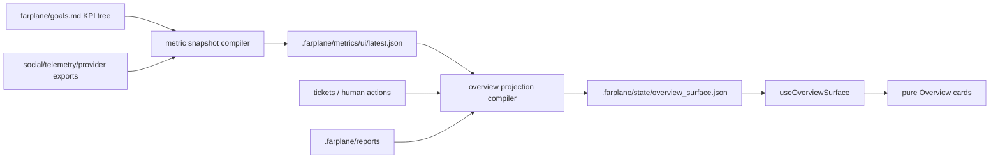

# TASK-0035: Dashboard projection fetching architecture

## Summary
Replace the current Overview dashboard shape with a projection-backed fetching
architecture: raw metrics, tickets, telemetry, and reports compile into stable
UI projection files, and the Overview renders those projections through one
module-owned TanStack Query hook. This keeps cards pure, makes Horizon Advisor
KPI pins actionable, and avoids each card independently refetching or
interpreting raw provider data.

## Scope
- In:
  - Add a daily metric snapshot compiler contract and implementation path for
    `.farplane/metrics/ui/latest.json`.
  - Add an Overview projection contract and compiler for
    `.farplane/state/overview_surface.json`.
  - Move Overview cards to render max-four pinned KPI cards plus attention
    items and lower report links from the compiled projection.
  - Introduce TanStack Query for HTTP/Vite-bridge project runtime fetching,
    starting with the Overview projection hook.
  - Document the projection architecture in `FEAT-0114`.
- Out:
  - Direct X/Instagram API integration or credential setup.
  - User-facing pin management UI.
  - Migrating every Team Workspace tab in the first pass.
  - Replacing Convex realtime queries.
  - Introducing Effect into React dashboard components.

## Delta

```text
overall_before:
  - Overview hardcodes Open Gaps + Reports, Signal Summary, KPI Axes, Open
    Tickets, Completed, PM Threads, Reports, and AI Burn cards.
  - The UI has a consumer shape for .farplane/metrics/ui/latest.json but no
    repo-owned daily compiler was found.
  - Social metric dry-run files are registered as separate runtime sources and
    parsed directly by UI helpers.
overall_after:
  - Horizon/KPI pin intent and runtime data compile into a stable Overview
    projection read by the UI.
  - Overview shows at most four pinned cards, attention items linked to
    tickets/gaps/human actions, and reports as lower context.
  - Dashboard cards render projection rows through TanStack Query-backed hooks
    and do not fetch raw provider data.
why_now:
  - The current Overview contains low-value inventory counts and source gaps
    above higher-priority operator signals.
  - The project needs a modular web fetching architecture before adding more
    dashboard cards or report-derived signals.
problems:
  - before: Cards combine data selection, fallback logic, and rendering.
    after: Compilers select and normalize data; cards render.
    why_now: More social, telemetry, and ticket-derived metrics would otherwise
      multiply bespoke card data paths.
first_principles_basis:
  objective: Make Overview answer "what should the operator look at now?"
  need: Coherent dashboard snapshots with provenance and refresh behavior.
  assumptions: Local-first projection files are sufficient for the first slice;
    cards do not need direct provider access.
  root_cause: Overview currently evolved as a UI composition surface before the
    dashboard data contract was explicit.
  constraints: Keep strong structure only where routing, sync, or UI contracts
    need it; keep tickets canonical for action; avoid new config/env fallbacks.
  first_viable_slice: Compile snapshot/projection files and render them in the
    existing Team Workspace Overview.
  proof_or_falsification: A seeded projection renders the desired Overview and
    missing sources become explicit source gaps/attention rows.
  tradeoff: Accept one extra projection layer to avoid card-level data coupling.
  non_goals: No direct social API integration, no user pin review loop, no
    Convex migration, and no Effect-in-React runtime layer.
```

## Change Plan

```text
architecture_signatures:
  module_level:
    - ui/src/modules/team-workspace/lib/dashboard-projections/goal-kpi-model.ts
      parses MetricsUiSnapshot and KPI tree inputs.
    - ui/src/modules/team-workspace/lib/dashboard-projections/overview-surface.ts
      defines and parses OverviewSurface projection rows.
    - ui/src/modules/team-workspace/components/tabs/overview/use-overview-surface.ts
      fetches the compiled projection through TanStack Query and the Vite
      bridge.
    - scripts/compile-dashboard-projections.mjs or equivalent existing CLI owner
      reads local project sources and writes metric/overview projection files.
    - ui/vite.config.ts project-config bridge exposes projection runtime source
      metadata without turning raw provider files into card APIs.
  main_flow:
    - compileMetricSnapshot(projectRoot): MetricsUiSnapshot
    - compileOverviewSurface(projectRoot, snapshot, goals, tickets, telemetry,
      reports): OverviewSurface
    - useOverviewSurface(projectPath, enabled): UseQueryResult<OverviewSurface>
      or module-local facade {
        surface, state, error, refresh
      }
  data_flow:
    - farplane/goals.md KPI hints -> OverviewSurface.pins[].source
    - .farplane/metrics/ui/latest.json metrics/source_gaps ->
      OverviewSurface.pins[] and OverviewSurface.attention[]
    - board tickets/human actions -> OverviewSurface.attention[]
    - .farplane/reports/** -> OverviewSurface.reports[]
  builder_freeform_boundary:
    - Builder may choose exact helper names and file placement inside the owning
      module/script boundaries, but changing source-of-truth files, projection
      shape, dependency policy, or UI ownership requires ticket update.
```

### Change 1: Metric snapshot compiler

```text
fixes:
  - The UI expects .farplane/metrics/ui/latest.json but no producer script is
    currently present.
before:
  - goal-kpi-model.ts parses MetricsUiSnapshot only when a runtime source file
    already exists.
after:
  - A repo-owned compiler writes .farplane/metrics/ui/latest.json with
    snapshot_date, generated_at, metrics, and source_gaps.
read:
  - path: ui/src/modules/team-workspace/lib/dashboard-projections/goal-kpi-model.ts
    reason: preserve existing MetricsUiSnapshot parser contract.
  - path: ui/vite.config.ts
    reason: preserve existing runtime source path for metrics-ui.
  - path: tmp/social-metrics-dry-run/*
    reason: consume optional local social fixture/export files when present.
write:
  - path: scripts/compile-dashboard-projections.mjs
    change: add or extend a compiler entrypoint for daily metric snapshots.
  - path: .farplane/metrics/ui/latest.json
    change: generated local runtime output; ignored unless explicitly promoted.
operation:
  - Read available local social metric files, telemetry summaries, and goal KPI
    ids; emit observed metrics and explicit source gaps for missing providers.
signature_or_type_impact:
  - compileMetricSnapshot(projectRoot: string): MetricsUiSnapshot
routes:
  docs: doc-advisor
  qa: tests
  review: reviewer
qa:
  - Unit test parser/compiler with available metric, missing metric, and daily
    diff examples.
failure_modes:
  - Missing provider files are accidentally treated as zero values.
  - Compiler creates a new schema that drifts from goal-kpi-model.ts.
```

### Change 2: Overview surface projection

```text
fixes:
  - Overview mixes hardcoded dashboard choices with source gap rendering and
    report buttons.
before:
  - Cards choose their own source logic inside overview-tab.tsx.
after:
  - Overview reads OverviewSurface with pins, attention, reports, and sources.
read:
  - path: ui/src/modules/team-workspace/components/tabs/overview/overview-tab.tsx
    reason: replace hardcoded Signal Summary and Open Gaps sections with
      projection rendering.
  - path: farplane/goals.md
    reason: preserve KPI tree and Horizon Advisor pin intent.
  - path: tickets/TASK-*/ticket.md
    reason: compile ticket-linked attention items when available.
write:
  - path: ui/src/modules/team-workspace/lib/dashboard-projections/overview-surface.ts
    change: add typed parser/build helpers for OverviewSurface.
  - path: scripts/compile-dashboard-projections.mjs
    change: add Overview projection generation after metric snapshot generation.
  - path: .farplane/state/overview_surface.json
    change: generated local runtime output; ignored unless explicitly promoted.
operation:
  - Resolve at most four pinned cards from KPI overview hints, metric snapshot,
    and high-priority fallback signals such as AI burn, review queue age, agent
    hours, or human-action backlog when source data exists.
  - Convert metric source gaps, linked tickets, and human actions into
    attention items.
signature_or_type_impact:
  - compileOverviewSurface(input: OverviewProjectionInput): OverviewSurface
  - parseOverviewSurface(value: unknown): OverviewSurface | null
routes:
  docs: doc-advisor
  qa: tests
  review: reviewer
qa:
  - Unit test max-four pin ordering, source-gap attention conversion, report
    link projection, and empty-state projection.
failure_modes:
  - Projection duplicates ticket state instead of linking to canonical tickets.
  - Compiler chooses more than four cards or hides missing provider reasons.
```

### Change 3: TanStack Query frontend fetching

```text
fixes:
  - Future cards would otherwise add independent fetches for raw metrics,
    tickets, reports, and telemetry.
before:
  - useFarplaneProjectConfig fetches project config and Overview derives many
    dashboard values in component code.
after:
  - The UI has a TanStack Query provider and one Overview projection query hook;
    cards receive render-ready rows.
read:
  - path: ui/src/modules/team-workspace/components/tabs/project-config/use-farplane-project-config.ts
    reason: preserve current behavior while migrating projection fetching to
      TanStack Query.
  - path: package.json
    reason: add or verify workspace dependency placement.
  - path: ui/package.json
    reason: add TanStack Query as UI-owned React dependency if not already
      present.
  - path: ui/src/main.tsx
    reason: identify the root provider insertion point.
write:
  - path: ui/package.json
    change: add @tanstack/react-query.
  - path: ui/src/main.tsx
    change: wrap the app in QueryClientProvider using a local query client
      module if needed.
  - path: ui/src/modules/team-workspace/components/tabs/overview/query-keys.ts
    change: add stable query keys for overview projection/runtime data if a
      shared key helper is useful.
  - path: ui/src/modules/team-workspace/components/tabs/overview/use-overview-surface.ts
    change: add useQuery-backed fetch for the overview projection endpoint.
  - path: ui/vite.config.ts
    change: expose overview-surface runtime source or dedicated read endpoint.
operation:
  - Adopt TanStack Query for HTTP/Vite-bridge project runtime state in this
    slice, starting with Overview projection fetching.
  - Keep Convex realtime queries on Convex useQuery.
  - Do not introduce Effect into React components; reconsider Effect only for
    compiler/provider ingestion if typed retries, resource cleanup, or
    dependency injection become materially useful later.
signature_or_type_impact:
  - useOverviewSurface({ projectPath, enabled }): {
      surface: OverviewSurface | null;
      state: ProjectConfigLoadState;
      error: string | null;
      refresh: () => void;
    }
routes:
  docs: doc-advisor
  qa: tests
  review: reviewer
qa:
  - Hook test or component test proves loading, ready, error, and refresh states.
failure_modes:
  - QueryClientProvider placement causes duplicate clients or resets cache on
    every render.
  - Query keys omit project path and leak one project's projection into another
    Team Workspace view.
  - Convex realtime state is accidentally routed through TanStack Query.
```

### Change 4: Overview UI replacement

```text
fixes:
  - Low-value inventory cards dominate Overview and reports sit too high.
before:
  - Open Gaps + Reports and Signal Summary render above CEO Overview; lower
    metrics include KPI Axes, Open Tickets, Completed, PM Threads, Reports, AI
    Burn.
after:
  - Overview renders pinned cards, Needs Attention, CEO Overview, recent/reports
    context, and source freshness.
read:
  - path: ui/src/modules/team-workspace/components/tabs/overview/overview-tab.tsx
    reason: replace current layout sections.
  - path: ui/src/modules/team-workspace/components/tabs/overview/overview-cards.tsx
    reason: reuse existing card primitives where possible.
write:
  - path: ui/src/modules/team-workspace/components/tabs/overview/overview-tab.tsx
    change: render projection-backed cards and attention rows.
  - path: ui/src/modules/team-workspace/components/tabs/overview/overview-cards.tsx
    change: add small projection card variants only if existing cards cannot
      represent the projection.
operation:
  - Keep UI dense and operational; avoid adding a landing-style dashboard or
    explanatory in-app text.
signature_or_type_impact:
  - OverviewTab consumes OverviewSurface in addition to or instead of derived
    local summary values.
routes:
  docs: doc-advisor
  qa: visual-qa
  review: reviewer
qa:
  - Browser QA opens Team Workspace Overview with seeded projection, captures
    screenshot, verifies no overlapping text and max-four cards.
failure_modes:
  - Visual change regresses dense cockpit readability.
  - Empty projection state becomes less useful than current fallback state.
```

### Change 5: Durable docs

```text
fixes:
  - The dashboard data contract would otherwise live only in chat and ticket
    implementation details.
before:
  - No official feature spec owns dashboard projection architecture.
after:
  - FEAT-0114 owns source contracts, projection shapes, fetching policy, and
    non-goals.
read:
  - path: docs/features/README.md
    reason: register the feature spec.
  - path: docs/features/FEAT-0114-dashboard-projection-architecture.md
    reason: keep implementation aligned with the approved architecture.
write:
  - path: docs/features/FEAT-0114-dashboard-projection-architecture.md
    change: update if implementation changes contract details.
  - path: docs/features/README.md
    change: keep feature index discoverable.
operation:
  - Keep feature spec as the canonical durable behavior contract; keep bulky
    proof in ticket artifacts.
signature_or_type_impact:
  - none for runtime code; docs source of truth becomes FEAT-0114.
routes:
  docs: doc-advisor
  qa: tests
  review: reviewer
qa:
  - Run focused doc link/reference checks or at minimum rg checks for FEAT-0114
    references.
failure_modes:
  - Spec duplicates implementation details that should live in the ticket or
    module README.
```



## Gap Analysis
- Current state: UI parses a metrics snapshot if present, registers social
  dry-run files as runtime sources, and derives Overview cards directly inside
  `overview-tab.tsx`.
- Production expectation: Dashboard systems usually separate card definition,
  query/metric execution, caching/materialization, and frontend rendering.
- Missing gaps: no metric snapshot producer, no Overview projection file, no
  centralized Overview fetch hook, no official projection contract before
  FEAT-0114, and no clear dependency policy for TanStack Query.
- Comparable implementations: Metabase dashboard cards/questions plus caching,
  Grafana panels/data sources plus query/resource caching, Superset chart cache
  policy, and TanStack Query for React server-state lifecycle.
- Recommendation: Build projection-first with existing fetch conventions;
  introduce TanStack Query for HTTP/Vite-bridge server state in this slice, and
  keep Convex realtime queries on Convex.

## Done

```text
done_when:
  - .farplane/metrics/ui/latest.json can be generated from available local
    sources with explicit source_gaps for missing X/Instagram/telemetry data.
  - .farplane/state/overview_surface.json can be generated with max-four pins,
    attention items, reports, and source metadata.
  - Overview renders TanStack Query-backed projection cards and no longer
    relies on hardcoded inventory cards as the primary dashboard.
  - TanStack Query is installed/configured once for UI HTTP/Vite-bridge server
    state, without migrating Convex realtime queries.
  - Missing/empty projection states remain useful and source-backed.
  - FEAT-0114 is updated if implementation changes the contract.
```

## QA Strategy

```text
qa_strategy:
  proof_weight: visual_qa
  checks:
    - npm run test:once -- compile-dashboard-projections goal-kpi-model overview-surface social-content-insights
    - npm run typecheck:root or the narrowest available TypeScript check that
      covers the compiler and Team Workspace UI.
    - npm run dashboard:compile -- --project <repo-root>
      --json or the final equivalent command.
    - npm install if package-lock changes are required after adding
      @tanstack/react-query.
  manual:
    - Open the Team Workspace Overview with a seeded projection.
    - Confirm pinned cards are at most four and come from projection data.
    - Confirm Needs Attention links gaps/tickets/human actions with status and
      owner.
    - Confirm reports appear as lower context, not the top dashboard action.
    - Confirm React Query Devtools are not required and no extra visible UI is
      introduced.
  delegated_lanes:
    - visual-qa for final Overview screenshot and overlap/readability check.
    - reviewer for architecture, evidence-quality, and documentation-quality.
  review:
    - rubric: implementation-plan
      required_tas: pass
    - rubric: architecture
      required_tas: pass
    - rubric: evidence-quality
      required_tas: pass
    - rubric: documentation-quality
      required_tas: pass
  evidence:
    - compiler command output or generated JSON sample path.
    - focused test output.
    - screenshot of the updated Overview.
    - reviewer receipt.
  goal_advisor_inputs:
    proof_route: compiler tests + browser visual QA + reviewer gate
    final_evidence: best Overview screenshot plus compiler/test output paths
    final_checkpoint: reviewer validates projection architecture and proof
      before ticket closeout.
  residual_risk:
    - Real X/Instagram provider APIs may require a separate credentialed
      ingestion ticket; this ticket only compiles available local exports.
    - Effect may become useful later for provider ingestion/compilation, but it
      is intentionally out of scope for React dashboard fetching.
```

## Proof

```text
implementation_receipt:
  - Added npm run dashboard:compile for
    scripts/compile-dashboard-projections.mjs.
  - Compiler writes .farplane/metrics/ui/latest.json and
    .farplane/state/overview_surface.json.
  - Overview fetches the compiled projection through a TanStack Query hook and
    renders Pinned Signals, Needs Attention, CEO Overview, then Reports.
  - Shared dashboard parsing/model helpers live under
    ui/src/modules/team-workspace/lib/dashboard-projections/.
  - Shared project-config parsing/types live under
    ui/src/modules/team-workspace/lib/project-config/.
  - Dashboard runtime source inventory lives in
    farplane/dashboard-runtime-sources.json and is consumed by both the
    compiler and Vite project-config bridge; durable provider exports belong
    under .farplane/metrics/provider-exports/.
  - Runtime config POST handling is partial-update safe for runtime/Convex
    fields, so Telegram-only saves preserve existing Convex URLs.
  - Overview projection parsing rejects unrelated/malformed JSON instead of
    rendering it as an empty ready surface.
  - /farplane/overview-surface requires an explicit projectPath, resolves only
    the repo root or Codex UI-known project roots, and returns project-relative
    source paths.

verification:
  - npm run dashboard:compile -- --project . --json
    -> ok true, metricCount 5, sourceGapCount 5, pinCount 4, attentionCount 5.
  - npm run test:once -- compile-dashboard-projections goal-kpi-model
    overview-surface social-content-insights goal-kpi-cockpit
    -> 5 files passed, 9 tests passed.
  - npm run typecheck:root
    -> passed.
  - npx biome check --files-ignore-unknown=true ... <touched files>
    -> passed, 23 files checked.
  - npm run ui:typecheck remains blocked by broad existing UI debt; a filtered
    pass over touched TASK-0035 paths produced no matching errors.
  - curl http://127.0.0.1:5173/farplane/overview-surface
    -> HTTP 400 project_path_required.
  - curl http://127.0.0.1:5173/farplane/overview-surface?projectPath=<repo>
    -> HTTP 200, path .farplane/state/overview_surface.json, pins 4,
    attention 5.

browser_qa:
  - Local-only report path:
    docs/research/qa-testing/TASK-0035/2026-07-01_dashboard-projection/report.md
  - Best screenshot:
    docs/research/qa-testing/TASK-0035/2026-07-01_dashboard-projection/screens/overview-dashboard-projection-final.png
  - Observed Overview state: Pinned Signals first, Needs Attention second, CEO
    Overview below action bands, Reports lower on the page, projection badge
    rendered, and /farplane/overview-surface with an explicit projectPath
    returned HTTP 200 with pins: 4 and attention: 5.

review:
  - Latest local Codex review:
    .farplane/reviews/latest/review.md
  - TASK-0035-specific blocker fixed by folding generated proof into this
    ticket and keeping generated Goal/proof files local-only.
  - Later lightweight reviewer findings were fixed by adding the shared runtime
    source manifest, rejecting malformed Overview projection JSON, extracting
    the Overview bridge reader from Vite config, requiring explicit projectPath
    for projection fetches, and moving social provider exports out of tmp/.
  - Final lightweight reviewer rerun timed out with AbortError before writing a
    fresh verdict. Local deterministic gates and endpoint checks above passed.
```

Final report: include the best screenshot/image evidence as
``, or block/revise with the missing
proof reason.

Grounding evidence: local PRD, project rules, memory invariants, Team Workspace
module docs, current Overview/KPI code, Metabase/Grafana/Superset official
dashboard caching docs, TanStack Query official docs, and Effect official docs
for the non-goal boundary.

## Docs Strategy

```text
docs_strategy:
  outcome: update_docs
  doc_targets:
    - docs/features/FEAT-0114-dashboard-projection-architecture.md
    - docs/features/README.md
  no_docs_reason:
  validation:
    - rg -n "FEAT-0114|dashboard projection|overview_surface" docs/features tickets/TASK-0035
    - If doc validators are available and affordable, run python3
      bin/validators/check_doc_refs.py.
```

## Agent Contract
- Open: `npm run ui`, then open `/office` and the Team Workspace panel for the
  Farplane UI project.
- Test hook: generated `.farplane/state/overview_surface.json` fixture or
  compiler dry run.
- Stabilize: seed local social metric fixture files or use compiler fixture
  inputs; do not require live X/Instagram credentials.
- Inspect: Overview DOM text for pinned card count, Needs Attention rows,
  source freshness, and report placement.
- Key screens/states: populated projection, missing projection, source gaps,
  ticket-linked attention, reports source missing.
- Design baseline: current screenshots attached in the originating discussion
  plus FEAT-0114; no separate design.md needed for first slice.
- QA cookbook: start from `qa/README.md`; use closest Team Workspace/browser
  cookbook if one exists.
- Taste refs: dense operational cockpit; no landing-page treatment.
- Expected artifacts: compiler output sample, focused test output, Overview
  screenshot, reviewer receipt.
- Delegate with: this ticket path and FEAT-0114.

## Run Hints
- Likely size: normal
- Goal recommendation: recommend
- Budget hint: one implementation pass plus visual QA and reviewer gate
- Compute hint: local_shared
- Planning hint: impl_plan
- QA source: QA Strategy
- Batchability: single-ticket
- Batch reason: metric compiler, projection contract, fetch hook, and Overview
  UI must land together to avoid half-migrated dashboard behavior.
- Human inputs/assets: none required
- Credentials / external access: no live social credentials required
- Compute/runtime needs: local npm workspace and Vite UI
- Tooling gaps: no existing TanStack Query dependency; decide in implementation
  whether dependency belongs in `ui/package.json` only or also needs root lock
  updates.
- QA risks: screenshots can pass while projection provenance is wrong; reviewer
  should inspect generated JSON and source-gap handling.
- Human gates: approval before goal-advisor execution
- Agent decision boundaries: do not add direct provider credentials, env vars,
  localStorage keys, or user pin UI in this ticket.

## Links
- `artifacts:`
  - docs/research/qa-testing/TASK-0035/2026-07-01_dashboard-projection/report.md
  - docs/research/qa-testing/TASK-0035/2026-07-01_dashboard-projection/snapshot-final.json
  - docs/research/qa-testing/TASK-0035/2026-07-01_dashboard-projection/screens/overview-dashboard-projection-final.png
- `review:`
  - local Codex review: .farplane/reviews/latest/review.md
  - browser visual QA pass-with-residual-risk in report artifact
- `refs:`
  - docs/features/FEAT-0114-dashboard-projection-architecture.md
  - farplane/goals.md
  - ui/src/modules/team-workspace/lib/dashboard-projections/goal-kpi-model.ts
  - ui/src/modules/team-workspace/components/tabs/overview/overview-tab.tsx
  - ui/vite.config.ts

## Notes
- Blast radius: Team Workspace Overview, local projection generation, Vite
  project config bridge, feature docs.
- Risks / rollback: keep old Overview derivation available until projection
  empty/error states are proven; rollback can restore current sections while
  retaining FEAT-0114 as proposed architecture.
- Follow-ups: direct X/Instagram provider ingestion, operator pin overrides,
  broader TanStack Query migration for other HTTP/Vite-bridge runtime views,
  and possible Effect use in compilers if provider ingestion gets complex.
- Citations:
  - https://www.metabase.com/docs/latest/dashboards/introduction
  - https://www.metabase.com/docs/latest/configuring-metabase/caching
  - https://grafana.com/docs/grafana/latest/administration/data-source-management/
  - https://superset.apache.org/admin-docs/configuration/cache/
  - https://tanstack.com/query/latest
  - https://effect.website/docs/getting-started/introduction/
- Blockers: approval required before implementation.

```text
plan_qa:
  minimal_required_version: pass
  reuse_before_new_surface: pass
  least_parameters: pass
  new_files_functions_justified: pass
  minimal_impl_plan_claim: pass
  existing_service_fit: pass
  goal_advisor_ready: pass
  clarifying_questions: pass
  architecture_signatures: pass
  change_plan_signature_linkage: pass
  change_plan_locality: pass
  qa_strategy_explicit: pass
  docs_strategy: pass
  independent_plan_review: revise - reviewer gate is specified but not yet run
  grounding_evidence: pass
  highest_risk: introducing TanStack Query too broadly instead of scoping it to
    HTTP/Vite-bridge server state.
  fix_or_deferral: defer implementation approval to reviewer/goal-advisor after
    operator accepts the ticket plan.
```
