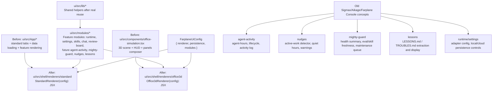

# TKT-007: Renderer shell and module architecture

## Status

- state: `building`
- owner: codex
- assignee:
- dependencies:
- location: `tickets/building/TKT-007-renderer-shell-module-architecture`
- enter when: Farplane UI needs one product architecture that can render the same feature modules through either a conventional app layout or the 3D office
- leave when: the repo has a documented renderer/module contract, project rules reflect it, and the first shell seam is ready for implementation without moving feature logic blindly
- blockers:
- spawned follow-ups:
- complexity: `M`

## Summary

Farplane UI should become one human-facing app with configurable renderers, not a set of product forks named Console, Office, and Shop. The first parameter should be `renderer`, with `standard` for the navigation-first web app and `office3d` for the spatial 3D office; both render the same product modules and runtime state.

## Scope

- In scope:
  - Name and document the renderer/module/lib contract for Farplane UI.
  - Create a spec for `FarplaneUiConfig` with `renderer`, `persistence`, and `modules`.
  - Update repo/module rules so future work does not recreate Console as a fake product module.
  - Plan the first code seam around `ui/src/App/*`, `ui/src/pages/OfficePage.tsx`, `ui/src/components/office-simulation.tsx`, and `ui/src/modules/*`.
  - Define the migration map for old Sigmax/Aikage/Farplane Console concepts into Farplane UI modules.
- Out of scope:
  - Moving large feature code in this planning ticket.
  - Creating `packages/`; shared code stays in `ui/src/lib` until a real multi-app boundary exists.
  - Treating autonomous ecommerce shop as a separate app or module before it exists as a concrete workflow.
  - Renaming all current `office` files in one broad churn pass.

## Delta

### Before

- `ui/src/App/*` is a conventional app surface with hardcoded tabs: Operations, Memory, Skills, Office.
- `ui/src/components/office-simulation.tsx` composes the 3D office scene, HUD, panels, settings, logs, team panel, chat, and modals.
- `ui/src/modules/office` already owns much of the 3D scene/object system, but "Office" currently means both a module and the spatial renderer.
- `ui/src/modules/README.md` correctly treats modules as operator workflows, but the repo does not yet define renderers as a first-class shell concept.
- Prior product language risks turning "Console" into a module even though it is only the standard renderer for the same modules.

### After

- Farplane UI has a first-class renderer contract:

```ts
type FarplaneUiRenderer = "standard" | "office3d";

type FarplaneUiPersistence = "local" | "cloud";

const moduleRegistry = {
  runtime: runtimeModule,
  settings: settingsModule,
  "skills-studio": skillsStudioModule,
  "review-board": reviewBoardModule,
  chat: chatModule,
} as const;

type FarplaneUiModuleId = keyof typeof moduleRegistry;

type FarplaneUiConfig = {
  renderer: FarplaneUiRenderer;
  persistence: FarplaneUiPersistence;
  modules: FarplaneUiModuleId[];
};
```

- `standard` means nav-first web app rendering.
- `office3d` means spatial 3D office rendering.
- Modules own feature capabilities and pages; renderers own how users enter and arrange those modules.
- Module identity comes from explicit imports and the shell registry, not from a hand-maintained global union.
- `ui/src/lib` owns shared domain helpers only after there is a second real caller.
- `packages/` remains out of scope until more than one workspace app imports the same library.

### Why Now

The current repo already has a modular Office system, runtime adapters, settings, skills, chat, team workspace, and review board surfaces. Without an explicit renderer boundary, the next migration from Sigmax/Aikage/Farplane Console will either create a fake `console` module or dump unrelated operational surfaces into the 3D office composer.

### First-Principles Basis

- Objective: make Farplane UI one configurable product that can be used as a conventional dashboard or a spatial office.
- Need: the operator wants less product/project fragmentation and a clear map for absorbing old features as modules.
- Assumptions: both renderers open the same feature modules; Office/3D is an entry model, not a separate business logic layer; shop is currently a use case, not a module.
- Root cause: the repo has modules but no named shell/renderer layer, so "Console" and "Office" are overloaded as product names.
- Constraints: preserve existing module migration rules, keep code movement slow, avoid `packages/` until reuse is real, and protect dirty worktree changes.
- First viable slice: document the renderer contract, update rules, create the shell seam, then move only the office renderer composer behind that seam.
- Proof/falsification: a reviewer can inspect the spec/rules and see exactly where new modules go, where renderers live, and which old features map to which module.
- Tradeoff: accept one new shell/renderer abstraction now to avoid heavier product and repo splits later.
- Non-goals: no full visual redesign, no broad app router rewrite, no migration of every old feature in one ticket.

## Program

```text
vars:
  renderer_names = ["standard", "office3d"]
  config_surface = "FarplaneUiConfig"
  first_shell_seam = "ui/src/shell"
  source_standard = "ui/src/App/*"
  source_office3d = "ui/src/components/office-simulation.tsx"
  module_home = "ui/src/modules/*"

program:
  ground(vars) ->
    inspect App, OfficePage, office-simulation, modules README/AGENTS, runtime/settings/office module boundaries

  document_architecture(current_state) ->
    create docs/specs/module-shell-architecture.md with renderer/module/lib rules,
    old-feature migration map,
    and naming decisions

  update_repo_contract(spec) ->
    update AGENTS.md and ui/src/modules/README.md with compact renderer rules,
    keeping detailed behavior in the spec

  introduce_first_seam(contract) ->
    add ui/src/shell/README.md and planned entrypoints:
      module-registry.ts
      shell-config.ts
      renderers/standard/
      renderers/office3d/

  prepare_office_move(seam) ->
    move only the Office renderer composer in the implementation ticket:
      ui/src/components/office-simulation.tsx
        -> ui/src/shell/renderers/office3d/Office3dRenderer.tsx
    keep compatibility import if needed

  verify(done_when, proof) ->
    docs/rules review,
    targeted tests for any moved imports,
    UI smoke screenshot if renderer import path changes
```

## Map



Touch:

- `docs/specs/module-shell-architecture.md`
- `AGENTS.md`
- `PROJECT_RULES.md` if root rules need the renderer distinction
- `ui/src/modules/README.md`
- `ui/src/modules/AGENTS.md`
- `ui/src/shell/README.md`
- later implementation: `ui/src/App/*`, `ui/src/pages/OfficePage.tsx`, `ui/src/components/office-simulation.tsx`

Inspect:

- `ui/src/App/index.tsx`
- `ui/src/App/render-sections.tsx`
- `ui/src/App/tab-nav.tsx`
- `ui/src/pages/OfficePage.tsx`
- `ui/src/components/office-simulation.tsx`
- `ui/src/modules/README.md`
- `ui/src/modules/office/README.md`
- `ui/src/modules/runtime/README.md`
- `docs/MEMORY.md`
- `ARCHITECTURE.md`
- `PROJECT_RULES.md`

Typed flow:

1. `FarplaneUiConfig` selects `renderer`.
2. Renderer asks `moduleRegistry` for enabled modules.
3. `standard` renderer exposes modules through nav/routes.
4. `office3d` renderer exposes modules through office objects, HUD launchers, and the same registry.
5. Modules call runtime adapters and shared `ui/src/lib` helpers; renderers do not own business logic.

## Done / Proof

- Done conditions:
  - [x] Spec states that `renderer = standard | office3d` and explains why `console` is not a module.
  - [x] Spec states that modules are folder/import boundaries registered explicitly by the shell; any `ModuleId` type is derived from the registry, not manually maintained.
  - [x] Spec maps existing and old-product features into modules: `agent-activity`, `nudges`, `mighty-guard`, `lessons`, `runtime/settings`, `skills-studio`, `review-board`, `chat`.
  - [x] Repo rules say renderers compose, modules own features, and lib owns shared helpers after real reuse.
  - [x] Ticket identifies the first safe implementation move and the files it touches.
  - [x] First shell seam is implemented with static registry, config normalization, renderer wrappers, and `FarplaneShell`.
  - [x] No `packages/` boundary is introduced.
- Mechanical checks:
  - `git diff --check`
  - Focused shell registry/config test.
  - Targeted typecheck scan for `src/shell` paths.
- Manual checks:
  - Read the rendered spec and confirm the naming answers the product question: "Office or standard web?"
  - Confirm the migration map does not create separate top-level products for Console, Office, or Shop.
- Review focus:
  - Architecture boundary is legible.
  - Naming is stable enough for future tickets.
  - Scope does not hide a broad refactor.
  - The plan preserves existing module rules and dirty worktree safety.
- Hard gates:
  - Do not implement large code moves until this ticket is approved.
  - Do not move old Sigmax/Aikage/Farplane Console features until the renderer/module spec exists.
  - Do not create `packages/` for this slice.
- Required evidence:
  - [x] Spec link: `docs/specs/module-shell-architecture.md`.
  - [x] Rule update diff: `AGENTS.md`, `PROJECT_RULES.md`, `ui/src/modules/README.md`, `ui/src/modules/AGENTS.md`, `ui/src/shell/README.md`.
  - [x] `git diff --check` output captured in `progress.md`.
  - [x] Focused test output captured in `progress.md`.
  - [x] Targeted shell typecheck scan captured in `progress.md`.

## Agent Contract

- Open: `AGENTS.md`, `PROJECT_RULES.md`, `ARCHITECTURE.md`, `docs/prd.md`, `docs/MEMORY.md`, `ui/src/modules/README.md`, `ui/src/modules/AGENTS.md`, `ui/src/App/*`, `ui/src/pages/OfficePage.tsx`, `ui/src/components/office-simulation.tsx`, and relevant module READMEs.
- Test hook: docs-only phase can use `git diff --check`; first code seam phase should run focused tests or import checks around `OfficePage`, `Office3dRenderer`, and any compatibility export.
- Stabilize: keep changes additive first; preserve compatibility imports for `OfficeSimulation` until callers are migrated.
- Inspect: dirty worktree before edits; do not overwrite unrelated existing changes.
- Key screens/states: `/office` for the 3D renderer; the standard app tab surface for nav-first rendering.
- Taste refs: no new visual language in this ticket; this is architecture and migration shape.
- Expected artifacts: spec, compact rule updates, shell README/entrypoint plan, and follow-up implementation ticket if scope splits.
- Delegate with: reviewer lane if the spec starts redefining runtime ownership, persistence storage, or product roadmap beyond renderer/module boundaries.

## Evidence Checklist

- [ ] Screenshot: not required for docs-only planning.
- [ ] Snapshot: `git diff --check`.
- [ ] Snapshot: optional focused import/test output if code seams are added.
- [ ] QA report linked:

## State

- Planning state: approved for Goal-backed execution on 2026-06-13.
- Current recommendation: use `renderer` as the config key and `standard | office3d` as values.
- Current split decision: keep this as one coherent build loop for architecture/rules/first seam; split old feature migrations into follow-up tickets.
- Implemented seam: `ui/src/shell` now exports registry-derived module ids, config normalization, `StandardRenderer`, `Office3dRenderer`, and `FarplaneShell`; `/office` enters through `FarplaneShell` with `renderer: "office3d"`.
- Goal packet:
  - Program: `tickets/building/TKT-007-renderer-shell-module-architecture/program.md`
  - Progress: `tickets/building/TKT-007-renderer-shell-module-architecture/progress.md`
  - Native Goal Prompt: `tickets/building/TKT-007-renderer-shell-module-architecture/goal-prompt.md`
  - Spec: `docs/specs/module-shell-architecture.md`

## Links

- PRD: `docs/prd.md`
- Architecture: `ARCHITECTURE.md`
- Project rules: `PROJECT_RULES.md`
- Module contract: `ui/src/modules/README.md`
- Related memory:
  - `MEM-0227`: Codex default runtime adapter, OpenClaw optional.
  - `MEM-0228`: Codex app-server bridge, no private file scraping as primary control plane.
  - `MEM-0220`: global office launchers stay registry-driven.

## Notes

- Recommended public labels:
  - `standard`: "Standard"
  - `office3d`: "3D Office"
- Avoid labels such as "serious", "enterprise", "classic", or "no fun" in code because they describe tone rather than behavior.
- Do not build a dynamic JavaScript plugin loader for first-party UI modules in the first slice; use static imports so Vite, TypeScript, tests, and bundle splitting stay understandable.
- `team-workspace` should not receive new scope until the renderer/module spec decides whether its durable parts become `project-workspace`, `agent-activity`, `lessons`, or remain as existing team panel implementation.
