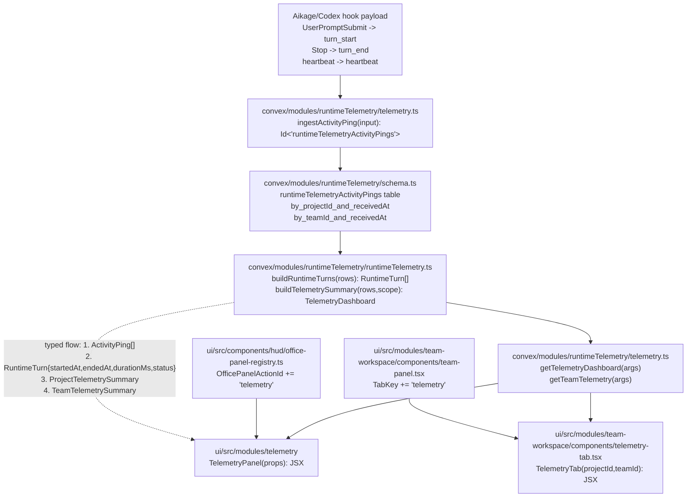

# TKT-010: Runtime telemetry dashboard and team-scoped agent hours

## Status

- state: `building`
- owner: codex
- assignee:
- dependencies: `TKT-009`
- location: `tickets/building/TKT-010-runtime-telemetry-dashboard`
- enter when: the operator approved execution of the runtime telemetry dashboard plan
- leave when: the shared telemetry model, global dashboard entry, team-scoped tab, proof checks, and browser evidence are complete
- blockers: none
- spawned follow-ups:
- complexity: `L`

## Summary

Integrate the Aikage runtime telemetry model into Farplane UI as one shared dashboard domain. The feature records and derives completed runtime turn time by project, exposes an overall telemetry dashboard from the office launcher/settings-adjacent controls, and adds a team-scoped telemetry tab inside Team Panel using Farplane's existing shadcn-style primitives instead of importing Farplane-Console's bento visual language.

## Scope

- In scope:
  - Add an Aikage-compatible runtime telemetry ingest/store/query path for `heartbeat`, `turn_start`, and `turn_end`.
  - Derive runtime turns from lifecycle rows and count only completed `turn_start`/`turn_end` pairs as agent hours.
  - Group telemetry by normalized project identity, then map project telemetry into Farplane teams through `projectId` / `team-<projectId>` conventions.
  - Add a global `telemetry` module surface with compact shadcn cards, tables, tabs, selects, badges, progress, and tooltips.
  - Add a Team Panel `Telemetry` tab that uses the same query/model filtered to the active team/project.
  - Add one office launcher/radio-dial action for overall Telemetry.
  - Preserve diagnostics for in-progress and unmatched lifecycle events without counting them as completed run time.
- Out of scope:
  - Importing old Aikage/Farplane-Console React components wholesale.
  - Replacing existing `agentEvents`, `agentStatus`, board timeline, or team runtime-cost summaries.
  - Building long-term alerting/nudges, Telegram flows, or learning inboxes.
  - Tracking raw prompts or assistant output text.
  - Migrating OpenClaw config/state ownership into Convex.

## Delta

### Before

- Farplane UI has Convex `agentEvents`, `agentStatus`, board events, team memory, and artefact metadata, but no Aikage-style lifecycle telemetry store.
- Team Panel derives AI usage cost from runtime session timelines in `useTeamPanelRuntimeState`, not project run-time telemetry.
- The office menu has panel actions for organization, team workspace, agent session, skills, CEO workbench, review, builder, decoration, and settings, but no telemetry entry.
- Farplane-Console already proves an agent-hours dashboard shape, but its visual system is bento/custom-console oriented rather than Farplane UI's local shadcn operational style.

### After

- Convex stores bounded activity lifecycle rows:

```ts
type ActivityPing = {
  eventType: "heartbeat" | "turn_start" | "turn_end";
  source: string;
  activeAgentCount: number;
  prompt?: string | null;
  agentName?: string | null;
  workflowName?: string | null;
  machineName?: string | null;
  projectName?: string | null;
  projectDirectory?: string | null;
  projectId?: string | null;
  teamId?: string | null;
  sessionId?: string | null;
  turnId?: string | null;
  receivedAt: number;
};
```

- Shared telemetry helpers reduce rows into:
  - completed turn rows with `durationMs`
  - in-progress rows
  - unmatched diagnostics
  - project/team/global summaries
  - day/hour buckets for compact charts or tables
- Global Telemetry opens from the office launcher and renders as a module-owned dashboard.
- Team Panel gets a `Telemetry` tab scoped to the selected project/team.
- UI uses local shadcn primitives and theme tokens: `Card`, `Table`, `Tabs`, `Select`, `Badge`, `Progress`, `Tooltip`, `ScrollArea`, and icon buttons from `lucide-react`.

### Why Now

The operator wants the Aikage module that answers "how long has each project been run?" to become part of Farplane. Farplane already has team/project context, runtime adapters, and an office launcher, but it lacks the lifecycle telemetry contract that makes overall and per-team time visible.

### First-Principles Basis

- Objective: make project/team runtime time observable in Farplane without duplicating unrelated dashboard systems.
- Need: an operator running multiple autonomous teams needs to know where agent time is going globally and per team.
- Assumptions: Aikage's hook model is the right event contract; Farplane's team/project mapping remains `project.id` plus `team-${project.id}` for project-backed teams.
- Root cause: Farplane currently exposes activity/status and session usage, but not completed turn duration grouped by project.
- Constraints: keep Codex as default runtime adapter, keep OpenClaw optional, do not scrape private runtime files in the browser, keep UI module-owned, and use shadcn-style primitives.
- First viable slice: ingest/store lifecycle rows, derive project/team/global summaries, add global dashboard entry, and add a team tab.
- Proof/falsification: seeded or test lifecycle rows produce correct completed hours, open/unmatched rows stay diagnostic-only, global and team UI show the same totals under different filters, and the office UI remains stable.
- Tradeoff: accept a new Convex table/domain helper instead of overloading `agentEvents`; lifecycle duration has different identity and retention needs from timeline breadcrumbs.
- Non-goals: no nudge policy, no alerting, no raw transcript telemetry, no imported Console dashboard UI.

## Program

```text
vars:
  source_contract = "Aikage-compatible activity ping lifecycle"
  storage = "convex/modules/runtimeTelemetry"
  global_surface = "ui/src/modules/telemetry"
  team_surface = "ui/src/modules/team-workspace/components/telemetry-tab.tsx"
  launcher = "ui/src/components/hud/office-panel-registry.ts"

program:
  ground(vars) ->
    inspect Aikage hook payload, Farplane Convex schema, office launcher registry,
    Team Panel tab shell, runtime adapter session usage, and shadcn primitives

  model_lifecycle(source_contract) ->
    add ActivityPing validators/table/indexes,
    add ingest mutation or HTTP route for hook posts,
    add runtime-turn reducer helpers with completed/in_progress/unmatched states

  build_queries(storage) ->
    expose getTelemetryDashboard({ timezone, rangeDays }),
    expose getTeamTelemetry({ teamId?, projectId?, timezone, rangeDays }),
    return global/project/team summaries from the same reducer

  build_global_ui(global_surface) ->
    register Telemetry as a first-party module/office panel,
    render compact cards, contribution table, day/hour breakdown, diagnostics table
    using local shadcn primitives and theme tokens

  build_team_ui(team_surface) ->
    add Team Panel "Telemetry" tab,
    scope query by active project/team,
    show same key metrics plus recent turns and diagnostics

  verify(done_when, proof) ->
    unit tests for reducer/model,
    Convex query tests or focused one-off query proof,
    Team Panel tab/type tests,
    browser QA for global Telemetry and team-scoped Telemetry,
    git diff whitespace check
```

## Map



Touch:

- `convex/schema.ts`
- `convex/http.ts` if hook ingest needs HTTP parity
- `convex/modules/runtimeTelemetry/schema.ts`
- `convex/modules/runtimeTelemetry/validators.ts`
- `convex/modules/runtimeTelemetry/telemetry.ts`
- `convex/modules/runtimeTelemetry/runtimeTelemetry.ts`
- `ui/src/modules/telemetry/*`
- `ui/src/shell/module-registry.ts` after `TKT-009`
- `ui/src/components/hud/office-panel-registry.ts`
- `ui/src/components/hud/office-menu.tsx`
- `ui/src/store/*` if a new panel-open flag is needed
- `ui/src/modules/team-workspace/components/team-panel-types.ts`
- `ui/src/modules/team-workspace/components/team-panel.tsx`
- `ui/src/modules/team-workspace/components/telemetry-tab.tsx`

Inspect:

- Aikage hook source: `/Users/kenjipcx/.codex/hooks/aikage_ping.py`
- Farplane-Console reducer reference: `/Users/kenjipcx/Zanarkand Technologies/projects/Farplane-Console/convex/lib/runtimeTurns.ts`
- Farplane-Console dashboard query reference: `/Users/kenjipcx/Zanarkand Technologies/projects/Farplane-Console/convex/dashboard.ts`
- `ui/src/modules/runtime/lib/session-usage/session-usage.ts`
- `ui/src/modules/team-workspace/components/use-team-panel-runtime.ts`
- `ui/src/components/ui/*`
- `docs/TASTE.md`

## Done / Proof

- Done conditions:
  - [ ] Runtime telemetry lifecycle rows can be stored without prompt/transcript leakage beyond the existing bounded prompt excerpt contract.
  - [ ] Completed agent hours equal the sum of matched `turn_start` -> `turn_end` durations.
  - [ ] In-progress and unmatched lifecycle events appear as diagnostics and do not inflate completed time.
  - [ ] Global Telemetry opens from one office launcher/settings-adjacent action.
  - [ ] Team Panel has a `Telemetry` tab scoped to the current project/team.
  - [ ] Global and team surfaces use the same shared telemetry derivation.
  - [ ] UI uses Farplane shadcn-style primitives and theme tokens; no Farplane-Console bento/custom dashboard components are imported.
  - [ ] Empty, loading, no-Convex, stale-data, in-progress, and unmatched-event states are visible and compact.
- Mechanical checks:
  - `npm run test:once -- runtimeTelemetry telemetry team-panel`
  - `npm run typecheck`
  - `npm run lint`
  - `git diff --check`
- Manual checks:
  - Browser open office, launch Telemetry from the speed dial/command palette, verify global dashboard layout.
  - Browser open a team cluster or Team Workspace, switch to `Telemetry`, verify scoped totals and diagnostics.
  - Seed or ingest sample lifecycle rows with one completed turn, one in-progress turn, and one unmatched end; verify only the completed turn contributes hours.
- Review focus:
  - Telemetry reducer is deterministic and covered by tests.
  - Project/team mapping is explicit and tolerant of missing `projectId` by falling back to project name/directory display.
  - UI stays dense, operational, restrained, and shadcn-native.
  - The new domain does not duplicate board timeline or runtime session cost semantics.
- Metrics:
  - Completed-hours calculation tested with at least three lifecycle scenarios.
  - Global and team totals match for a single-team fixture.
- Rubric/TAS gates:
  - `integration-readiness`: pass
  - `ui-quality`: pass against `docs/TASTE.md`
  - `privacy-boundary`: pass
  - `evidence-quality`: pass
- Hard gates:
  - Do not count unmatched or open lifecycle events as completed time.
  - Do not send raw assistant output or transcripts.
  - Do not import old Aikage/Farplane-Console UI components wholesale.
  - Do not bypass the office panel registry for the launcher action.
- Required evidence:
  - [x] Focused reducer/query test output.
  - [x] Typecheck/lint output or documented pre-existing failures.
  - [x] Browser screenshot: global Telemetry dashboard.
  - [x] Browser screenshot: Team Panel Telemetry tab.
  - [x] QA note proving completed/in-progress/unmatched fixture behavior.

## Agent Contract

- Open: `convex/schema.ts`, `convex/http.ts`, `convex/status.ts`, `ui/src/components/hud/office-panel-registry.ts`, `ui/src/components/hud/office-menu.tsx`, `ui/src/modules/team-workspace/*`, `ui/src/modules/runtime/*`, `ui/src/components/ui/*`, `docs/TASTE.md`.
- Test hook: focused reducer tests first, then typecheck/lint, then browser QA with seeded lifecycle rows.
- Stabilize: keep existing team overview, timeline, kanban, and runtime cost summaries unchanged except for adding the new tab/action.
- Inspect: dirty worktree before editing; preserve existing uncommitted ticket and docs changes.
- Key screens/states: office launcher, command palette if action appears there, global Telemetry panel, Team Panel Telemetry tab, no-data/diagnostic states.
- Taste refs: `docs/TASTE.md`; local shadcn primitives under `ui/src/components/ui`.
- Expected artifacts: activity lifecycle model, shared reducer/query, global telemetry module, team telemetry tab, launcher action, tests, browser proof.
- Delegate with: review lane if telemetry ingest authentication/HTTP exposure expands beyond local-hook parity.

## Evidence Checklist

- [x] Screenshot: global Telemetry dashboard.
- [x] Screenshot: Team Panel Telemetry tab.
- [x] Snapshot: reducer/query test output.
- [x] Snapshot: typecheck/lint output.
- [x] QA report linked: `artifacts/qa/telemetry-browser-qa.md`

## State

- Planning state: approved for active build.
- Recommendation: build option 3 from the advice pass: one global telemetry entry plus team-scoped telemetry panels, backed by one shared lifecycle reducer.
- Approval gate: cleared by operator request to execute the plan.

## Links

- PRD: `docs/prd.md`
- Taste guide: `docs/TASTE.md`
- Team workspace contract: `ui/src/modules/team-workspace/AGENTS.md`
- Settings contract: `ui/src/modules/settings/AGENTS.md`
- Office panel registry: `ui/src/components/hud/office-panel-registry.ts`
- Module entrypoint predecessor: `tickets/review/TKT-009-standard-renderer-module-entrypoints/ticket.md`
- Aikage hook reference: `/Users/kenjipcx/.codex/hooks/aikage_ping.py`
- Farplane-Console reducer reference: `/Users/kenjipcx/Zanarkand Technologies/projects/Farplane-Console/convex/lib/runtimeTurns.ts`

## Notes

- This ticket intentionally plans a production slice, not a visual mock. If `TKT-009` is not complete, the builder should still implement the office launcher and Team Panel tab, then register the standard/global module entry after the shell entry contract lands.
- Retention/auth policy may need a small follow-up once real deployment shape is chosen; the first slice can stay local/operator scoped if hook ingest uses the existing private Convex deployment pattern.
