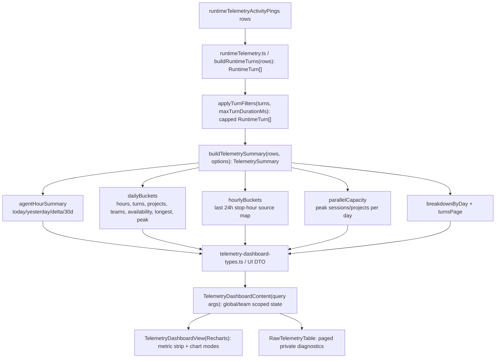

# TKT-013 Implementation Plan

## Summary

Restore the Aikage/Farplane-Console telemetry dashboard shape inside Farplane
UI while preserving the current raw telemetry workflow and duration-confidence
rules. The work stays one build-and-proof loop: install Recharts, port the
shadcn chart wrapper, extend the Convex telemetry summary with derived parity
fields, replace the custom chart stopgap, and capture browser proof.

## Scope

- In scope:
  - Add Recharts to the UI workspace.
  - Add a Farplane UI chart wrapper equivalent to Console's shadcn/Recharts
    `ChartContainer`, `ChartTooltip`, and `ChartTooltipContent`.
  - Extend `buildTelemetrySummary` with Aikage/Console parity fields while
    preserving the existing 4h default cap and filtered-turn accounting.
  - Replace custom SVG/HTML chart primitives with Recharts views.
  - Restore the metric strip and dashboard views for agent-hours, capacity,
    source map, parallel capacity, project breadth, longest turn, and
    availability.
  - Keep global and team telemetry using the same component pattern and query
    args.
  - Preserve `Raw Telemetry` pagination, status/source filters, and privacy
    boundary.
- Out of scope:
  - Nudge/Telegram/learning inbox parity.
  - Importing Console components wholesale.
  - Replacing telemetry ingestion or Convex schema.
  - Exposing raw assistant output, transcripts, or full prompts.

## Delta

### Before

- Farplane UI has `Dashboard`, `Projects`, `Teams`, and `Raw Telemetry`.
- Dashboard charts are one-off SVG/HTML primitives.
- Query output has only aggregate totals, daily buckets, breakdowns, and paged
  turns.
- The UI cannot answer the operator questions about last-day/last-week
  parallel work capacity, project breadth, hourly stop concentration, daily
  capacity, availability, or longest-turn shape.

### After

- Farplane UI uses Recharts through a shared shadcn-style chart wrapper.
- Dashboard top metrics show Today, Delta, 30d total, Capacity, Availability,
  Peak parallel, Projects, Longest turn, plus confidence/filtered state.
- Dashboard has dense chart modes or sections for Agent-hours, Capacity,
  Source map, Parallel, Projects, Longest, and Availability.
- Query output carries parity fields derived from capped completed turns:
  `agentHourSummary`, `hourlyBuckets`, `parallelCapacity`, enriched
  `dailyBuckets`, and day-scoped breakdown maps.
- Raw telemetry remains a separate inspection lane with paging, filters, and
  source/confidence labels.

### Why Now

The first TKT-013 pass fixed the missing tab separation but did not restore the
older telemetry product value. The operator is explicitly trying to measure
parallel project capacity and confidence over recent days; the current thin
dashboard cannot answer that.

### First-Principles Basis

- Objective: make telemetry a decision surface for agent-hours, confidence,
  and parallel work capacity, not just a totals panel.
- Need: operators need to see whether multiple projects ran in parallel, which
  projects consumed time, and where stop-hook gaps make totals suspect.
- Root cause: current Farplane summary is narrower than the Console/Aikage
  query and UI contracts.
- Assumptions: imported telemetry rows already include enough lifecycle,
  project/team, machine/session, and received-at data to derive parity fields.
- Constraints: no raw transcripts, no ingestion redesign, no old component
  wholesale import, keep UI module-local boundaries, keep Convex reducers
  deterministic and testable.
- First viable slice: derive capped daily/hourly/parallel fields from existing
  `RuntimeTurn[]`, then render them with Recharts.
- Proof/falsification: reducer tests demonstrate derived fields and cap
  semantics; browser screenshots show Recharts dashboard and scoped team view.
- Tradeoff: add one chart dependency and a small shared chart wrapper instead
  of maintaining bespoke SVG primitives.
- Non-goals: learning inbox, Telegram nudges, retention policy, raw prompt
  review.

## Program

```text
vars:
  ticket = tickets/building/TKT-013-telemetry-dashboard/ticket.md
  reducer = convex/modules/runtimeTelemetry/runtimeTelemetry.ts
  ui = ui/src/modules/telemetry
  chart_wrapper = ui/src/components/ui/chart.tsx

program:
  install_recharts(ui/package.json) -> package_lock_delta
  port_chart_wrapper(Console chart.tsx) -> chart_wrapper
  extend_types(reducer, telemetry-dashboard-types.ts) -> parity_summary_shape
  derive_fields(rows, cap, timezone) -> daily/hourly/parallel/capacity/availability
  replace_charts(ui views) -> Recharts dashboard sections
  preserve_raw(ui views) -> raw tab unchanged except type compatibility
  verify(reducer tests, lint, typecheck/build, browser QA) -> evidence
  writeback(ticket, progress, qa report) -> completion state
```

## Map



Typed flow:

1. `ActivityPingRow[]` enters `buildTelemetrySummary`.
2. `RuntimeTurn[]` is inferred and capped; over-cap turns become `status:
   "filtered"` and do not count toward completed agent-hours.
3. `TelemetrySummary` returns enriched derived fields plus the existing
   `turnsPage`.
4. UI renders chart-only derived metadata in Dashboard and turn metadata in
   Raw Telemetry.

Touch:

- `ui/package.json`, `package-lock.json`
- `ui/src/components/ui/chart.tsx`
- `ui/src/modules/telemetry/telemetry-dashboard-types.ts`
- `ui/src/modules/telemetry/telemetry-dashboard-content.tsx`
- `ui/src/modules/telemetry/telemetry-dashboard-views.tsx`
- `convex/modules/runtimeTelemetry/runtimeTelemetry.ts`
- `convex/modules/runtimeTelemetry/runtimeTelemetry.test.ts`
- ticket/progress/QA artifacts

Inspect:

- `/Users/kenjipcx/Zanarkand Technologies/projects/Farplane-Console/src/components/ui/chart.tsx`
- `/Users/kenjipcx/Zanarkand Technologies/projects/Farplane-Console/src/features/dashboard/components/*`
- `/Users/kenjipcx/Zanarkand Technologies/projects/Farplane-Console/convex/dashboard.ts`
- `/Users/kenjipcx/Zanarkand Technologies/projects/Farplane-Console/convex/lib/parallelCapacity.ts`

## Done / Proof

- Mechanical:
  - `npm install` updates UI workspace dependency state cleanly.
  - `npm run test:once -- convex/modules/runtimeTelemetry` passes.
  - focused Biome lint passes on changed telemetry/chart files.
  - `npm run typecheck:root` passes.
  - focused UI typecheck filter has no telemetry/chart errors; full workspace
    debt is documented if still present.
  - `npm run ui:build` passes or any failure is proven unrelated.
  - `git diff --check` passes on touched paths.
- Browser proof:
  - global Telemetry dashboard screenshot with Recharts-backed parity views.
  - global Raw Telemetry screenshot proving raw workflow preserved.
  - team Telemetry dashboard screenshot with scoped parity views.
  - team Raw Telemetry screenshot proving scoped raw workflow preserved.
- Review focus:
  - Duration cap still excludes suspicious inferred turns from counted hours.
  - Parallel capacity uses completed positive-duration turn intervals only.
  - Hourly source map attributes hours to stop/recovered end hour.
  - Public mode still hides Raw Telemetry.
  - No raw assistant output/transcripts appear in modeled UI types or rendered
    rows.
- Hard gates:
  - No hidden chart globals.
  - No duplicate telemetry entrypoint.
  - No Console component wholesale import.
  - New source files over 500 raw lines get a ticket split note or are split.

## State

- Ready for implementation.
- `convex/_generated/ai/guidelines.md` is absent in this checkout; planning
  used the module-local Convex contract and existing reducer tests.
- Existing workspace has unrelated dirty files and known full typecheck debt;
  do not revert unrelated changes.

## Links

- Ticket: `tickets/building/TKT-013-telemetry-dashboard/ticket.md`
- Gap analysis: `tickets/building/TKT-013-telemetry-dashboard/artifacts/research/aikage-telemetry-gap.md`
- Program: `tickets/building/TKT-013-telemetry-dashboard/program.md`
- Progress: `tickets/building/TKT-013-telemetry-dashboard/progress.md`

## Notes

- Risk: deriving parallel capacity incorrectly would create misleading
  operator confidence. Contain by testing overlap with representative completed,
  filtered, open, and cross-day turns.
- Rollback: Recharts UI can be reverted to the current thin dashboard while
  keeping backend derived fields if the chart pass misbehaves.
- Plan review: passed impl-plan checks for reference coverage, coherent scope,
  map usefulness, typed flow, proof specificity, and risk clarity.
