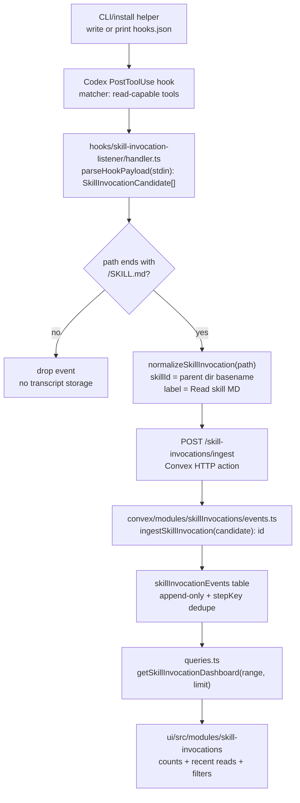

# TKT-025: Skill invocation listener hook and dashboard

## Status

- state: `building`
- owner: Farplane UI
- assignee: Codex
- dependencies: Convex runtime URL configured; Codex hooks enabled and trusted by operator via `/hooks`
- location: `tickets/building/TKT-025-skill-invocation-listener-hook/ticket.md`
- enter when: operator requested a Codex hook that records `SKILL.md` reads as skill invocations and a UI module showing usage counts
- leave when: hook, install helper, Convex endpoint/query, and UI module are implemented, verified, trusted in Codex `/hooks`, and approved
- blockers:
  - Codex hook trust is user-controlled; implementation generated repo-local config but cannot make Codex run a changed hook until the operator trusts it.
- spawned follow-ups: none
- complexity: `L`

## Summary

Add a deterministic Codex `PostToolUse` hook that detects successful reads of any `*/SKILL.md`, derives the skill id from the parent directory, and posts a compact `skill_invoked` event to Farplane. Build the backend as a module-owned Convex ingestion/query surface and add a simple UI module that shows recent skill reads, per-skill counts, and source-tool diagnostics.

## Scope

- In scope:
  - repo-owned hook package for Codex `PostToolUse` events with status message `Read skill MD`
  - parser that recognizes `SKILL.md` paths in hook stdin payloads and Bash/read-file style payloads without logging raw transcripts
  - Convex HTTP endpoint for hook writes, token-compatible with existing telemetry auth stance
  - Codex-local backend/install surface, either CLI-owned or Vite state-bridge-owned, that can generate/show hook install status without browser-side `~/.codex` scraping
  - Convex module table/query/reducer for skill invocation counts and recent events
  - UI module that can be opened from the office launcher and/or Skills Studio Harness surface
  - install helper similar in spirit to existing onboarding hook generation, with idempotent config output and clear `/hooks` trust instructions
- Out of scope:
  - judging whether a skill should have been invoked
  - modifying global `AGENTS.md` behavior
  - storing full hook payloads, assistant messages, secrets, or raw command output
  - auto-trusting Codex hooks
  - replacing runtime telemetry or agent activity dashboards

## Delta

### Before

Farplane has runtime telemetry and agent activity events, plus a disabled diagnostics-only `farplane-status` message hook. There is no reliable record of which Codex skills were actually read during a turn, and no UI surface that answers "which skills are being invoked how often?"

### After

Farplane has a first-party skill invocation module:

- Codex runs a `PostToolUse` command hook for read-capable tools.
- The hook extracts `skillPath`, `skillId`, `sourceTool`, session/thread metadata when available, and a deterministic `stepKey`.
- Convex accepts `POST /skill-invocations/ingest`, dedupes, stores append-only rows, and exposes dashboard queries.
- The UI renders recent `Read skill MD` events and count summaries by skill, source tool, project, and time range.
- Installation is generated through a repo helper that writes or prints a Codex `hooks.json` patch and tells the operator to review it with `/hooks`.

### Why Now

Skill usage is becoming part of the harness itself. Without invocation telemetry, Farplane can show skill catalogs and runtime status, but cannot measure whether agents are following skill routing, which skills are high-leverage, or where skill bloat is hiding.

### First-Principles Basis

- Objective: make skill invocation visible without adding always-loaded prompt bloat.
- Need: operators need a factual usage trail for skill calls, not inferred chat phrasing.
- Assumptions: a successful read of `*/SKILL.md` is the best available deterministic proxy for "skill invoked" in Codex.
- Root cause: current status hooks inspect messages, not actual tool use, so they miss or misclassify skill reads.
- Constraints: hooks receive untrusted payloads; no raw transcript storage; Codex hook trust remains explicit; Convex operational state is the canonical live event store.
- First viable slice: log successful `SKILL.md` reads from `PostToolUse`, count by parent directory name, and show the counts in one UI panel.
- Proof/falsification: fixture payloads that read `harness-advisor/SKILL.md` must create exactly one `harness-advisor` event; fixture payloads for non-skill files must create no event; browser UI must show the ingested count.
- Tradeoff: this captures file-read-based invocations, not future in-memory or synthetic skill references that do not read `SKILL.md`.
- Non-goals: enforcement, skill quality scoring, automatic hook trust, and broad Codex config management.

## Placement Decision

- Failure/loss term: skill invocation behavior is invisible, so harness improvement lacks usage evidence.
- Primary owner: a new deterministic hook package plus new `skillInvocations` Convex/UI modules.
- Rejected surfaces:
  - Root `AGENTS.md`: too much always-loaded context for a deterministic event.
  - Existing `farplane-status` hook: message-level and diagnostics-only; this needs tool payloads.
  - Runtime telemetry module: optimized for turn lifecycle and agent hours, not skill semantics.
  - Skills Studio metadata parser only: owns skill files, but not runtime invocation history.
- Secondary sync points:
  - Skills Studio can deep-link to per-skill invocation detail later.
  - Agent Activity can optionally mirror `skill_call` breadcrumbs later, but does not own the source event table.

## Program

```text
vars:
  event_name = "skill_invoked"
  hook_status = "Read skill MD"
  skill_name = basename(dirname(skill_path))
  endpoint = "${FARPLANE_CONVEX_SITE_URL}/skill-invocations/ingest"

program:
  ground(existing hooks, Convex modules, UI modules, Codex hook docs) -> current_state
  build_hook_package(current_state):
    add hooks/skill-invocation-listener/{HOOK.md,handler.ts,handler.test.ts}
    parse PostToolUse stdin payloads -> SkillInvocationCandidate[]
    publish candidates with token header when FARPLANE_TELEMETRY_TOKEN exists
  build_install_helper(current_state):
    add CLI/script command to print or write Codex hooks.json entry
    matcher = "Bash|mcp__filesystem__.*|mcp__.*read.*"
    command = "node <repo>/hooks/skill-invocation-listener/dist-or-tsx-entry"
    statusMessage = "Read skill MD"
  build_backend(current_state):
    add convex/modules/skillInvocations/{schema.ts,contracts.ts,events.ts,queries.ts,README.md,AGENTS.md}
    add /skill-invocations/ingest to convex/http.ts
    compose table in convex/schema.ts
  build_ui(current_state):
    add ui/src/modules/skill-invocations/{README.md,AGENTS.md,index.ts,...}
    render counts, recent rows, source-tool filters, and empty/error states
    add launcher entry through shared office panel registry or Skills Studio Harness tab
  verify(done_when, proof) -> test output + browser evidence + ticket update
```

## Map



Typed flow:

1. `PostToolUsePayload` from stdin is untrusted JSON; the classifier extracts only known-safe tool name, cwd/session metadata, and path-like strings from discovered payload fields.
2. `SkillInvocationCandidate` keeps `{ skillId, skillPath, sourceTool, sourceEvent: "PostToolUse", sessionId?, turnId?, projectPath?, occurredAt, stepKey }`.
3. `SkillInvocationRow` persists candidate plus `label: "Read skill MD"` and `source: "codex-post-tool-use"`.
4. `SkillInvocationDashboard` returns `{ totals, bySkill, recentEvents, bySourceTool }`.

Touch:

- `hooks/skill-invocation-listener/*`
- `convex/http.ts`
- `convex/schema.ts`
- `convex/modules/skillInvocations/*`
- `ui/src/modules/skill-invocations/*`
- `ui/src/shell/module-registry.ts`
- `ui/src/components/hud/office-panel-registry.ts`
- `ui/src/store/app-store.ts`
- install helper under `cli/` or `scripts/`
- targeted tests beside each touched module

Inspect:

- `hooks/farplane-status/*`
- `convex/modules/agentActivity/*`
- `convex/modules/runtimeTelemetry/*`
- `ui/src/modules/telemetry/*`
- `ui/src/modules/skills-studio/*`
- `ui/vite.config.ts` Codex app-server bridge routes
- `cli/onboarding-commands.ts`

## Acceptance Criteria

- [x] AC-1: Hook classifier detects `*/SKILL.md` reads from representative `PostToolUse` payload fixtures and derives the skill name from the parent directory.
- [x] AC-2: Hook classifier ignores non-skill markdown/files and never persists raw tool output or full transcripts.
- [x] AC-3: Convex exposes `POST /skill-invocations/ingest` with invalid JSON/payload handling, optional telemetry token protection, and deterministic dedupe.
- [x] AC-4: Convex exposes a dashboard query with total events, count by skill, count by source tool, and recent event rows.
- [x] AC-5: UI module shows recent skill invocation rows and count summaries, including an empty state when no events exist.
- [x] AC-6: Office launcher entrypoint opens the module through the shared registry/state path.
- [x] AC-7: Install helper generates an idempotent Codex hook config entry with `PostToolUse`, status message `Read skill MD`, and a clear `/hooks` trust instruction.
- [x] AC-8: Ticket proof includes focused hook/backend/UI tests plus browser evidence of the panel.

## Agent Contract

- Open:
  - Start by rereading `PROJECT_RULES.md`, this ticket, nearest module `AGENTS.md`, and `convex/_generated/ai/guidelines.md` if present.
  - Recheck current Codex hook docs/manual section before relying on payload fields.
- Test hook:
  - `npm run test:once -- hooks/skill-invocation-listener convex/modules/skillInvocations skill-invocations`
  - `npx tsc -p convex/tsconfig.json --noEmit`
  - `npm run ui`, then browser QA for the module panel.
- Stabilize:
  - Keep hook network failures non-fatal and logged to stderr only.
  - Deduplicate with `stepKey` built from event source, skill path, tool name, session/turn id, and occurred-at bucket when available.
  - Cap endpoint batch sizes if batch ingestion is added.
- Inspect:
  - Verify no full hook stdin payload is stored.
  - Verify browser bundle does not expose telemetry tokens.
- Key screens/states:
  - empty dashboard
  - dashboard with one skill
  - dashboard with multiple skills and source tools
  - endpoint/config error state
- Taste refs:
  - dense operational UI like `ui/src/modules/telemetry`
  - Skills Studio/Harness language for skill-facing labels
- Expected artifacts:
  - test output
  - browser screenshot
  - hook install config sample
  - updated ticket QA reconciliation
- Delegate with:
  - QA lane for browser evidence after implementation
  - reviewer lane for hook trust/security and Convex payload safety

## Evidence Checklist

- [x] Screenshot: Empty panel state.
- [x] Snapshot: generated Codex `hooks.json` entry or CLI install output.
- [x] Snapshot: test fixture proving `/skill-invocations/ingest` payload parsing and dashboard aggregation.
- [x] QA report linked.

## Done / Proof

- Done conditions:
  - Hook package, install helper, Convex module, HTTP endpoint, query, and UI module exist.
  - A read of `/Users/kenjipcx/.codex/skills/harness-advisor/SKILL.md` can produce a `harness-advisor` row.
  - UI shows the `harness-advisor` invocation count without needing page reload when Convex subscription updates.
- Metrics:
  - mechanical: test pass/fail, endpoint response, dashboard count equality.
  - product: none mechanical beyond visible counts.
- Checks:
  - `npm run test:once -- hooks/skill-invocation-listener`
  - `npm run test:once -- convex/modules/skillInvocations`
  - `npm run test:once -- skill-invocations`
  - `npx tsc -p convex/tsconfig.json --noEmit`
  - focused `npm run ui:build` or UI typecheck if module exports change
- Manual QA:
  - Start UI, open the new panel, confirm counts/recent rows.
  - Run hook fixture or local hook smoke against Convex site URL.
  - Confirm `/hooks` trust instruction is visible after install helper output.
- Review focus:
  - TAS gate: `TAS-A` required for hook payload privacy and token handling.
  - Hard gate: no raw transcript/tool output storage; no auto-trust of Codex hooks; no browser-exposed secret.

## Run Hints

- Use a local Convex deployment or configured `FARPLANE_CONVEX_SITE_URL`.
- Hook command should read stdin and exit zero on non-skill events.
- Prefer a repo-local hook config sample first; user-level install should be explicit and idempotent.
- Codex docs source used for this plan: current Codex manual `Hooks` section says hooks support `PostToolUse`, matcher filters by tool name, command hooks receive payload on stdin, hook config can live in `hooks.json` or config, and changed hooks require review/trust with `/hooks`.

## State

- Placement: approved by operator on 2026-06-14.
- Implementation: started under native Goal.
- Verification: focused tests, Convex typecheck, root build, UI build, installer dry-run, hook smoke, and browser panel QA completed.
- Review: plan self-check passed against `impl-plan/references/review.md`.
- Known missing references:
  - `convex/_generated/ai/guidelines.md` is referenced by `AGENTS.md` but was absent in this checkout.
  - `docs/specs/goal-loop-contract.md` and goal-loop templates referenced by `goal-advisor` were absent in this checkout.

## QA Reconciliation

- [x] AC-1: Hook classifier detects `*/SKILL.md` reads from representative `PostToolUse` payload fixtures and derives the skill name from the parent directory.
- [x] AC-2: Hook classifier ignores non-skill markdown/files and never persists raw tool output or full transcripts.
- [x] AC-3: Convex exposes `POST /skill-invocations/ingest` with invalid JSON/payload handling, optional telemetry token protection, and deterministic dedupe.
- [x] AC-4: Convex exposes a dashboard query with total events, count by skill, count by source tool, and recent event rows.
- [x] AC-5: UI module shows recent skill invocation rows and count summaries, including an empty state when no events exist.
- [x] AC-6: Office launcher entrypoint opens the module through the shared registry/state path.
- [x] AC-7: Install helper generates an idempotent Codex hook config entry with `PostToolUse`, status message `Read skill MD`, and a clear `/hooks` trust instruction.
- [x] AC-8: Ticket proof includes focused hook/backend/UI tests plus browser evidence of the panel.

## Evidence

- Screenshot: `artifacts/qa/screenshots/skill-invocations-dialog.png`
- Browser log caveat: `artifacts/qa/screenshots/browser-errors-dialog.json`
- QA report: `artifacts/qa/skill-invocations-qa.md`
- Generated local hook config: `.codex/hooks.json` via `npm run hooks:install:skill-invocations -- --json`
- Focused tests: `npm run test:once -- hooks/skill-invocation-listener convex/modules/skillInvocations ui/src/modules/skill-invocations ui/src/components/hud/office-panel-registry.test.ts ui/src/shell/shell-config.test.ts ui/src/store/app-store.test.ts`
- Type/build checks: `npx tsc -p convex/tsconfig.json --noEmit`, `npm run build`, `npm run ui:build`

## Links

- Codex manual cache checked: `/var/folders/98/ht394qw529jbzxvzl7ldp1040000gn/T/openai-docs-cache/codex-manual.md`
- Existing hook: `hooks/farplane-status/`
- Existing backend patterns: `convex/modules/agentActivity/`, `convex/modules/runtimeTelemetry/`
- Existing UI patterns: `ui/src/modules/telemetry/`, `ui/src/modules/skills-studio/`

## Notes

- Security risk: hook payloads are untrusted and may contain sensitive command output. The classifier should extract only path-like candidates and discard the rest.
- Rollback: disable or remove the generated hook entry from Codex `hooks.json`; Convex rows can remain as audit history.
- Future follow-up: after the first dashboard lands, Skills Studio can add per-skill detail links and compare invocation counts against skill registry metadata.

## Artifact Links

## User Evidence

- Hero screenshot: `artifacts/qa/screenshots/skill-invocations-dialog.png`
- Supporting evidence: `artifacts/qa/skill-invocations-qa.md`
- QA report: `artifacts/qa/skill-invocations-qa.md`
- Final verdict: `passed-with-caveats`

## Required Evidence

- [x] Hook classifier tests pass.
- [x] Convex endpoint/query tests pass.
- [x] UI module tests pass.
- [x] Typecheck passes for Convex/root build path; full UI workspace typecheck has pre-existing unrelated failures.
- [x] Browser QA evidence captured.
