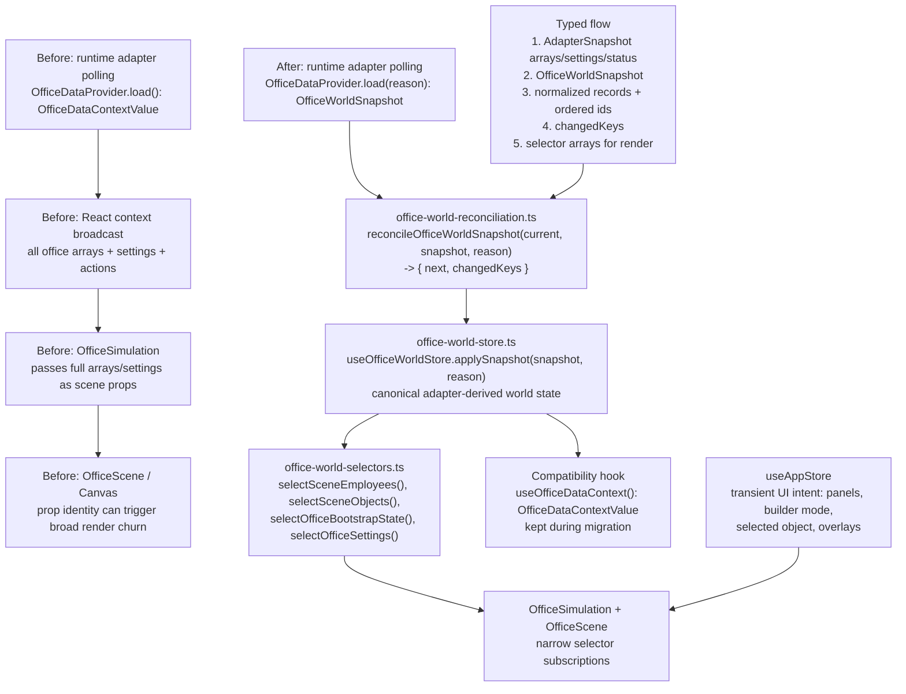

# TKT-008: Office world store and reconciliation boundary

## Status

- state: `done`
- owner: codex
- assignee:
- dependencies:
  - Related: `TKT-007` renderer shell and module architecture
- location: `tickets/done/TKT-008-office-world-store-reconciliation`
- enter when: office polling and runtime snapshots can cause broad scene refresh behavior because adapter-derived data and render-facing props are coupled through one React context
- leave when: complete; implementation and proof are captured
- blockers:
  - Full workspace typecheck has known unrelated UI type debt; execution must use focused checks and report the broader gate honestly.
- spawned follow-ups:
  - Later engine-style systems extraction ticket after the office world store contract proves stable.
- complexity: `L`

## Summary

Refactor the AI office state pipeline so adapter snapshots reconcile into a module-local Zustand office world store before the 3D scene consumes them. This creates the stable contract needed to prevent polling, live status, or gateway changes from behaving like whole-scene reloads, while keeping the current React provider as the adapter/polling boundary during the migration.

## Scope

- In scope:
  - Add a module-local `office-world-store` under `ui/src/modules/office/store`.
  - Define normalized office world state for teams, employees, desks, office objects, office areas, settings, workload, warnings, live status, and loading/error metadata.
  - Add a pure reconciliation helper that turns adapter/context snapshots into changed store slices.
  - Change `OfficeDataProvider` from a broad snapshot context into a polling/orchestration boundary that commits reconciled snapshots to the office world store.
  - Preserve a temporary compatibility hook for existing consumers while migrating the scene and bootstrap path first.
  - Add changed-key debug logs so future poll churn can be diagnosed from console output.
  - Update module docs with the office state ownership contract.
- Out of scope:
  - Full entity-component-system rewrite.
  - Moving renderer shell work from `TKT-007`.
  - Replacing `useAppStore` for local UI state.
  - Migrating all HUD/panel consumers in one broad pass if compatibility selectors can contain the first slice.
  - Changing Codex/OpenClaw adapter source-of-truth rules.

## Delta

### Before

- `OfficeDataProvider` loads adapter data every 5 seconds and exposes a full `OfficeDataContextValue` through React context.
- `OfficeSimulation` reads the full context and passes arrays/settings down to `OfficeScene`.
- `OfficeScene` and scene hooks rely on prop identity staying stable.
- `useAppStore` owns local UI state such as selected object, builder mode, open panels, and overlays.
- `ui/src/modules/office/store` exists, but it only owns transient Three.js object registration.
- A fresh object returned by polling can accidentally fan out through the whole scene even when semantic office data did not change.

### After

- `OfficeDataProvider` remains the adapter boundary, but its main side effect is:

```ts
reconcileOfficeWorldSnapshot(current, snapshot, reason) -> { next, changedKeys }
useOfficeWorldStore.getState().applySnapshot(snapshot, reason)
```

- `useOfficeWorldStore` owns the canonical render-facing office world state.
- Scene and bootstrap consumers subscribe through narrow selectors such as `selectSceneEmployees`, `selectSceneObjects`, `selectOfficeSettings`, and `selectOfficeBootstrapState`.
- `useAppStore` continues to own transient local UI intent only: panels, selections, builder mode, overlays, modals, onboarding visibility.
- Existing context consumers keep working through a compatibility hook while the first implementation moves the scene path onto store selectors.
- Poll logs report `reason`, `changedKeys`, timing, entity counts, and `unchanged` decisions.

### Why Now

The immediate refresh issue showed that broad React context and adapter polling are too easy to couple. The PRD asks for reliable runtime observability and a small, readable office; MEM-0176 says reactive status changes must not mimic full reloads; MEM-0194 keeps structural office state sidecar-backed and hybrid with Convex live state; MEM-0227 keeps Codex as the default adapter with OpenClaw optional. A Zustand office world store fits those constraints without prematurely building a full game engine.

### First-Principles Basis

- Objective: make the AI office state pipeline stable, inspectable, and modular enough that runtime polling cannot accidentally remount or refresh the whole scene.
- Need: operators should trust that the office only changes when world data changes, not because a polling adapter returned new object references.
- Assumptions: Codex remains the default adapter; OpenClaw remains optional; `useAppStore` continues to own local UI state; `OfficeDataProvider` can stay as a compatibility boundary while store selectors are introduced.
- Root cause: adapter snapshots, semantic world state, and render props currently share one broad context surface.
- Constraints: preserve sidecar/runtime ownership, avoid broad renderer work from `TKT-007`, avoid overwriting dirty worktree changes, and keep proof focused because full typecheck has known unrelated debt.
- First viable slice: introduce the office world store, reconciliation helper, selector set, provider commit path, scene/bootstrap selector migration, and focused tests.
- Proof/falsification: repeated poll intervals report `unchanged` with no scene remount or loader reset when data is semantically equal; changed snapshots report precise `changedKeys`.
- Tradeoff: accept one new module-local state boundary now instead of a full ECS rewrite.
- Non-goals: no full game loop, no asset manager rewrite, no renderer shell migration, no adapter source-of-truth change.

## Options Considered

1. Keep React context and keep hardening stabilization in place.
   - Pros: smallest change, lowest migration risk, already partly proven by the immediate reload fix.
   - Cons: broad context remains easy to misuse, new fresh references can reintroduce churn, and the scene remains coupled to provider shape.
2. Add a module-local Zustand office world store and reconciliation boundary.
   - Pros: matches project state tooling, creates stable changed-key proof, lets scene selectors subscribe narrowly, and preserves current adapter/provider ownership.
   - Cons: adds a migration seam and must avoid duplicate canonical state during compatibility.
3. Build a full game-style runtime layer now.
   - Pros: strongest long-term architecture for a 3D office with world state, systems, inputs, assets, and render state.
   - Cons: requires stable contracts we do not have yet, risks overbuilding around current product churn, and would hide too much work inside one ticket.

Recommendation: implement option 2 in this ticket. It creates the state contract that makes option 3 possible later without a top-down rewrite now.

## Program

```text
vars:
  world_store = "ui/src/modules/office/store/office-world-store.ts"
  reconcile = "ui/src/modules/office/store/office-world-reconciliation.ts"
  selectors = "ui/src/modules/office/store/office-world-selectors.ts"
  provider = "ui/src/providers/office-data-provider.tsx"
  compatibility_hook = "useOfficeDataContext()"
  scene_entry = "ui/src/components/office-simulation.tsx"
  scene_shell = "ui/src/modules/office/office-scene.tsx"

program:
  ground(vars) ->
    inspect current OfficeDataProvider, office-data-mapper, office-data-stability,
    office-simulation, office-scene, scene derived data, app-store, office store,
    project rules, module contract, memory invariants

  define_world_contract(current_state) ->
    create OfficeWorldState and OfficeWorldSnapshot types,
    separate adapter-derived world state from local UI intent,
    keep status/source metadata explicit

  implement_reconcile(contract) ->
    add reconcileOfficeWorldSnapshot(current, snapshot, reason):
      returns { next, changedKeys },
    normalize arrays by id,
    preserve references for semantically equal slices,
    record counts and load/error state

  add_store(reconcile) ->
    add useOfficeWorldStore with applySnapshot(), setLoading(), setError(), reset(),
    export intentional selectors from ui/src/modules/office/store/index.ts

  wire_provider(store) ->
    keep adapter polling in OfficeDataProvider,
    replace broad setValue path with applySnapshot(),
    keep compatibility value derived from store selectors for old consumers,
    log changedKeys under farplane.debug.officeRefresh

  migrate_first_consumers(selectors) ->
    move OfficeSimulation bootstrap and OfficeScene props to selector-backed reads,
    keep local UI controls in useAppStore,
    avoid migrating every panel until the scene path is stable

  verify(done_when, proof) ->
    unit-test reconciliation reference stability and changedKeys,
    focused provider/store tests,
    browser smoke across two poll intervals with debug logs,
    git diff --check
```

## Map



Touch:

- `ui/src/modules/office/store/office-world-store.ts`
- `ui/src/modules/office/store/office-world-reconciliation.ts`
- `ui/src/modules/office/store/office-world-selectors.ts`
- `ui/src/modules/office/store/index.ts`
- `ui/src/providers/office-data-provider.tsx`
- `ui/src/components/office-simulation.tsx`
- `ui/src/modules/office/office-scene.tsx` if prop ownership changes in the first slice
- `ui/src/modules/office/README.md`
- `ui/src/providers/office-data-provider.test.ts`
- new focused store/reconciliation tests

Inspect:

- `ui/src/providers/office-data-mapper.ts`
- `ui/src/providers/office-data-stability.ts`
- `ui/src/store/app-store.ts`
- `ui/src/modules/office/scene/use-office-scene-derived-data.ts`
- `ui/src/modules/office/scene/scene-contents.tsx`
- `ui/src/modules/office/store/object-registration-store.ts`
- `ui/src/modules/README.md`
- `PROJECT_RULES.md`
- `ARCHITECTURE.md`
- `docs/MEMORY.md`

Signature delta:

```ts
type OfficeWorldSnapshot = {
  company: Company | null;
  teams: TeamData[];
  employees: EmployeeData[];
  desks: DeskLayoutData[];
  officeObjects: OfficeObject[];
  officeAreas: OfficeAreaNode[];
  officeSettings: OfficeSettingsModel;
  companyModel: CompanyModel | null;
  workload: ProjectWorkloadSummary[];
  warnings: ReconciliationWarning[];
  liveStatusByAgentId: Record<string, AgentLiveStatus>;
  isLoading: boolean;
  error?: string;
};

type OfficeWorldChangedKey =
  | "company"
  | "teams"
  | "employees"
  | "desks"
  | "officeObjects"
  | "officeAreas"
  | "officeSettings"
  | "companyModel"
  | "workload"
  | "warnings"
  | "liveStatus"
  | "loading"
  | "error";

function reconcileOfficeWorldSnapshot(
  current: OfficeWorldState,
  snapshot: OfficeWorldSnapshot,
  reason: OfficeDataRefreshReason,
): { next: OfficeWorldState; changedKeys: OfficeWorldChangedKey[] };
```

## Done / Proof

- Done conditions:
  - [x] `useOfficeWorldStore` exists under the office module and owns adapter-derived office world state.
  - [x] `useAppStore` remains the owner of transient UI state only.
  - [x] `OfficeDataProvider` commits snapshots into the store and no longer needs to broadcast a full fresh office tree for unchanged polls.
  - [x] Reconciliation returns stable references for semantically equal slices and precise `changedKeys` for changed slices.
  - [x] Scene/bootstrap first path reads through store selectors or a clearly documented compatibility selector layer.
  - [x] Existing consumers of `useOfficeDataContext()` keep working during migration.
  - [x] Debug logging can prove whether a poll changed world state, live status, loading/error state, or nothing.
  - [x] Office module README documents the state ownership boundary.
- Mechanical checks:
  - `npm run test:once -- ui/src/providers/office-data-provider.test.ts`
  - focused store/reconciliation tests, for example `npm run test:once -- ui/src/modules/office/store`
  - `git diff --check`
  - `npm run ui:typecheck` attempted and reported honestly if blocked by known unrelated debt.
- Manual/browser checks:
  - Start `npm run ui`.
  - Open `/office`.
  - Enable `localStorage.setItem("farplane.debug.officeRefresh", "1")`.
  - Observe at least two poll intervals.
  - Required behavior: semantically equal polls log `unchanged` or `changedKeys: []`, the loader does not reappear, camera/canvas does not remount, and the URL remains `/office`.
  - Store ticket-scoped QA evidence under `docs/research/qa-testing/TKT-008/<timestamp>_office-world-store/` if the run produces screenshots, console logs, or a report.
- Review focus:
  - State ownership is clear: adapter-derived world state in office world store, UI intent in `useAppStore`, adapter access in runtime/provider layer.
  - Store selectors are narrow and do not recreate broad context churn under a different name.
  - The compatibility hook is explicitly temporary and does not become the new canonical surface.
  - The design is a runway to game-style systems, not a premature full engine rewrite.
- Hard gates:
  - Do not move this ticket to `building` until approved.
  - Do not implement a full ECS/game loop in this ticket.
  - Do not change Codex/OpenClaw source-of-truth behavior.
  - Do not overwrite unrelated dirty worktree changes.
- Required evidence:
  - [x] Test output for focused provider/store tests.
  - [x] Browser console excerpt showing unchanged polls after the migration.
  - [x] Screenshot or short QA note from `/office` showing the scene remains loaded after poll intervals.
  - [x] Diff check output.

## Agent Contract

- Open: `AGENTS.md`, `PROJECT_RULES.md`, `ARCHITECTURE.md`, `docs/prd.md`, `docs/MEMORY.md`, `docs/TROUBLES.md`, `docs/LESSONS.md`, `ui/src/modules/README.md`, `ui/src/modules/office/AGENTS.md`, `ui/src/modules/office/README.md`, `ui/src/providers/office-data-provider.tsx`, `ui/src/providers/office-data-mapper.ts`, `ui/src/providers/office-data-stability.ts`, `ui/src/store/app-store.ts`, `ui/src/components/office-simulation.tsx`, `ui/src/modules/office/office-scene.tsx`, and `ui/src/modules/office/scene/use-office-scene-derived-data.ts`.
- Test hook: focused Vitest tests for reconciliation/store/provider plus browser smoke through `qa/cookbook/office.md` or agent-browser for the poll stability claim.
- Stabilize: preserve existing context API until the first scene path is migrated and tested; only then remove or shrink compatibility.
- Inspect: run `git status --short` before edits and avoid touching unrelated dirty files.
- Key screens/states: `/office`, initial load, two background poll intervals, builder mode idle, normal mode idle, one live-status update if available.
- Taste refs: no visual redesign; the user-visible result should be "nothing flickers or reloads unless the world actually changed."
- Expected artifacts: store/reconciliation code, tests, README update, browser proof note.
- Delegate with: use QA lane/browser proof for poll stability; use reviewer lane if the implementation starts redefining runtime source-of-truth or pulling in full ECS architecture.

## Evidence Checklist

- [x] Screenshot: `/office` after at least two poll intervals.
- [x] Snapshot: console logs showing `unchanged` or empty `changedKeys` for stable polls.
- [x] Snapshot: focused test output.
- [x] QA report linked: `docs/research/qa-testing/TKT-008/2026-06-13_133634_office-world-store/report.md`

## State

- Planning state: approved for implementation by user request on 2026-06-13.
- Completion state: done on 2026-06-13.
- Recommended path: implement Option 2 now, with the office world store as the state boundary and a later follow-up for full game-style system extraction.
- Split decision: keep this ticket as one coherent build loop because the store, reconciliation helper, provider commit path, first scene selector migration, docs, and proof all validate one boundary. Split the later ECS/game-loop architecture into a follow-up after this contract proves stable.
- Proof summary: focused tests passed, touched-file typecheck filter had no matching errors, `git diff --check` passed, and browser proof captured stable `/office` state after poll intervals.

## Links

- PRD: `docs/prd.md`
- Architecture: `ARCHITECTURE.md`
- Project rules: `PROJECT_RULES.md`
- Module contract: `ui/src/modules/README.md`
- Office module: `ui/src/modules/office/README.md`
- Related ticket: `tickets/review/TKT-007-renderer-shell-module-architecture/ticket.md`
- Memory:
  - `MEM-0176`: provider setup must stay stable across status updates so reactive status does not mimic full reloads.
  - `MEM-0194`: Farplane is hybrid-state; Convex owns realtime operational state while sidecars own structural office state.
  - `MEM-0227`: Codex is default office runtime adapter; OpenClaw is optional.
  - `MEM-0228`: Codex runtime mode uses the local Codex app-server bridge, not private file scraping.

## Notes

- Why not Option 3 immediately: a full game-style runtime layer is the desired direction, but it needs stable state contracts first. This ticket creates those contracts without committing to a top-down engine rewrite.
- Main risk: duplicating state between context and store during migration. Containment is to make store canonical, context compatibility derived, and removal follow-ups explicit.
- Rollback: keep the compatibility context path until the scene selector migration is proven; if the store migration regresses, revert provider commits to the context path while retaining pure reconciliation tests as design guidance.
