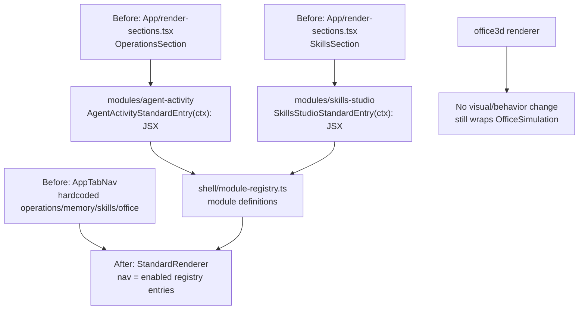

# TKT-009: Standard renderer module entrypoint integration

## Status

- state: `review`
- owner: codex
- assignee:
- dependencies: `TKT-007`
- location: `tickets/review/TKT-009-standard-renderer-module-entrypoints`
- enter when: the shell registry exists but renderers still mostly wrap legacy hardcoded app surfaces
- leave when: the standard renderer reads module entries from the shell registry and at least two current standard surfaces have clear module ownership without changing the 3D office behavior
- blockers:
- spawned follow-ups:
- complexity: `M`

## Summary

Make the shell registry do real work for the standard renderer. The first module-integration slice should not import old Sigmax/Aikage/Farplane Console code yet; it should convert the current hardcoded standard tabs into registry-backed module entries and move the least risky current sections into module-owned entrypoints.

## Scope

- In scope:
  - Extend `ShellModuleDefinition` with optional standard-renderer entry metadata.
  - Make `StandardRenderer` render nav from enabled registry entries instead of the old hardcoded tab list.
  - Move or wrap the current `OperationsSection` under a new `modules/agent-activity` boundary.
  - Move or wrap the current `SkillsSection` under `modules/skills-studio`.
  - Keep `OfficePage` and the `office3d` renderer visually stable.
  - Preserve the existing runtime adapter data loading path while carving render entrypoints out of `ui/src/App`.
- Out of scope:
  - Importing old Sigmax/Aikage/Farplane Console features.
  - Rebuilding the full standard app layout.
  - Moving `office-simulation.tsx` internals.
  - Creating `packages/`.
  - Replacing runtime adapter contracts.

## Delta

### Before

- `ui/src/shell/module-registry.ts` contains metadata but no renderable standard entrypoints.
- `StandardRenderer` wraps `App`, and `App` still owns hardcoded tabs: `operations`, `memory`, `skills`, `office`.
- `OperationsSection` and `SkillsSection` live in `ui/src/App/render-sections.tsx` even though they are durable feature surfaces.
- The registry cannot yet prove the rule "renderer composes, module owns feature."

### After

- Registry entries can expose a standard navigation entry:

```ts
type StandardModuleEntry = {
  navLabel: string;
  order: number;
  render: (ctx: StandardRendererContext) => ReactNode;
};

type ShellModuleDefinition = {
  id: string;
  label: string;
  description: string;
  surfaces: readonly ShellModuleSurface[];
  standard?: StandardModuleEntry;
};
```

- `StandardRenderer` derives visible nav from `config.modules` and `moduleRegistry`.
- `modules/agent-activity` owns the current agent/session/timeline/chat-bridge standard surface.
- `modules/skills-studio` owns the current skills summary/list standard surface.
- `ui/src/App` either becomes a compatibility wrapper around `FarplaneShell({ renderer: "standard" })` or shrinks to standard-renderer state/data orchestration until a later extraction.

### Why Now

TKT-007 created the shell boundary but still lets the standard renderer fall through to a legacy app tab structure. Before migrating old Console/Sigmax features, the repo needs one proven path for turning a module folder into a standard-renderer page.

### First-Principles Basis

- Objective: make module integration real without broad migration churn.
- Need: old features can only be absorbed cleanly once current first-party modules have a working shell entry pattern.
- Assumptions: standard and office3d renderers should eventually open the same module capabilities, but the first proof can target standard nav only.
- Root cause: current shell registry is metadata-only; it does not yet own entrypoint composition.
- Constraints: keep OfficePage stable, avoid dynamic loaders, keep helpers local until reused, and do not absorb old feature migrations into this ticket.
- First viable slice: registry-backed standard nav plus two module-owned entrypoints.
- Proof/falsification: `/office` still renders through office3d, the standard renderer can render at least agent activity and skills from registry entries, and tests prove config/registry filtering.
- Tradeoff: accept a small bridge layer around legacy App data state before fully extracting all standard surfaces.
- Non-goals: no visual redesign, no full App rewrite, no old repo feature migration.

## Program

```text
vars:
  source_app = "ui/src/App/*"
  registry = "ui/src/shell/module-registry.ts"
  standard_renderer = "ui/src/shell/renderers/standard/StandardRenderer.tsx"
  first_modules = ["agent-activity", "skills-studio"]

program:
  ground(vars) ->
    inspect current App state shape, render-sections props, module exports, and shell registry types

  design_entry_contract(current_state) ->
    extend shell types with StandardRendererContext and optional standard entry metadata

  integrate_agent_activity(contract) ->
    create modules/agent-activity with README, AGENTS, index, and a component wrapper for OperationsSection

  integrate_skills_studio(contract) ->
    move/wrap SkillsSection under modules/skills-studio without changing skill data contracts

  wire_standard_renderer(entries) ->
    derive nav from enabled registry entries,
    render selected module entry,
    preserve existing initial-tab compatibility where needed

  verify(done_when, proof) ->
    focused shell/module tests,
    targeted typecheck scan for shell, App, agent-activity, skills-studio,
    browser QA for standard renderer route if reachable,
    browser QA for /office regression
```

## Map



Touch:

- `ui/src/shell/types.ts`
- `ui/src/shell/module-registry.ts`
- `ui/src/shell/renderers/standard/StandardRenderer.tsx`
- `ui/src/App/*`
- `ui/src/modules/agent-activity/*`
- `ui/src/modules/skills-studio/*`
- module docs/tests as needed

Inspect:

- `ui/src/App/index.tsx`
- `ui/src/App/render-sections.tsx`
- `ui/src/App/tab-nav.tsx`
- `ui/src/shell/*`
- `ui/src/modules/skills-studio/*`
- `ui/src/modules/runtime/index.ts`
- `ui/src/pages/OfficePage.tsx`

## Done / Proof

- Done conditions:
  - [ ] `StandardRenderer` derives nav from registry entries instead of hardcoded `TAB_OPTIONS`.
  - [ ] `agent-activity` owns the current agent roster/session/timeline/chat-bridge standard entrypoint.
  - [ ] `skills-studio` owns the current skills summary/list standard entrypoint.
  - [ ] Registry entries remain static imports and derive module ids from the registry.
  - [ ] `/office` still renders through `office3d` without runtime import cycles.
  - [ ] Old Sigmax/Aikage/Farplane Console feature migration is left to follow-up tickets.
- Mechanical checks:
  - `npm run test:once -- ui/src/shell/shell-config.test.ts` plus any new focused shell/module tests.
  - targeted typecheck scan for touched shell/App/module paths.
  - `git diff --check`.
- Manual checks:
  - Browser load the standard renderer route or app entry that exercises module nav.
  - Browser load `/office` and confirm no console/page errors from shell imports.
- Review focus:
  - Module entry contract is minimal and static.
  - No generic dynamic loader appears.
  - App state/data loading is not rewritten more than necessary.
  - Module boundaries are real but not over-abstracted.
- Hard gates:
  - Do not move office composer internals in this ticket.
  - Do not add `packages/`.
  - Do not migrate old external repo features until this entrypoint pattern is proven.
- Required evidence:
  - [ ] Focused test output.
  - [ ] Targeted typecheck scan.
  - [ ] Browser QA notes for standard renderer and `/office`.
  - [ ] `git diff --check` output.

## Agent Contract

- Open: `ui/src/App/*`, `ui/src/shell/*`, `ui/src/modules/README.md`, `ui/src/modules/skills-studio/*`, `ui/src/modules/runtime/index.ts`, `ui/src/pages/OfficePage.tsx`.
- Test hook: focused shell/module tests, targeted typecheck scan, browser QA using local browser if Playwright browsers are unavailable.
- Stabilize: keep `OfficePage` and `office3d` route stable; prefer wrappers before moving large components.
- Inspect: existing dirty worktree before staging; do not include unrelated docs/runtime/plugin changes.
- Key screens/states: standard renderer nav, agent activity page, skills page, `/office`.
- Taste refs: existing standard panels until a later visual pass.
- Expected artifacts: module entrypoint contract, two module-owned standard entries, registry-backed nav, tests, QA notes.
- Delegate with: reviewer/QA lane if the module entry contract starts affecting office object launchers or route architecture beyond standard nav.

## Evidence Checklist

- [ ] Screenshot: standard renderer with registry-backed nav.
- [ ] Screenshot: `/office` after shell imports.
- [ ] Snapshot: focused test output.
- [ ] Snapshot: targeted typecheck scan.
- [ ] QA report linked:

## State

- Planning state: draft for review.
- Recommendation: integrate current repo modules before importing old Sigmax/Aikage/Farplane Console features.
- First implementation target: registry-backed standard nav plus `agent-activity` and `skills-studio` standard entries.

## Links

- Architecture spec: `docs/specs/module-shell-architecture.md`
- Prior ticket: `tickets/building/TKT-007-renderer-shell-module-architecture/ticket.md`
- Shell README: `ui/src/shell/README.md`
